Action menus display context-specific actions in a dropdown list.


| Figma | Web | iOS | Android |
| --- | --- | --- | --- |
| Ready ✅ | Ready ✅ | Ready ✅ | To Do 🚧 |

* [Action menu on Figma](https://www.figma.com/design/xxqSJcKOphrgimxRQbvtfe/2.-Gemini-Components-Library?node-id=3-7287)
* [Action menu on Storybook](https://gemini-storybook.prompt-scorpion-preview.aws.aviv.eu/?path=/docs/ui-navigation-actionmenu--docs)

---

## Usage

Action menus display a list of context-specific actions in a dropdown list. They are used when additional options are available to the user, but space is limited.

The action menu does not support submenus or subsections.

### Platform

We use platform-specific action menus that differ between Web/Android and iOS. The difference is the position of the icons and that we use a native dropdown list on iOS. On iOS a destructive action is available; on Web/Android it's not.

| Web/Android | iOS |
| --- | --- |
|  | 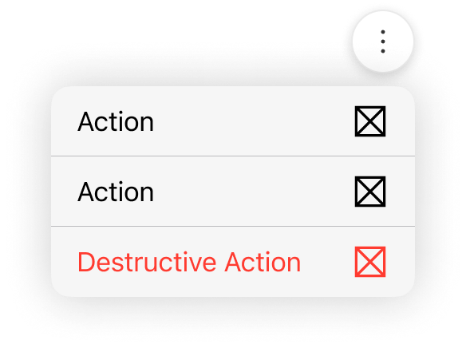 |

### When to use

**Action menu** — a dropdown list of contextual actions, primarily on desktop.

### When NOT to use

| Instead, when… | Use |
| --- | --- |
| Mobile (XXS/XS) or in apps | **Modal bottom sheet menu** |
| Selecting a form value rather than triggering actions | **Dropdown** |
| All options always visible, ≤7 | **Button group** |

### Variant Selection Flow

```
Trigger
├─ Space is limited, or the action is commonly recognised (three-dot) → Tertiary icon button
├─ The menu sits on top of an image or a map → Floating icon button
└─ The action must be explicitly clear, or is uncommon or complex → Text button

Icons in the list
├─ Every item has a meaningful icon → With icons
└─ Any item lacks one → Remove icons from all items; never mix

Menu items
├─ The item performs an action → Plain item
└─ The item navigates away → Link item, always with the external-link icon

Concurrency
└─ Only one action menu may be open at a time on a page
```

### Usage Guidance

| DO | DON'T |
| --- | --- |
|  **DO:** Use action menus to display a list of actions. |  **DON'T:** Don't use action menus as selection elements inside a form. Use dropdowns instead. |
|  **DO:** Use action menus to filter pages. |  **DON'T:** Don't use a backdrop behind the action menu. If you want to block the content, use a modal bottom sheet instead. |

Scrolling is technically possible, but we don't recommend using it. We recommend using fewer options or using a [modal bottom sheet menu](https://zeroheight.com/626199550/p/28f40b-modal-bottom-sheet-menu) in apps.

| DO | DON'T |
| --- | --- |
|  **DO:** Use fewer options to prevent scrolling. |  **DON'T:** Avoid using too many menu items to prevent usability issues. For longer lists consider using a modal bottom sheet menu on apps. |

### Related Components

| Component | Priority | Usage | Example Scenario |
| --- | --- | --- | --- |
| **Action menu** | — | Action menus display a list of context-specific actions. Although they are primarily used on desktop, they can also be used in apps if they contain only a few actions. | — |
| [**Modal bottom sheet menu**](../modal-bottom-sheet-menu/modal-bottom-sheet-menu.md) | High | Modal bottom sheet menus display a list of context-specific actions on mobile screens or on apps. | Mobile (XXS/XS) or in apps |
| [**Dropdown**](../dropdown/dropdown.md) | High | Dropdowns are used to select one option from a list. | Selecting a form value rather than triggering actions |
| [**Dropdown**](../dropdown/dropdown.md) | High | Dropdowns are used to select one option from a list. | Selecting a form value rather than triggering actions |
| [**Button group**](../button-group/button-group.md) | High | Button groups display multiple related choices in a horizontal row, allowing users to select one or more options. | All options always visible, ≤7 |
| [**Filter bar**](../filter-bar/filter-bar.md) | Medium | Filter bars are used to narrow down search results or displayed content based on selected criteria. | Filter bar redirects here when: Triggering filter-related actions rather than setting criteria |

---

## Variants & Modifiers

### Modifiers

#### Trigger

The action menu can be opened with the following button types: tertiary icon button, floating icon button and text button.

If you use a different trigger, please share your use case with us so we can improve our guidelines and documentation.

| Tertiary icon button | Floating icon button | Text button |
| --- | --- | --- |
|  Use icon buttons when space is limited or the action is commonly recognized, such as the three-dot menu icon. |  Use a floating icon button when the action menu is on top of an image or map. |  Use a text button when the action needs to be explicitly clear, especially for less common or more complex tasks. Use it to filter pages. |

| Tertiary icon button | Floating icon button | Text button |
| --- | --- | --- |
| 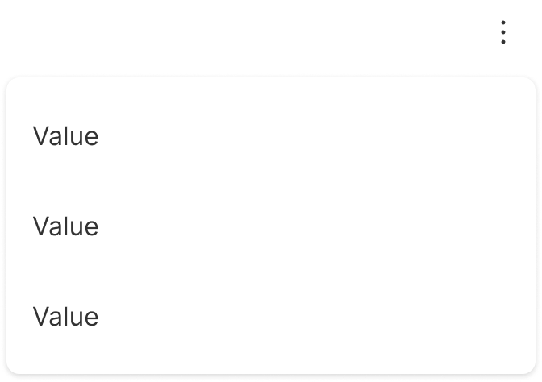 | 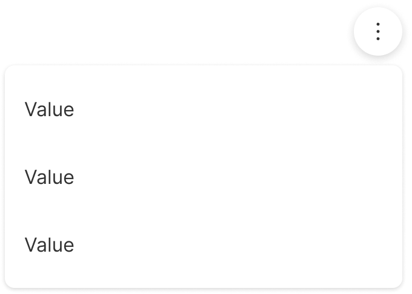 | 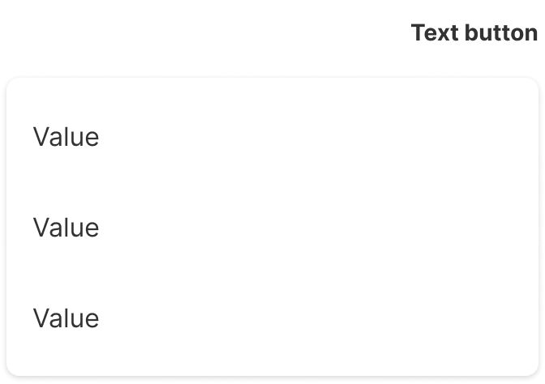 |

#### Icons

Icons can be added to the dropdown list. They act as visual cues to provide clarity to the user. On Web/Android the default icons are on the left and the external link icon on the right. On iOS all icons are on the right.

| DO | DON'T |
| --- | --- |
|  **DO:** If some items don't have an icon, remove all icons. |  **DON'T:** Don't mix menu items with and without icons, as it reduces readability. |

| Web/Android | iOS |
| --- | --- |
|  |  |

#### Menu items

Menu items can be actions or links. If the menu item is a link, the external link icon is displayed.

| DO | DON'T |
| --- | --- |
|  **DO:** Links are marked with the external link icon. |  **DON'T:** Don't hide the link icon, as it can be misleading to the user. |

---

## Behavior & Responsiveness

### Interactive States & Loading

* **Default / Hovered / Pressed:** The items in the dropdown list have the states default, hovered, and pressed. They can be selected or unselected.
* **Interaction:** The action menu list opens when the user clicks or taps on the button. When it's focused, it can also be opened by pressing the return key or the space bar. It closes when the user clicks on the button again, selects an option from the list, clicks outside the action menu, or presses the Esc key. It's not possible to have two or more action menus open at the same time on the same page.

| Unselected | Selected |
| --- | --- |
| 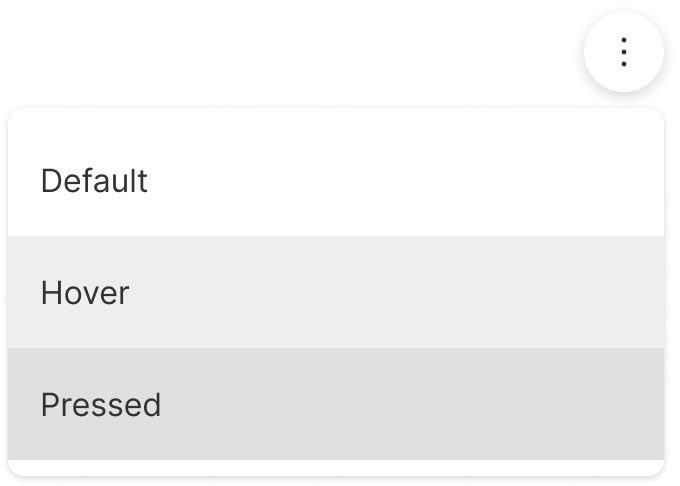 | 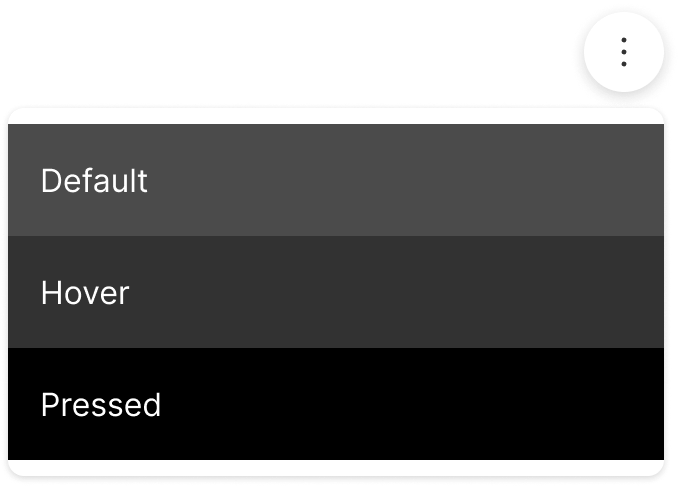 |

| Opening and closing | Selecting and closing | Closing |
| --- | --- | --- |
| 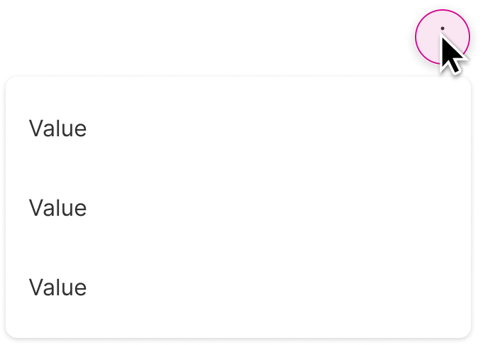 | 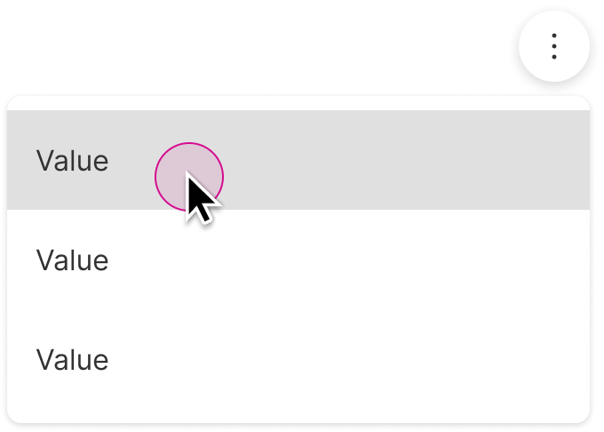 | 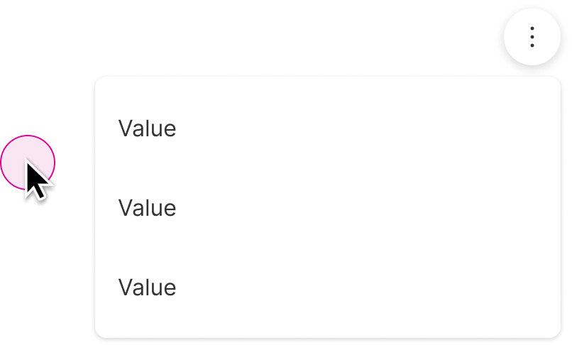 |

#### Position

| &nbsp; | &nbsp; | &nbsp; | &nbsp; |
| --- | --- | --- | --- |
| 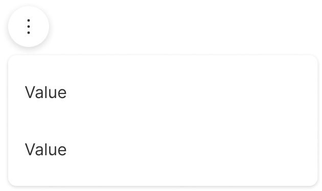 | 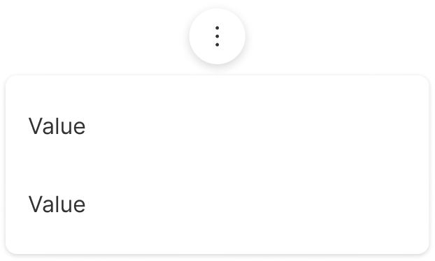 | 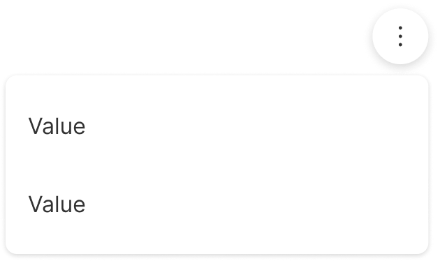 | 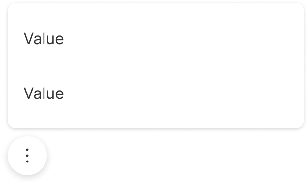 |

| &nbsp; | &nbsp; | &nbsp; | &nbsp; |
| --- | --- | --- | --- |
| 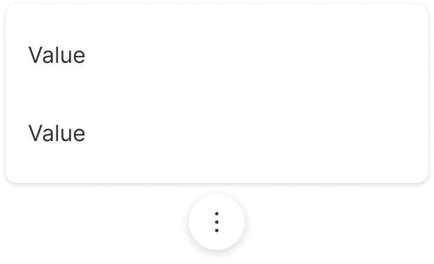 | 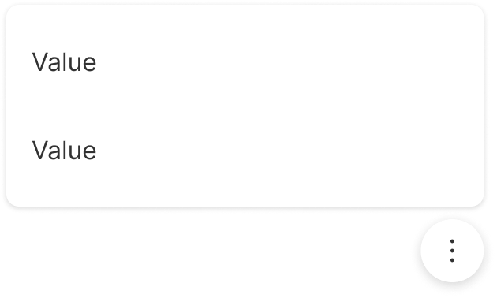 | 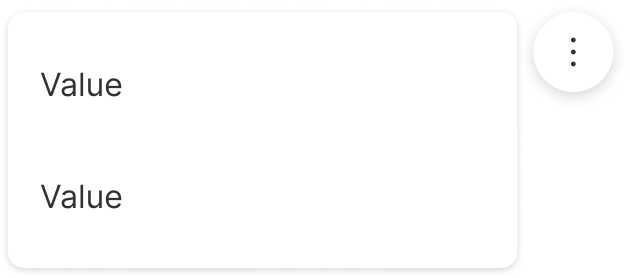 | 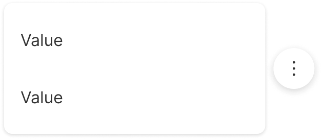 |

| &nbsp; | &nbsp; | &nbsp; | &nbsp; |
| --- | --- | --- | --- |
| 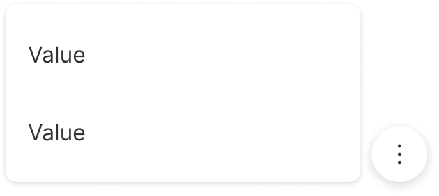 | 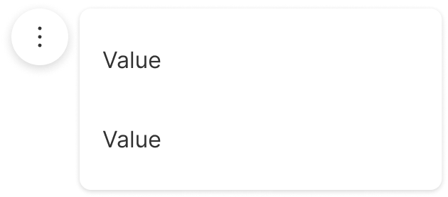 | 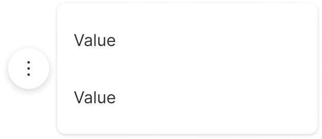 | 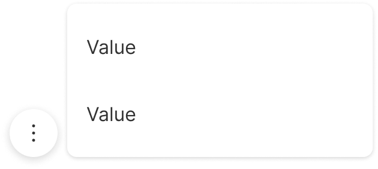 |

#### Breakpoints and width

On the Web, for XXS and XS breakpoints (from 0 to 600px) a modal bottom sheet is used.

For the breakpoints above SM, the dropdown list is used. By default the width is 320px. It can also be set to hug the content.

On Android and iOS both components can be used regardless of the screen size.

To learn more about our breakpoints, see our grids and breakpoint guidelines.

| Modal bottom sheet menu | Action menu |
| --- | --- |
| 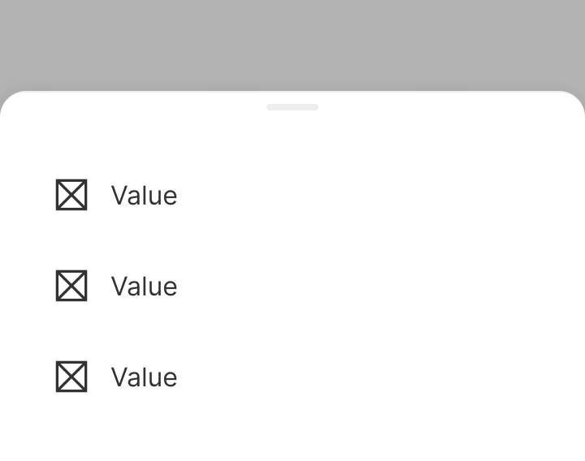 | 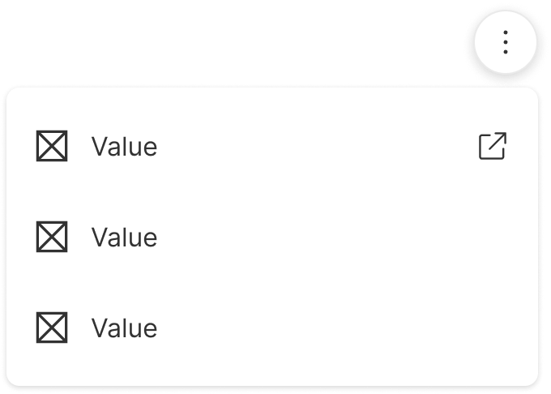 |

### Touch Target & Layout

* **Position:** The dropdown menu can appear at the bottom, top, left, or right of the opening trigger. The opening trigger can be aligned to the left, center, or right. On iOS, it's not possible to position the menu manually — it uses the default native behavior. To avoid complexity, not all positions are available in Figma; feel free to detach the component.

### Breakpoints & Platform Adaptations

| Platform / Breakpoint | Layout & Width Behavior |
| --- | --- |
| **Web — Mobile (0–600px, XXS/XS)** | A [modal bottom sheet](https://zeroheight.com/626199550/p/5942fd-modal-bottom-sheet) is used instead of the dropdown list. |
| **Web — Desktop (>600px, SM and above)** | The dropdown list is used, 320px wide by default, or set to hug the content. See our [grids and breakpoint guidelines](https://zeroheight.com/626199550/p/04fc9a-grids-and-breakpoints). |
| **Android / iOS** | Both the dropdown list and modal bottom sheet components can be used regardless of screen size. |

---

## Content & UX Writing

* **Capitalization:** Sentence case without punctuation.
* **Label Formula:** Lead with an action verb that encourages action, in the infinitive tense.
* **Length Limits:** Try to keep menu item labels under 2 lines.
* For more information, refer to the [UX Writing principles](https://zeroheight.com/626199550/p/324518-intro).

---

### Menu items

The actions in the list should be clear and inciting. Our users should be able to anticipate what will happen when they click on an action.

Menu items should lead with an action verb that encourages action, in the infinitive tense.

Use sentence case without punctuation.

Try to keep it under 2 lines.

For more information on content guidelines, please refer to the UX Writing principles.

## Accessibility (a11y)

Not documented
