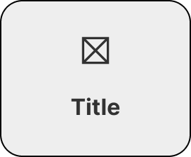

<!-- Source: https://avivgroup.atlassian.net/wiki/spaces/ADS/pages/2832007251/Button+card | Last modified: Aug 13, 2026 -->

# Button card

Button cards are prominent calls to action that can be used alone or in a group, with icons or pictograms.


| Figma | Web | iOS | Android |
| --- | --- | --- | --- |
| Ready ✅ | To Do 🚧 | To Do 🚧 | To Do 🚧 |

[Button card on Figma](https://www.figma.com/design/xxqSJcKOphrgimxRQbvtfe/2.-Gemini-Components-Library?node-id=3-7271)

---

## Usage

Button cards are prominent clickable containers. They are mainly used as navigational elements, for example, to navigate from an overview to a detail page.

### When to use

* As a prominent call to action, alone or in a group, to navigate from an overview to a detail page

### When NOT to use

* For selection — *Use Select card group instead.*
* When more flexible content (images or descriptions) is needed — *Use Cell content, wrapped in a card, instead.*

### Variant Selection Flow

```
Alignment
├─ Single card, narrow space or short label → Vertical
├─ Single card, wide space or longer label → Horizontal
└─ In a group → every card in the group takes the same alignment

Leading visual
├─ A rich, illustrative action → Illustration
├─ A simple, recognisable action → Icon
└─ The label alone is clear → Neither
   └─ Never mix icons and illustrations in the same section
```

### Usage Guidance

| DO | DON'T | CAUTION |
| --- | --- | --- |
|  **DO:** Use button cards to navigate to other pages. |  **DON'T:** Use button cards for selection. Use select cards instead. | **CAUTION:** If you need more flexible button cards that include images or descriptions, for example, consider using cell contents and wrapping them in a card. |

### Related Components

| Component | Priority | Usage | Example Scenario |
| --- | --- | --- | --- |
| **Button card** | — | Button cards are prominent calls to action that can be used alone or in a group, with icons or pictograms. | — |
| [**Select card group**](../select-card-group/select-card-group.md) | High | Select cards are selection elements in forms. | When the goal is selection rather than navigation |
| [**Cell content**](../cell-content/cell-content.md) | Medium | Cell contents are flexible building blocks that can be either clickable or non-clickable. When placed inside cards, they can be used as navigational elements. | When you need more flexible button cards that include images or descriptions |
| [**Button**](../button/button.md) | Medium | Buttons are used to trigger an immediate action. | Button redirects here when: Prominent navigational entry point with icon or illustration |
| [**Card**](../card/card.md) | Medium | Cards are flexible containers used to visually group content. | Card redirects here when: The whole container is a single navigational action |

---

## Variants & Modifiers

### Alignment

Button cards are available with vertical and horizontal alignment. Which one to use depends on the content inside the card, the available space on the screen, and the overall visual design of the page.

#### Single button card

| Vertical | Horizontal |
| --- | --- |
|  |  |

#### Button card group

| Horizontal | Vertical |
| --- | --- |
|  |  |

### Modifiers

#### Icons and illustrations

Use icons or illustrations to make the button cards more prominent and emphasize the action stated in the label.

| With illustration | With icon | Without illustration or icon |
| --- | --- | --- |
|  |  |  |

| DO | DON'T |
| --- | --- |
|  **DO:** Only use one type of button card in the same section. |  **DON'T:** Don't mix icons and illustrations in the same section. |

---

## Behavior & Responsiveness

### Interactive States & Loading

Button cards have the states default, hover, pressed and disabled.

| Default | Hover | Pressed | Disabled |
| --- | --- | --- | --- |
|  |  |  |  |

Button cards in a group all have the same height. In development, the height is automatically adjusted to the largest card.

| DO | DON'T | CAUTION |
| --- | --- | --- |
|  **DO:** Button cards in a group all have the same height. In development, the height is automatically adjusted to the largest card. |  **DON'T:** Don't use different heights in the same section. |  **CAUTION:** Avoid using more than 8 button cards as the list gets very long and it's harder to scan for the user. |

### Touch Target & Layout

| Horizontal group | Vertical group | Single cards |
| --- | --- | --- |
|  Min-width: 288px Max-width: 524px |  Min-width: 136px Max-width: 344px |  Vertical: Min-width 136px, max-width 344px Horizontal: Min-width 156px, max-width 524px |

| DO | DON'T |
| --- | --- |
|  **DO:** To ensure easy scannability button cards are aligned to the left. |  **DON'T:** Don't center align button cards. |

### Breakpoints & Platform Adaptations

Not documented

---

## Content & UX Writing

* **Capitalization:** Sentence case, without punctuation.
* Button card labels should be clear and concise. Our users should be able to anticipate where the button card leads to.
* For more information on content guidelines, please refer to the [UX Writing principles](https://zeroheight.com/626199550/v/latest/p/324518-intro).

| DO | DON'T |
| --- | --- |
|  **DO:** Use a maximum of 2-3 lines in the vertical variant. |  **DON'T:** Avoid using more than 2-3 lines in the vertical variant. |

| DO | DON'T |
| --- | --- |
|  **DO:** Use a maximum of 2 lines in the horizontal variant. |  **DON'T:** Avoid using more than 2 lines in the horizontal variant. |

---

## Accessibility (a11y)

Not documented
