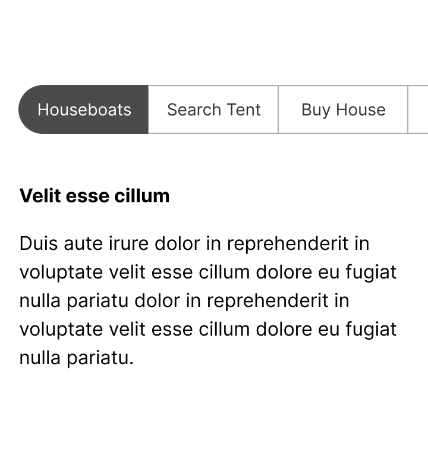
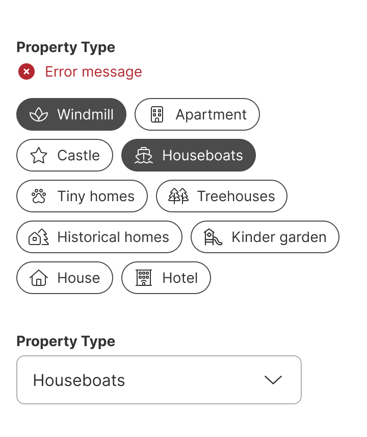
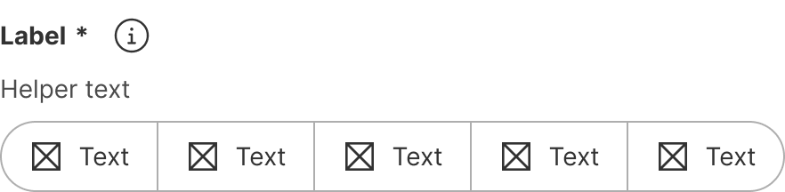
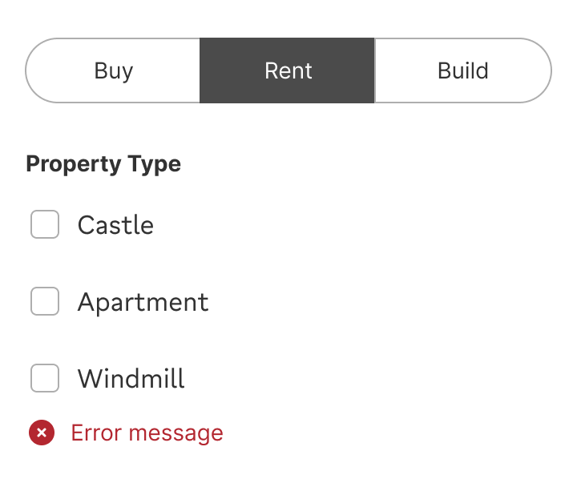
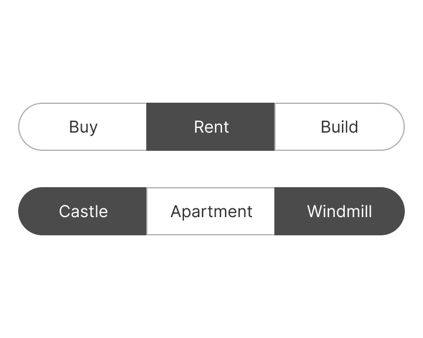
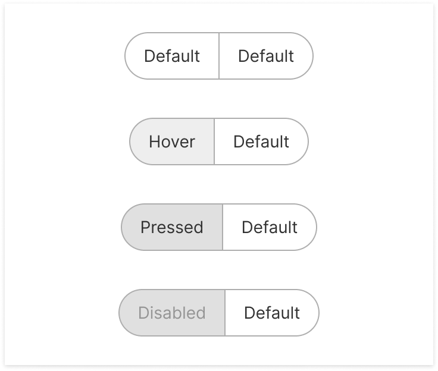
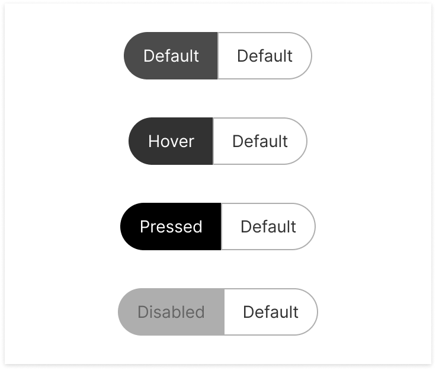
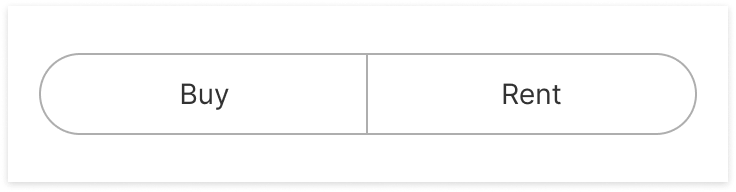
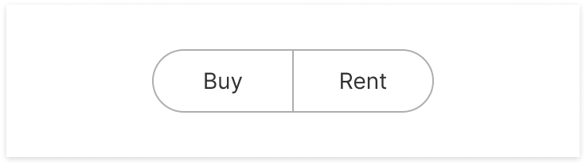
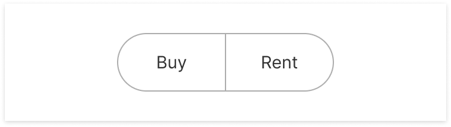

Button groups display multiple related choices in a horizontal row, allowing users to select one or more options.


| Figma | Web | iOS | Android |
| --- | --- | --- | --- |
| Ready ✅ | Ready ✅ | Ready ✅ | Ready ✅ |

* [Button group on Figma](https://www.figma.com/design/xxqSJcKOphrgimxRQbvtfe/2.-Gemini-Components-Library?node-id=3-7272)
* [Button group on Storybook](https://gemini-storybook.prompt-scorpion-preview.aws.aviv.eu/?path=/docs/ui-action-buttongroup--docs)

---

## Usage

Button groups allow users to select one or more options from a group. They are similar to [radio buttons](https://zeroheight.com/626199550/p/55bfd7-radio-button-group) (single-select) and [checkboxes](https://zeroheight.com/626199550/p/41df87-checkbox-group) (multi-select).

### Platform

The button group component is available on all platforms.

| DO | DON'T |
| --- | --- |
|  **DO:** Use the button group component on all platforms. |  **DON'T:** Don't replace the button group component by the native iOS segmented control. |

### When to use

**Button group** — a set of related choices shown as always-visible buttons, single- or multi-select, up to 7 options.

### When NOT to use

| Instead, when… | Use |
| --- | --- |
| Standard form styling with labels and helper text is needed | **Radio button group** / **Checkbox group** |
| Options benefit from icons or illustrations | **Select card group** |
| Switching between view modes rather than setting a value | **Segmented control** |
| The list is long or space is constrained | **Dropdown** |

### Variant Selection Flow

```
Number of items
├─ 2 to 7 → Standard
└─ 8 or 9 → Energy selection on desktop only
   └─ Otherwise, above 7: multi-select → Chip group; single-select → Dropdown

Icons
├─ Icon with label → Preferred
└─ Icon without label → Only when the icon's meaning is unmistakable
   └─ Never mix icon-only and icon-with-label items in one group

Border highlight
└─ Energy and CO₂ selection only

In a form
└─ Add the header with a clear, concise label, and helper text for accessibility
```

### Usage Guidance

| DO | DON'T |
| --- | --- |
|  **DO:** Use button groups inside forms. |  **DON'T:** Avoid using the button group as navigation. |

### Related Components

| Component | Priority | Usage | Example Scenario |
| --- | --- | --- | --- |
| **Button group** | — | Button groups display multiple related choices in a horizontal row, allowing users to select one or more options. | — |
| [**Radio button group**](../radio-button-group/radio-button-group.md) | High | Single-select alternative | Only one option can ever be selected at a time |
| [**Checkbox group**](../checkbox-group/checkbox-group.md) | High | Multi-select alternative | Users need to select several options at once |
| [**Button**](../button/button.md) | Medium | Buttons are used to trigger an immediate action. | Button redirects here when: Choosing from a set of related options |
| [**Segmented control**](../segmented-control/segmented-control.md) | Medium | Segmented controls are used to select one option from a group of mutually exclusive choices. | Segmented control redirects here when: The choice is a form value |
| [**Action menu**](../action-menu/action-menu.md) | Medium | Action menus display context-specific actions in a dropdown list. | Action menu redirects here when: All options always visible, ≤7 |

---

## Variants & Modifiers

### Number of items

The button group contains 2 to 9 items. Button groups with more than 7 items are mainly used for energy selection on desktop.

| DO |
| --- |
|  **DO:** Limit button group items to 7 or fewer for most cases to avoid accessibility problems. |
|  **DO:** If you want to display more than 7 options use chip groups for multi-select and dropdowns for single-select instead. |

| CAUTION |
| --- |
|  **CAUTION:** More than 7 items are only used in the energy selection. |

| &nbsp; | &nbsp; | &nbsp; | &nbsp; |
| --- | --- | --- | --- |
|  |  |  |  |

| &nbsp; | &nbsp; | &nbsp; | &nbsp; |
| --- | --- | --- | --- |
|  |  |  |  |

### Modifiers

#### Icons

Icons can be added as visual cues to provide clarity to the user. The icon is always to the left of the label.

| DO | DON'T | CAUTION |
| --- | --- | --- |
|  **DO:** Combine icons with text for clarity. |  **DON'T:** Avoid mixing different combinations. |  **CAUTION:** Make sure icons clearly communicate its meaning when they are used without a label. |

| Icon only | Icon left | No icon |
| --- | --- | --- |
|  |  |  |

#### Border highlight

The highlight is used for energy and co2 selection.

| &nbsp; | &nbsp; |
| --- | --- |
|  |  |

#### Header

When the button group is used in a form add the header and use a clear and concise label. Go to the [form guidelines](https://zeroheight.com/626199550/p/81b84d-forms/t/page-81b84d-92550230-54) for more information.



#### Helper Text

Include a helper text to improve accessibility. Go to the [form guidelines](https://zeroheight.com/626199550/p/81b84d-forms/t/page-81b84d-92550230-71) for more information.

| Left helper text | Left and right |
| --- | --- |
|  |  |

### Selection

For single selection, the button group allows users to select one item. For multiple selection, users can select multiple items.

| DO | DON'T |
| --- | --- |
|  **DO:** Use checkboxes, radio buttons, or chip groups to avoid having both single- and multi-select button groups on the same page. |  **DON'T:** Avoid mixing single-select and multi-select. |

| Single-select | Multi-select |
| --- | --- |
|  |  |

---

## Behavior & Responsiveness

### Interactive States & Loading

* **Default / Hover / Pressed / Disabled:** Button groups have the states default, hover, pressed and disabled, both in selected and unselected modes.

| Unselected | Selected |
| --- | --- |
|  |  |

### Touch Target & Layout

* **Touch Target:** Available in 40px and 48px heights.
* **Width Adaptability:** Hugs content by default; can be changed to fill the container (full-width).

| DO | DON'T |
| --- | --- |
|  **DO:** Use short labels of similar lengths. |  **DON'T:** Avoid wrapping onto new lines. |

| Hug content | Fill container |
| --- | --- |
|  |  |

#### Height

The button group is available in 40 and 48px height.

| 40px | 48px |
| --- | --- |
|  |  |

### Breakpoints & Platform Adaptations

Not documented

---

## Content & UX Writing

* **Capitalization:** Start with a capital letter; do not use punctuation (nor colons).
* **Label Formula:** Noun form, e.g. {Noun}.
* **Length Limits:** 1-3 words, of similar length between items.

For information on header and helper texts please go to the [form guidelines](https://zeroheight.com/626199550/p/81b84d-forms/t/page-81b84d-92550230-71). For more information on content guidelines, please refer to the [UX Writing principles](https://zeroheight.com/626199550/v/latest/p/324518-intro).

---

## Accessibility (a11y)

Not documented
