Buttons are used to trigger an immediate action. Button labels express what action will occur when the user interacts with it.

  <!-- order-inferred, please verify -->
| Figma | Web | iOS | Android |
| --- | --- | --- | --- |
| Ready ✅ | Ready ✅ | Ready ✅ | Ready ✅ |

* [Button on Figma](https://www.figma.com/file/xxqSJcKOphrgimxRQbvtfe/2.-Gemini-Components-Library?type=design&node-id=11%3A27&mode=design&t=dkkP9LV7KntXJ8DP-1)
* [Button on Storybook](https://gemini-storybook.prompt-scorpion-preview.aws.aviv.eu/?path=/docs/ui-action-button--docs)

---

## Usage

Buttons are clickable elements that are used to trigger actions. They communicate calls to action to the user and allow users to interact with pages in a variety of ways. Button labels express what action will occur when the user interacts with it.

However, buttons are not intended to be navigational elements and should not be used to navigate to different areas of a website or app. Using buttons for navigation can confuse users, as buttons are generally associated with actions like submitting forms, triggering events, or performing specific tasks. For navigation, links should be used instead, as they are specifically designed to guide users to different pages or sections, ensuring a clear and intuitive user experience.

**Navigation button:** To guide users back to the previous page, use a tertiary button featuring a left-facing arrow and the label "Back." The recommended spacing between header and button depends on the content underneath: if there is a headline, 24px is recommended, but the spacing can be larger if there is an empty state below, for example.

**Read more button:** Use a "Read more" button to display additional content only when users choose to see it. By expanding or collapsing text, users control what they want to read, which makes interfaces cleaner and easier to navigate. The overlapping gradient indicates that the text is expandable. The read more button uses a text button, which is a different component than the normal button.

### Platform

On iOS and Android, an animated floating button is available. When the user starts scrolling, the button smoothly transitions to a smaller, circular icon button. The animation uses a duration of `500ms` and an easing `ease`.

### When to use

**Button** — the user triggers an immediate action — save, submit, share, open a modal.

### When NOT to use

| Instead, when… | Use |
| --- | --- |
| Navigation | **Link** |
| Full button weight is visually too heavy | **Text button** |
| Prominent navigational entry point with icon or illustration | **Button card** |
| Choosing from a set of related options | **Button group** |

### Variant Selection Flow

```
Emphasis
├─ The main call to action → Primary — once per section only
├─ A supporting action beside a primary → Secondary
├─ A less prominent, independent, or sub-task action → Tertiary
└─ Destructive and irreversible → Danger — consider a confirmation step after it

Size — always match the size of an adjacent button or field
├─ Default → 40px
├─ Generous whitespace around it → 48px
└─ Dense layout → 32px

Context
├─ Overlapping an image or a map → Floating
└─ On a normal page surface → Standard

Icon
├─ The icon reinforces the label → Icon with label, icon on the left by default
└─ The action is unmistakable from the icon alone → Icon-only
   └─ Never place a bare interactive icon outside a button

Badge
└─ Dynamic attention-grabbing information — notifications, counts, active filters → Add a badge
```

### Usage Guidance

| DO | DON'T |
| --- | --- |
|  **DO:** Use buttons to trigger actions, such as sharing, saving or opening a modal with a contact form. |  **DON'T:** Don't use buttons as navigational elements. Instead, use links when the desired action is to take the user to a new page. |

### Related Components

| Component | Priority | Usage | Example Scenario |
| --- | --- | --- | --- |
| **Button** | — | Buttons trigger actions. | — |
| [**Link**](../link/link.md) | High | Links are navigational elements that take users to different pages or sections. | Navigation |
| **Text button** | High | A distinct component from Button, for when full button weight is too heavy. | Full button weight is visually too heavy |
| [**Button card**](../button-card/button-card.md) | High | Button cards are prominent calls to action that can be used alone or in a group, with icons or pictograms. | Prominent navigational entry point with icon or illustration |
| [**Button group**](../button-group/button-group.md) | High | Button groups display multiple related choices in a horizontal row, allowing users to select one or more options. | Choosing from a set of related options |

---

## Variants & Modifiers

### Emphasis

These different types of buttons are based on the level of emphasis we want to give to various actions. The most important aspect is to establish a visual hierarchy among the buttons in your UI. Keep these best practices in mind.


Proportion of emphasis used across AVIV products

| Emphasis | Purpose |
| --- | --- |
| Primary | For the main call to action on the page. Primary buttons should only appear once per section. |
| Secondary | For secondary actions on each page. Secondary buttons can be used in conjunction with a primary button. |
| Tertiary | For less prominent, and sometimes independent, actions. Tertiary buttons can be used in isolation or paired with a primary button when there are multiple calls to action. Tertiary buttons can also be used for sub-tasks on a page where a primary button for the main and final action is present. |
| Danger | Reserved for destructive actions. These actions normally delete user's data and cannot be reverted. Depending on the severity of the action a confirmation modal can follow a Danger button action. |

| DO | DON'T |
| --- | --- |
|  **DO:** Use only one primary button per section. |  **DON'T:** Don't use more than one primary button per section. |

| DO |
| --- |
| 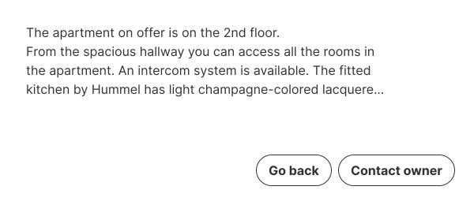 **DO:** You can use secondary and tertiary buttons without the need to include a primary one. |
|  **DO:** You can group multiple secondary and tertiary buttons. |

| CAUTION |
| --- |
| 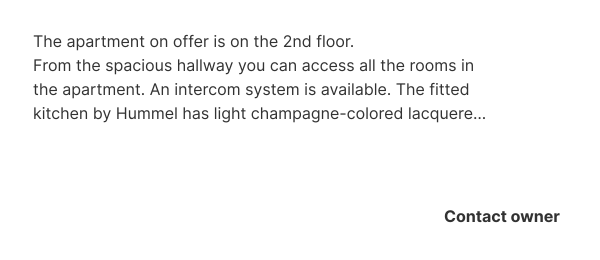 **CAUTION:** Be cautious using a standalone tertiary button as without context these buttons could be overlooked as actions. |

Data tracking in the [CDP](https://avivgroup.atlassian.net/wiki/spaces/ADS/database/1123451029) showed that the button change from secondary to tertiary initially caused a short-term drop in engagement but led to a sustained long-term increase. It is now performing the same / slightly better.

| Primary | Secondary | Tertiary | Danger |
| --- | --- | --- | --- |
|  |  |  |  |

### Size

At AVIV we use our 40px height button as the default but there's no strict rule that prevents designers from using the 48px or 32px height one, however when using the different sizes be mindful of the white space around them: the more white space around a button or a group of buttons you'll have, the more chances to use a bigger button.

| DO | DON'T |
| --- | --- |
|  **DO:** Use the same size of the button or field aside. | **DON'T:** Do not use a different size between two buttons aside or the field next to the button. |

### Context

Buttons change appearance depending on their context and background to better adapt to the environment, maintaining the same level of accessibility and usability.

| DO |
| --- |
|   <!-- order-inferred, please verify --> **DO:** Use the floating variant for buttons that overlap images. |
|  **DO:** Use the floating variant for buttons that overlap images. |

### Modifiers

#### Icons

Icons are used to emphasize the action stated in the label of the button. By default we use the left aligned button. Icon-only buttons should contain icons that easily depict the action intended.

| DO | DON'T |
| --- | --- |
|  **DO:** Icons that serve an interactive function must be placed within an icon-only button. This ensures accessibility, and clear affordance for user interactions. |  **DON'T:** Icons should not be added to layouts with the intent of being interactive. Icons themselves do not support different states or interactions and must be placed within appropriate interactive components, such as buttons, to ensure usability and accessibility. |

| Icon only | Icon left | Icon right |
| --- | --- | --- |
|  |  | 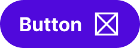 |

#### Badge

Badges in buttons are used to display dynamic information that grabs the user's attention. They can be used for things like notifications, alerts, or filtering.

---

| &nbsp; | &nbsp; | &nbsp; |
| --- | --- | --- |
| 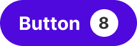 | 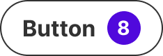 | 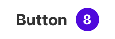 |

## Behavior & Responsiveness

### Interactive States & Loading

* **Default / Hover / Pressed:** Buttons have the states default, hover, pressed and disabled.
* **Disabled State Guidance:** We don't recommend using disabled buttons in most cases. They can be frustrating because they provide no feedback or information about why the button is disabled or what the user needs to do to enable it. This can lead to confusion and a negative user experience. This lack of guidance adds to the cognitive load and can make them inaccessible to neurodivergent people. In addition the low-contrast text is difficult to read for people with visual impairments. [User feedback from a Hotjar survey in the estimation funnel](https://docs.google.com/spreadsheets/d/1JzOYL405ef3BOIfBJ2nZwaXvxdSdubZNS04VhMvOJdo/edit?pli=1&gid=0#gid=0) showed that users didn't understand why the continue button was disabled and what they needed to do to enable it.

| DO | DON'T |
| --- | --- |
|  **DO:** Keep the button active and mark mandatory fields as required. Show error messages when the user clicks the button but hasn't filled all mandatory fields. |  **DON'T:** Avoid using disabled buttons. |

**Loading:** This state is typically triggered when the action initiated upon click involves an API call or server query. This provides the user with a visual indication that their action is being processed. When a button is in a Loading state, the user can still navigate the page. However, if they initiate a new action before the previous one is completed, a message or alert may appear.

| Default | Hover | Pressed | Disabled |
| --- | --- | --- | --- |
|  |  |  |  |

#### Disabled button

| DO | DON'T |
| --- | --- |
| <br>**DO:** Keep the button active and mark mandatory fields as required. Show error messages when the user clicks the button but hasn’t filled all mandatory fields. | <br>**DON'T:** Avoid using disabled buttons. |

| Loading (Web) | Loading (Android) | Loading (iOS) |
| --- | --- | --- |
|  |  |  |

#### Touch target

| 32px button | 40px button | 48px button |
| --- | --- | --- |
|  | 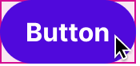 | 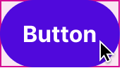 |

### Touch Target & Layout

* **Touch Target:** To ensure accessibility, the touch target of the 32px button has a height of 40px. For all other sizes, the touch target is the same height as the button.
* **Width Adaptability:** The width of the button adapts to the width of its content unless intentionally we span the width to the full of its container, specially in Mobile devices.

| DO |
| --- |
|  **DO:** Use full width buttons on mobile devices. |
|  **DO:** Use full width buttons on smaller containers on desktop devices. |

| 32px height | 40px height | 48px height |
| --- | --- | --- |
| 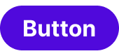 |  | 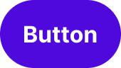 |

| DO | DON'T |
| --- | --- |
| <br>**DO:** Use the same size of the button or field aside | 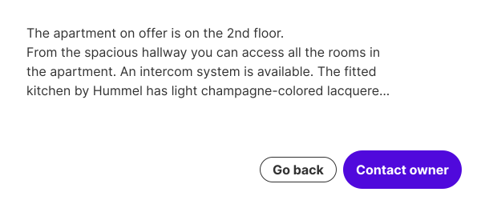<br>**DON'T:** Do not use a different size between two buttons aside or the field next to the button |

#### Context

| Default button | Inverted color button | Over primary color surface button | Over secondary color surface button | Floating button |
| --- | --- | --- | --- | --- |
|  |  |  |  | 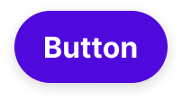 |

| DO |
| --- |
| <br>**DO:** Use the floating variant for buttons that overlap images |
| <br>**DO:** Use the floating variant for buttons that overlap images |

| DO |
| --- |
| <br>**DO:** Use full width buttons on mobile devices |
| <br>**DO:** Use full width buttons on smaller containers on desktop devices |

#### Use cases

#### Navigation button

To guide users back to the previous page, please use a tertiary button featuring a left-facing arrow and the label "Back."

We recommend the following spacing between header and button:

| Breakpoint: XXS - SM (0 - 767px) | Breakpoint: MD - XXXL (> 767px) |
| --- | --- |
| 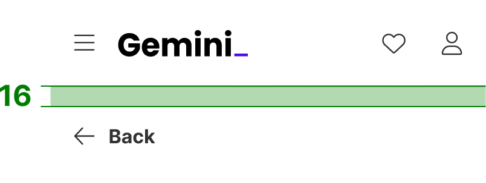 | 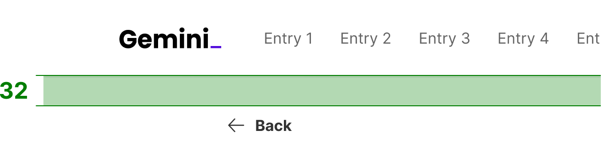 |

The space below the button depends on the content underneath.

#### Read more button

This makes interfaces cleaner and easier to navigate.

| Expanding | Collapsing |
| --- | --- |
| 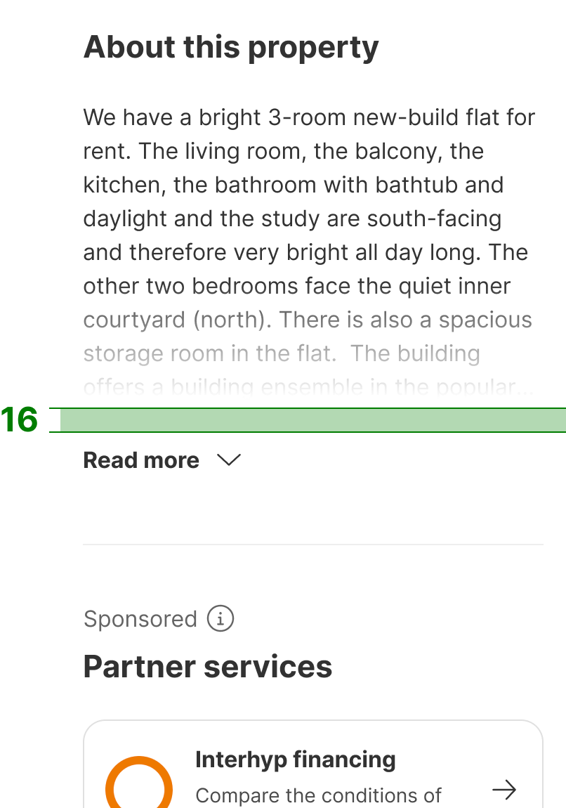 | 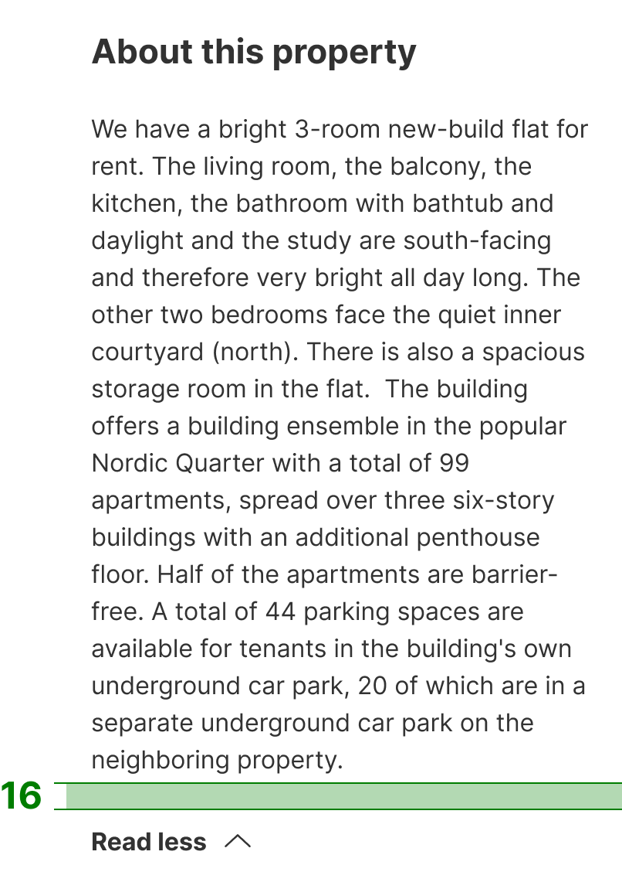 |

This example will be moved to the text button documentation when it's finished.

#### Animated floating button

| Default | Minimized |
| --- | --- |
| 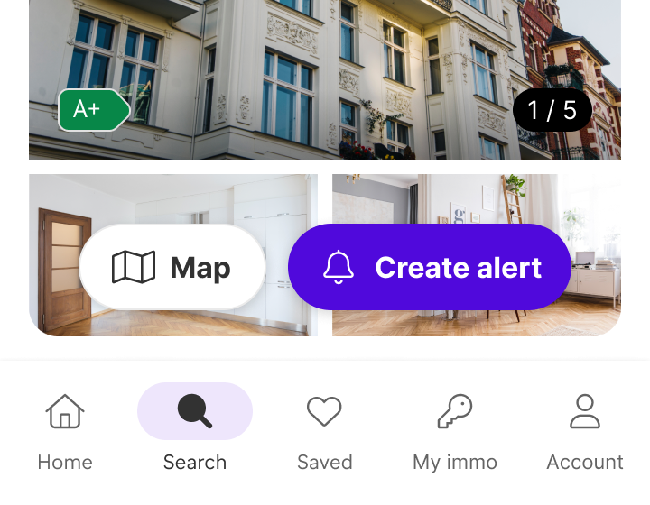 | 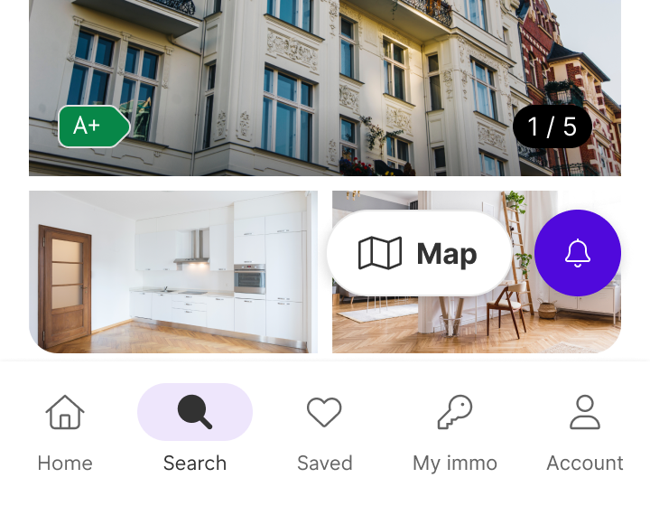 |

### Breakpoints & Platform Adaptations

Not documented

---

## Content & UX Writing

Buttons solicit an action from the user and trigger that action. Buttons should be clear and inciting. Our users should be able to anticipate what will happen when they click a button. Buttons should always lead with an action verb that encourages action, in the infinitive tense. For more information on content guidelines, please refer to UX Writing principles.

* **Capitalization:** Sentence case without punctuation.
* **Label Formula:** {Action Verb} + {Noun}, except in the case of common actions like "Done," "Close," "Cancel," or "OK."
* **Length Limits:** Under 4 words and/or 30 characters maximum in English.

| DO | DON'T |
| --- | --- |
|  **DO:** Give actions a clear naming. |  **DON'T:** Don't give actions a vague naming. |

---

## Accessibility (a11y)

Not documented
