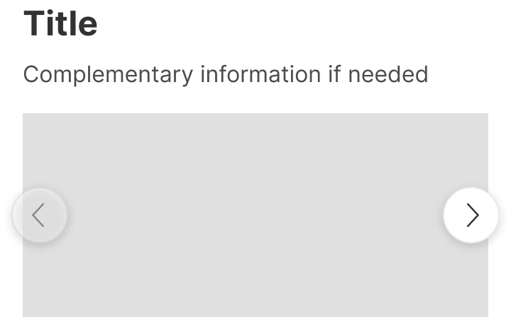
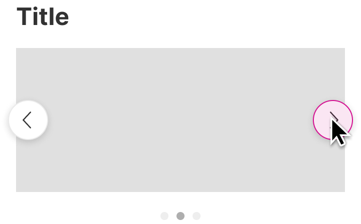
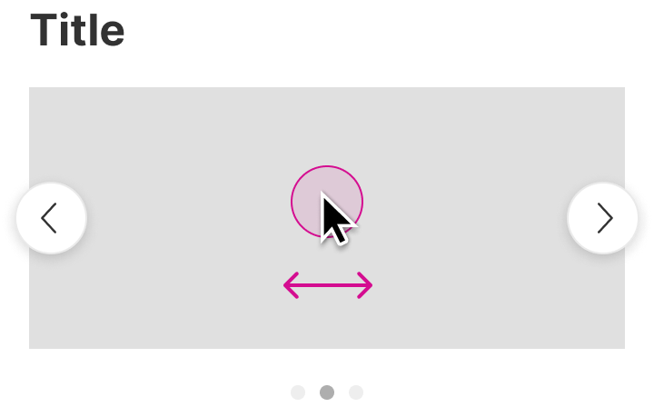

<!-- Source: https://avivgroup.atlassian.net/wiki/spaces/ADS/pages/2830925897/Carousel | Last modified: Aug 17, 2026 -->

# Carousel

Carousels are used to display a collection of items that the users can slide through.

⚠️ Web only


| Figma | Web | iOS | Android |
| --- | --- | --- | --- |
| Ready ✅ | Ready ✅ | N/A | N/A |

* [Carousel on Figma](https://www.figma.com/design/xxqSJcKOphrgimxRQbvtfe/2.-Gemini-Components-Library?node-id=3-7307)
* [Carousel on Storybook](https://gemini-storybook.prompt-scorpion-preview.aws.aviv.eu/?path=/docs/ui-content-carousel--docs)

---

## Usage

Carousels are versatile components that allow users to browse a collection of items (such as images, text, cards or media) by sliding or clicking horizontally through them. They are often used to display multiple pieces of content in a limited space, providing a dynamic and interactive way to explore information.

### Platform

The carousel is only used on the web. On iOS and Android, scrollable horizontal item lists are used.

### When to use

**Carousel** — users browse a horizontal collection of items one by one. **Web only**.

### When NOT to use

| Instead, when… | Use |
| --- | --- |
| All items should be visible simultaneously | **a grid layout, not a component — see Platform limits** |

### Variant Selection Flow

```
Arrow position
├─ Visually focused content, large images → Arrows inside
└─ Arrows would cover content or interactive elements → Arrows above
   └─ On web, desktop and mobile, arrows are mandatory for accessibility

Dots
├─ Space is limited, or the design is visually focused → Dots inside
├─ Dots would cover relevant information → Dots outside
└─ Progress is not useful to show → No dots

Clipped content
├─ Content should align with the rest of the page → Clipped
└─ Content should run to the screen edge → Not clipped

Title and description
├─ A primary identifier is needed → Title
└─ Extra clarity is needed → Add a description — not recommended without a title
```

### Usage Guidance

| DO | DON'T |
| --- | --- |
|  **DO:** Use carousels when you want to highlight related content and encourage user exploration. They are useful if you have limited space but want to display multiple items. |  **DON'T:** Don't use carousels for key messages or calls to action, as they can be hidden if users don't engage with the carousel. Also, don't use them when users need to find information quickly. Carousels can slow down the experience by requiring multiple interactions to view all the content. |

### Related Components

| Component | Priority | Usage | Example Scenario |
| --- | --- | --- | --- |
| **Carousel** | — | Slides horizontally through mixed content such as images, text, cards or media. | — |
| **Image slider** | — | Displays a sequence of images that users can slide through horizontally. | — |

---

## Variants & Modifiers

### Arrow position

Arrows can be positioned inside or above the content. We recommend using the inside arrows for visually focused content and large images. Use the top arrows when you want to avoid covering content, or when the design has interactive elements that need to remain visible.

| CAUTION |
| --- |
|  **CAUTION:** Make sure the arrows don't cover relevant information or interactive elements. If they do, use arrows above the content. |

For accessibility reasons arrows are **mandatory** on the web (desktop and mobile).

| Inside | Above |
| --- | --- |
|  |  |

### Dots

Dots are optional progress indicators that show the current slide. They can be placed inside or outside the content. We recommend placing dots inside the content when space is limited or the design is more focused on visuals, and outside the content when you want to avoid content overlap and improve readability. If the dots are placed inside, change the style of the dots to "contrast".

| CAUTION |
| --- |
|  **CAUTION:** Make sure that dots don't cover relevant information. Use outside dots if they don't. |

| Inside | Outside | No dots |
| --- | --- | --- |
|  |  |  |

### Clipped content

It's possible to show or clip the content that exceeds the carousel container.

| DO |
| --- |
|  **DO:** Use the carousel with clipped content if you want to align the content with other content on the page. |

| DO |
| --- |
|  **DO:** Use the carousel without clipped content if you want the content to reach the edge. |

| Clipped content | Visible content |
| --- | --- |
|  |  |

### Modifiers

#### Title and description

Title and description are both optional. We recommend using the title as the primary identifier, and adding a description when additional clarity or explanation is needed. We don't recommend using the description alone.

| Title and description | Only title | No title or description |
| --- | --- | --- |
|  |  |  |

### Carousel items

Carousel items hold the content. The carousel can be set to automatically adjust the number of items displayed per slide based on the available screen width, or it can be configured to display a fixed number of items per slide. The number of items displayed can also change at different screen sizes (breakpoints), so that more items are displayed when more space is available.

**Figma tip:** To simulate different slide positions in Figma, you can change the item alignment from left to center.

---

## Behavior & Responsiveness

### Interactive States & Loading

* **Disabled State Guidance:** The state of the buttons depends on the slide position — at the beginning and end of the carousel the button becomes disabled.

We recommend limiting carousels to 5-7 slides. This range helps to maintain user interest without overwhelming them, ensuring the most relevant content is seen and easy to navigate.

The carousel slides horizontally by pressing the chevron buttons or dragging the mouse on desktop and swiping on mobile. It's also possible to navigate using the arrow keys on the keyboard.

| Clicking button | Dragging / swiping |
| --- | --- |
|  |  |

#### Button states

| Start | Middle | End |
| --- | --- | --- |
|  |  |  |

### Touch Target & Layout

* **Width Adaptability:** The width of the carousel is fixed and needs to be defined by the designer/developer; the height is automatically determined by the content. The number of items displayed per slide can adapt to available screen width, or be fixed, and can vary across breakpoints.

### Breakpoints & Platform Adaptations

| Platform / Breakpoint | Layout & Width Behavior |
| --- | --- |
| **Any breakpoint** | Number of items displayed per slide can change at different screen sizes, showing more items when more space is available. |

---

## Content & UX Writing

* **Length Limits:** Brief and concise — present only essential information per slide.

Carousels are visually complex, so any text should be brief and concise. Aim to present only essential information, making it easier for users to quickly grasp the content of each slide.

It's best to have only one CTA per slide, or if there are multiple items on a single slide, make sure each item has only one CTA. This helps to avoid overwhelming users with too much content.

For more information on content guidelines, please refer to the [UX Writing principles](https://zeroheight.com/626199550/p/324518-intro).

---

## Accessibility (a11y)

* **Keyboard Navigation:** The carousel can be navigated using the arrow keys on the keyboard, in addition to the chevron buttons, dragging, or swiping.
* **Screen Readers:** Not documented.
