Cell contents are building blocks used to create elements such as lists or button cards.


| Figma | Web | iOS | Android |
| --- | --- | --- | --- |
| Ready ✅ | Ready ✅ | Ready ✅ | Partially available |

* [Cell content on Figma](https://www.figma.com/design/ABqcGx0cmJWozuJ8OoW6f2/2.-GSL-Components-Library?node-id=18359-17763)
* [Cell content on Storybook](https://gemini-storybook.prompt-scorpion-preview.aws.aviv.eu/?path=/docs/ui-content-cellcontent--docs)


_This component has a tool specification: [`cell-content-figma.md`](cell-content-figma.md) — what is true of it in the design tool, and nowhere else._

---

## Usage

The cell content is a flexible building block that can be used to build larger components or layouts. Its adaptable design allows it to be used in different contexts. It can be either clickable or non-clickable.

### When to use

**Cell content** — the building block for list rows and card content: a title, optional body and description, optional icon, image, badge or tag.

**Not selected directly.** **Never select**: choose the container first — **Card** for a grouped block, **Tables** for tabular rows — then compose Cell content inside it. There is no `List` component in any library.

### When NOT to use

| Instead, when… | Use |
| --- | --- |
| You are answering "which component solves this problem" | **Card** or **Tables** |
| Rows are tabular and comparable | **Tables** |
| The whole block is one navigational action | **Button card** |

### Variant Selection Flow

```
Alignment
├─ Plenty of horizontal space, longer content → Horizontal
└─ Horizontal space limited, vertical space available → Vertical

Padding
├─ The container already supplies the inset → 0 (non-clickable only)
├─ Narrow or dense container → 8px
└─ Roomier container → 16px

Text
└─ Title is the primary identifier; add body and description only when they add clarity

Icons and image
├─ Leading visual → Icon or image, on the left
├─ Trailing visual → Icon only, on the right
├─ The row links or triggers an action → Chevron, shown by default
└─ The row leaves the site → External-link icon

Icon alignment (horizontal layouts only)
├─ Default → Middle — leading icon centred on the whole text block
├─ Tall content, the icon should read with the first line → Top
└─ A trailing icon is shown → Middle, always

Badge
└─ Notifications or updates, such as messages or alerts → Badge beside the title

Tag
└─ A status or category label → Tag beside the title
```

### Usage Guidance

| DO |
| --- |
|  **DO:** Wrap the cell content in a card to create clickable cards that navigate users from an overview to a detail page. |
|  **DO:** Separate larger cards with a divider and place multiple cell contents in a container. |
|  **DO:** Use non-clickable cell contents to create tables. |

| DON'T |
| --- |
|  **DON'T:** Don't use cell content for selection. Use select cards instead. |

### Related Components

| Component | Priority | Usage | Example Scenario |
| --- | --- | --- | --- |
| **Cell content** | — | Flexible building block, either clickable or non-clickable; when placed inside [cards](../card/card.md), can be used as navigational elements. | — |
| [**Button card**](../button-card/button-card.md) | Medium | Also navigational, but offers less flexibility than cell content — always clickable. | A simpler, always-clickable navigational tile is enough |
| [**Select card**](../select-card-group/select-card-group.md) | High | Selection elements in forms. | User needs to select an option, not navigate |

---

## Variants & Modifiers

### Alignment

Cell contents are available with horizontal and vertical alignment. Which one to use depends on the available space, the amount of content, and the overall visual design of the page.

| DO |
| --- |
|  **DO:** Use the horizontal layout when there is plenty of horizontal space and the content in the cell is longer. |
|  **DO:** Use the vertical layout where horizontal space is limited but vertical space is available, such as in grid structures. Allows compact display of information in tight spaces. |

| Horizontal | Vertical |
| --- | --- |
|  | 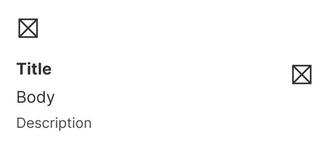 |

### Padding

The cell content is available with 0, 8 and 16px padding. Which one to use depends mainly on the visual design of the container in which the cell content is placed. For narrower designs where space is limited, use 8px; for wider designs, use 16px. Use 0 when the container already supplies the inset and the cell content has to sit flush inside it.

Padding applies to all four sides. It changes the outer inset only — the gaps between icon, text and trailing icon are unchanged, and the height stays driven by the content.

**0 padding is for non-clickable cell contents only.** The clickable combinations were removed from the component set, so only the non-clickable one offers it. The web component still accepts 0 on a clickable cell content — never use it there. Hover, pressed and disabled would paint right up to the edge of the content, with no margin around it.

| 8px | 16px |
| --- | --- |
| 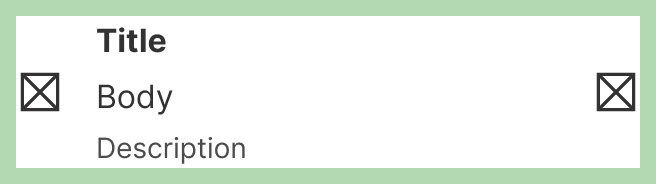 | 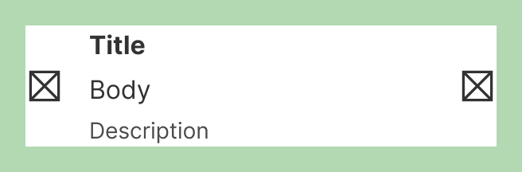 |

### Modifiers

#### Title, body and description

All text elements in the cell content are optional and can be freely combined. We recommend using the title as the primary identifier, and adding the body and description when additional clarity or explanation is needed. In tables, for example, it's possible to use the body text alone. We don't recommend using the description alone.

| Only title | Title and description | Title and body | Only body | Title, body and description |
| --- | --- | --- | --- | --- |
|  | 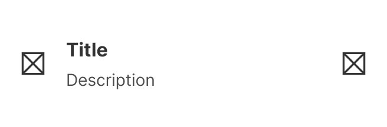 | 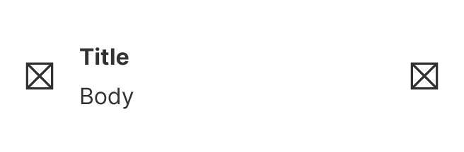 | 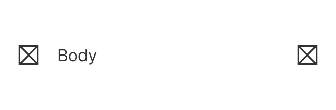 | 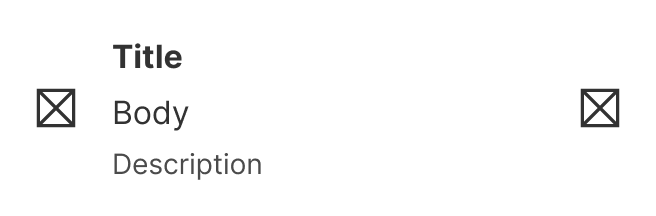 |

#### Icons and image

The cell content contains optional icons and images. Icons and images are available on the left. On the right, only icons are available.

**Link and action icons:** If a link or action is applied to the cell content, the chevron is displayed by default. If an external link is applied, the external link icon is displayed.

How the leading icon sits against the text is a separate setting — see *Icon alignment* below.

| Icon left and right | Icon left | Icon right |
| --- | --- | --- |
|  | 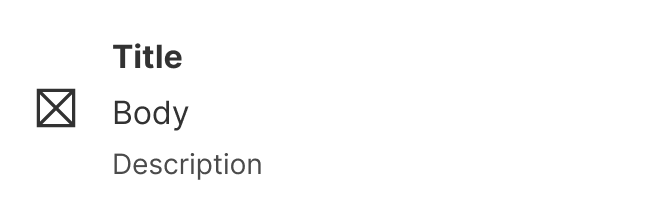 | 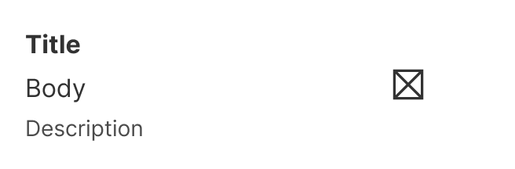 |

| No icon | Image and icon | Only image |
| --- | --- | --- |
| 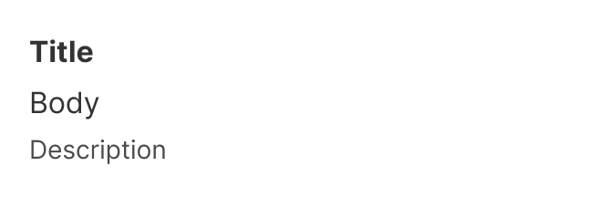 | 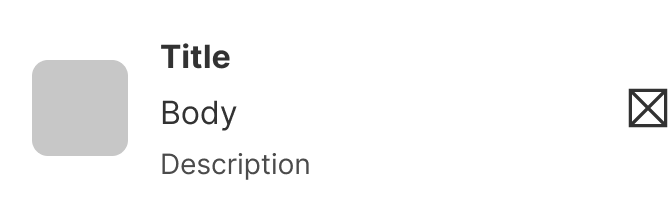 | 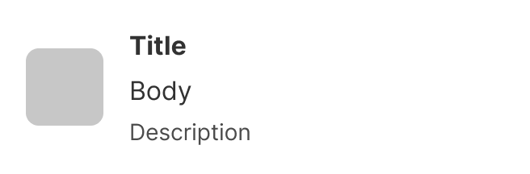 |

**Link and action icons**

| Action and internal link | External link |
| --- | --- |
| 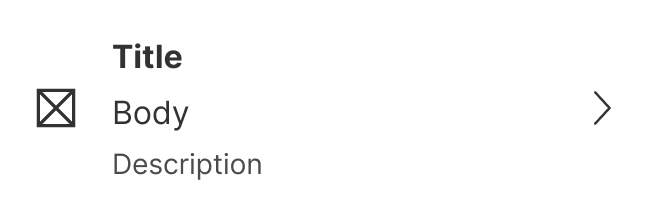 | 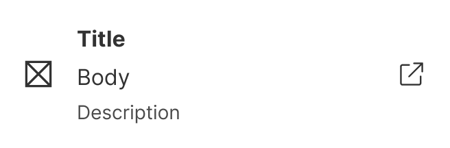 |

#### Icon alignment

Controls how the leading icon sits against the text. **Horizontal layouts only.** Vertical layouts are unaffected and have no such setting.

| Setting | What it does |
| --- | --- |
| **Middle** — the default | The 24×24 leading icon is centred against the whole title, body and description block. |
| **Top** | The leading icon is centred against the first line of text — the 24px title line when there is a title. |

Top does not mean top-edge alignment. The icon and the first line of text are centred against each other, never lined up by their top edges.

**Measured on the live component** (horizontal, 16px padding, title + body + description): under `Middle` the 24×24 icon's centre sits on the centre of the whole text block; under `Top` it sits on the title's own centre. The trailing icon's centre stays on the whole-block centre under both. With a 24px title the icon's top edge lands on the title's top edge as well — that follows from both being 24px tall, and is not the rule.

**With no title, the icon should centre on the first body line. That is design intent and has not been measured** — the title is a toggle rather than a variant, so the behaviour cannot be read off the component set.

The trailing icon is always centred against the whole content block, under both settings.

**If a trailing icon is shown, the leading icon must be Middle.** Nothing prevents Top in that combination — not the component, not the build — so the rule holds by convention alone. A top-aligned leading icon beside a centred trailing icon sits the two visuals on different lines and unbalances the row.

The setting governs the leading placeholder slot, which can hold an icon or an image. An image can stand in for the icon anywhere the icon is used, to build a list or a similar row. **What `Top` does with an image rather than a 24×24 icon is not documented**, and no rule for it exists.

#### Badge

An optional badge can be placed next to the title in the cell content.

| DO |
| --- |
|  **DO:** Use badges to indicate notifications or updates. For example, for messages or alerts. |

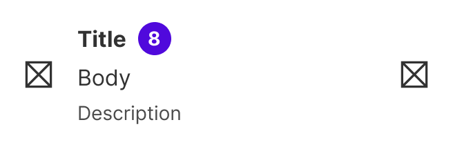

#### Tag

An optional tag can be placed next to the title in the cell content.

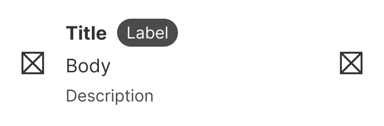

#### Clickable

The cell content can be either clickable or non-clickable.

---

## Behavior & Responsiveness

### Interactive States & Loading

* **Default / Hover / Pressed / Disabled:** The clickable cell content has four states: Default, Hover, Pressed and Disabled.

| Default | Hover | Pressed | Disabled |
| --- | --- | --- | --- |
|  |  | 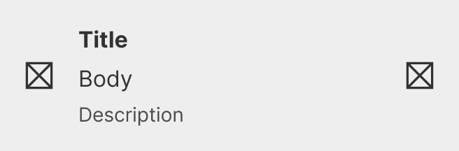 | 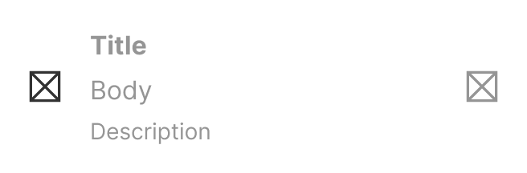 |

#### Touch target

| Clickable cell content | Wrapped in card |
| --- | --- |
| 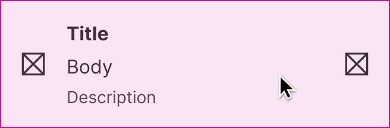 | 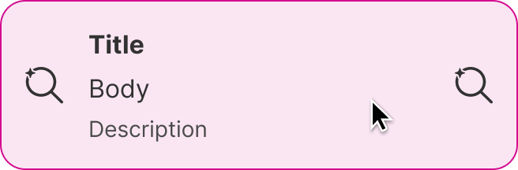 |

### Touch Target & Layout

* **Touch Target:** The entire cell content is clickable. If the cell content is wrapped in a [card](https://zeroheight.com/626199550/p/72edda-card), the corners are cropped by the card container.
* **Width Adaptability:** The cell content adapts to the width of its container, filling the available space according to the size of the container.

### Breakpoints & Platform Adaptations

Not documented

---

## Content & UX Writing

* **Capitalization:** Start each list item with a capital letter; no punctuation at the end of list items.
* **Label Formula:** Not documented.
* **Length Limits:** Keep list items short and concise.

Title, body and description text are all optional and can be multi-line. The **title** helps to structure the content — it's concise and has no punctuation unless it's a question. The **body** should be used to provide additional information to the title, using clear and simple language without overwhelming the user. If additional guidance is needed, use the **description**.

If you use the cell content to create a list, make sure to keep the items short and concise, avoid having more than one list on the screen, start each item with a capital letter, use parallel construction (if one item begins with a verb, each item should begin with a verb), and don't use punctuation at the end of items in a list.

For more information on content guidelines, please refer to the [UX Writing principles](https://zeroheight.com/626199550/p/324518-intro).

---

## Accessibility (a11y)

Not documented
