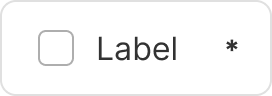
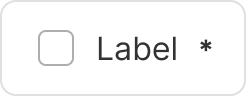
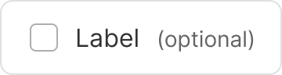
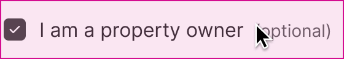

<!-- Source: https://avivgroup.atlassian.net/wiki/spaces/ADS/pages/2830958639/Checkbox | Last modified: Aug 17, 2026 -->

# Checkbox

Checkboxes are used to select one or more options from a list.


| Figma | Web | iOS | Android |
| --- | --- | --- | --- |
| Ready ✅ | Ready ✅ | Ready ✅ | Partially available |

* [Checkbox on Figma](https://www.figma.com/design/xxqSJcKOphrgimxRQbvtfe/2.-Gemini-Components-Library?node-id=3-7276)
* [Checkbox on Storybook](https://gemini-storybook.prompt-scorpion-preview.aws.aviv.eu/?path=/docs/ui-forms-checkbox--docs)

---

## Usage

Checkboxes are selection components that are used for multiple choices. They allow the user to select none, one or more items. They can also be used to display a single option that requires acceptance or confirmation before submission.

### Platform

On the web and iOS, we use custom checkboxes. On Android, we use native checkboxes.

| Web/iOS | Web/iOS | Android | Android |
| --- | --- | --- | --- |
|  |  |  |  |

### When to use

**Checkbox** — a single binary choice that is submitted as part of a form.

### When NOT to use

| Instead, when… | Use |
| --- | --- |
| The setting takes effect immediately | **Toggle** |
| Several related options are presented together | **Checkbox group** |
| The choices are mutually exclusive | **Radio button group** |

### Variant Selection Flow

```
Border
├─ Options need emphasis, or must be clearly separated from one another → With border
└─ Simple, easily distinguished options → Without border

Label
├─ Almost always → With label
└─ Context makes the meaning unambiguous, such as a table row selector → Without label

Header, as with every form component
├─ Mandatory field → Required asterisk to the right of the label
├─ Optional field → Optional mention to the right of the label
├─ Needs an explanation → Tooltip icon
└─ Needs persistent guidance → Helper text
```

### Usage Guidance

| DO | DON'T |
| --- | --- |
|  **DO:** Use a standalone checkbox in forms where the selection takes effect only after the form is submitted. |  **DON'T:** Avoid using a checkbox to toggle a state on and off immediately. Use a switch instead. |
|  **DO:** Use checkboxes to allow users to select one or more options in a list of related choices. |  **DON'T:** Don't use checkboxes for mutually exclusive choices or when only one item can be selected. Use radio buttons instead. |

| CAUTION |
| --- |
|  **CAUTION:** When you want to use checkboxes in a list, consider using the checkbox group component. |

### Related Components

| Component | Priority | Usage | Example Scenario |
| --- | --- | --- | --- |
| **Checkbox** | — | Allows users to select one or more choices independently; used in forms that must be submitted before the change takes effect. | — |
| [**Radio button**](../radio-button-group/radio-button-group.md) | High | Mutually exclusive choices, submitted before the change takes effect. | Only one option can ever be selected at a time |
| [**Toggle**](../toggle/toggle.md) | High | Binary, mutually exclusive choices that take effect immediately, no submit/save needed. | Turning a setting on/off with instant effect |

---

## Variants & Modifiers

### Border

Checkboxes can be used with or without a border. Add a border when you want to emphasize the options more clearly. Borders can also help to distinguish each checkbox.

| Without border | With border |
| --- | --- |
|  |  |

### Label

Checkboxes should be used with a label in most cases. Only in a few exceptions, when the context is clear, can checkboxes be used without labels. For example, in tables.

| With label | Without label |
| --- | --- |
|  |  |

### Modifiers

Checkboxes have the same elements as all form components:

* Required asterisk to the right of the label (visible by default)
* Optional mention to the right of the label
* Tooltip to the right of the checkbox

See the [form guidelines](https://zeroheight.com/626199550/p/81b84d-forms/t/page-81b84d-92550230-54) for more information.

---

| Required | Required | Optional |
| --- | --- | --- |
|  |  |  |

| Optional | Tooltip | Tooltip |
| --- | --- | --- |
|  |  |  |

## Behavior & Responsiveness

### Interactive States & Loading

* **Default / Hover / Pressed / Disabled:** Checkboxes have the states default, hover, pressed, and disabled. They can be selected, unselected or indeterminate, and they can be in an error state.

#### Neutral

| Default | Hover | Pressed | Disabled |
| --- | --- | --- | --- |
|  |  |  |  |

| Default selected | Hover selected | Pressed selected | Disabled selected |
| --- | --- | --- | --- |
|  |  |  |  |

| Default indeterminate | Hover indeterminate | Pressed indeterminate | Disabled indeterminate |
| --- | --- | --- | --- |
|  |  |  |  |

#### Error

| Default | Hover | Pressed | Disabled |
| --- | --- | --- | --- |
|  |  |  |  |

| Default selected | Hover selected | Pressed selected | Disabled selected |
| --- | --- | --- | --- |
|  |  |  |  |

| Default indeterminate | Hover indeterminate | Pressed indeterminate | Disabled indeterminate |
| --- | --- | --- | --- |
|  |  |  |  |



### Touch Target & Layout

* **Width Adaptability:** The width of the checkbox component is determined by its content. According to the [form guidelines](https://zeroheight.com/626199550/p/81b84d-forms/t/page-81b84d-92550230-13), the max-width should be kept at 448px.

Not only the checkbox itself is clickable, but also the entire row. The row height is 48px.

### Breakpoints & Platform Adaptations

Not documented

---

## Content & UX Writing

* **Capitalization:** Start each list item with a capital letter; don't use commas or semicolons at the end of each line.
* **Label Formula:** Not documented.
* **Length Limits:** Less than 3 words; don't use an ellipsis to cut off label text — wrap to 2 lines if necessary.

**Checkbox labels:** Always use clear and concise labels for checkboxes. Labels appear to the right of checkbox inputs. A label is always required in the code for a checkbox, even if it's not shown in the interface.

**Overflow content:** Make sure that the text under the checkbox wraps to the next line, and that the checkbox and its label are aligned at the top.

For more information on content guidelines, please refer to the [UX Writing principles](https://zeroheight.com/626199550/p/324518-intro).

---

### Checkbox lists

Lists that use checkboxes should:

* **Start with a capital letter**

* Not use commas or semicolons at the end of each line

## Accessibility (a11y)

* **Keyboard Navigation:** Not documented.
* **Screen Readers:** A label is always required in the code for every checkbox, even when it's not visibly shown in the interface, so it can still be announced.
