Chip groups are collections of chips that allow users to filter, select, or manage multiple related options simultaneously.


| Figma | Web | iOS | Android |
| --- | --- | --- | --- |
| Ready ✅ | Ready ✅ | To do 🚧 | To do 🚧 |

* [Chip group on Figma](https://www.figma.com/design/xxqSJcKOphrgimxRQbvtfe/2.-Gemini-Components-Library?node-id=3-7273)
* [Chip group on Storybook](https://gemini-storybook.prompt-scorpion-preview.aws.aviv.eu/?path=/docs/ui-action-chipgroup--docs)

---

## Usage

Chip groups are dynamic, interactive collections of chips that allow users to filter content, toggle options, or make multiple selections within a related set, providing an efficient way to organize and manage complex choices or actions.

### When to use

**Chip group** — lightweight multi-select filtering or input outside a structured form.

### When NOT to use

| Instead, when… | Use |
| --- | --- |
| Inside a structured form with labels and helper text | **Checkbox group** |
| Constrained space or numerous options | **Dropdown** |
| Filtering a SERP or data table with structured panels | **Filter bar** |
| The element is non-interactive | **Tag** |

### Variant Selection Flow

```
Type
├─ Toggling filters on and off across a set of options → Filter chip, selectable
├─ Representing user input or a selection inside a form, removable → Input chip, selectable
└─ Triggering a quick, secondary contextual action → Action chip, which cannot be selected
   └─ Never use action chips for primary navigation or for critical actions
   └─ Whether one group may mix types is not documented

Wrapping — the group's own layout, not the chip's
└─ The chips do not fit the container width → They wrap to a new line
   └─ How many chips a group may hold is not documented

Icons
└─ Optional — add one only when it makes the chip's purpose clearer
```

### Usage Guidance

| DO | DON'T |
| --- | --- |
|  **DO:** Use chip groups to allow users to filter content, make selections, or perform actions. | 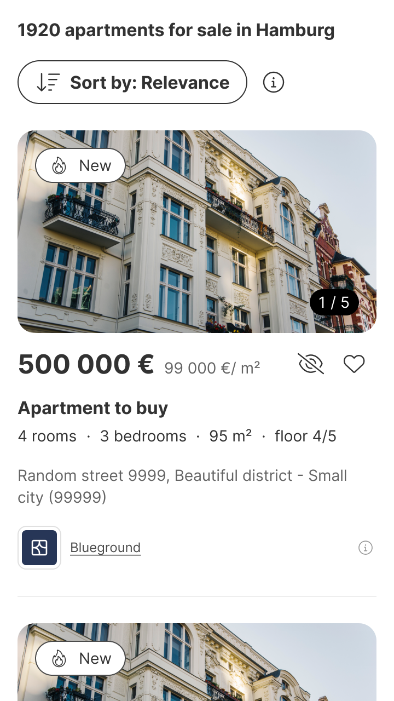 **DON'T:** Don't use chip groups to display static, non-interactive labels. Use tags instead. |

### Related Components

| Component | Priority | Usage | Example Scenario |
| --- | --- | --- | --- |
| **Chip group** | — | Collections of chips that allow users to filter, select, or manage multiple related options simultaneously. | — |
| [**Chip**](../chip/chip.md) | High | Dynamic, clickable standalone component for selecting, filtering, or removing items. | Only a single, standalone chip is needed |
| [**Button**](../button/button.md) | Medium | Triggers actions. | A primary or critical action, not filtering/selection |
| [**Tag**](../tag/tag.md) | High | Non-interactive component for fixed information such as labels, categories, or statuses. | Displaying a static label or status with no interaction |
| [**Checkbox group**](../checkbox-group/checkbox-group.md) | High | Checkbox groups are used to select multiple options from grouped checkboxes. | Inside a structured form with labels and helper text |
| [**Dropdown**](../dropdown/dropdown.md) | High | Dropdowns are used to select one option from a list. | Constrained space or numerous options |
| [**Filter bar**](../filter-bar/filter-bar.md) | High | Filter bars are used to narrow down search results or displayed content based on selected criteria. | Filtering a SERP or data table with structured panels |

---

## Variants & Modifiers

### Type

#### Filter chips

Filter chips are used to represent filters in a set of options. They allow users to toggle selections on and off, providing a way to dynamically apply or remove filters.

| DO |
| --- |
|  **DO:** Use filter chips to filter content. |

| Default | Hover | Pressed |
| --- | --- | --- |
|  | 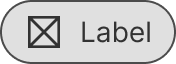 | 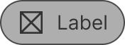 |

| Default selected | Hover selected | Pressed selected |
| --- | --- | --- |
|  |  |  |

#### Input chips

Input chips represent user input, selections, or entries within a form. They can be removed with the close icon.

| DO |
| --- |
| 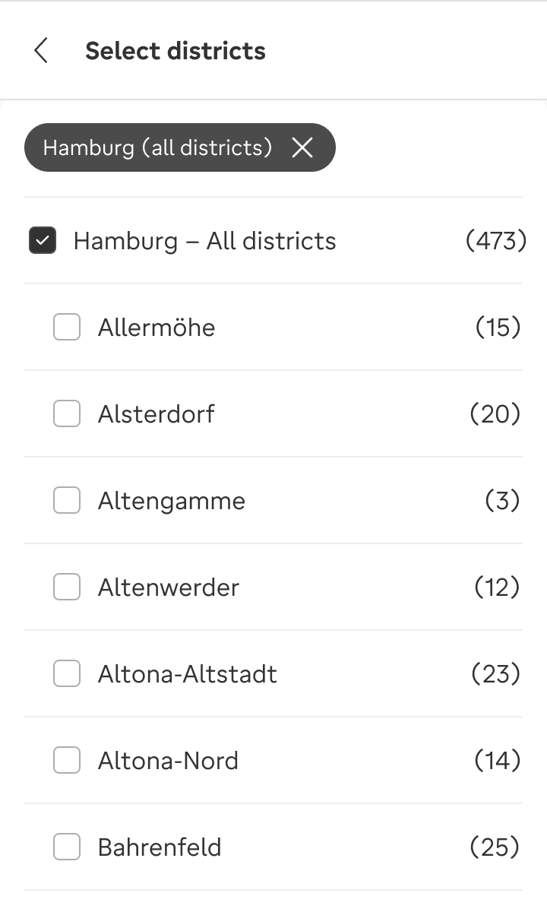 **DO:** Use input chips to select items or enter information into a field. |

| Default | Hover | Pressed |
| --- | --- | --- |
|  |  |  |

| Default selected | Hover selected | Pressed selected |
| --- | --- | --- |
|  |  |  |

#### Action chips

Action chips trigger actions when clicked, often performing contextual tasks that enhance the primary functionality of a page. They are lightweight, intuitive, and designed for quick, secondary actions.

| DO | DON'T |
| --- | --- |
|  **DO:** Use action chips when users need a lightweight, dynamic way to perform quick actions relevant to their current task. |  **DON'T:** Don't use action chips as primary navigation or for critical actions. Don't use them to move to the next/previous step or to complete/progress in a user journey. Use buttons instead. |

| Default | Hover | Pressed |
| --- | --- | --- |
| 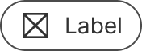 |  |  |

### Modifiers

#### Icons

Icons are optional and can be included to provide additional context or visual cues that make the purpose of the chips more intuitive and easier to understand.

---

| With icon | Without icon |
| --- | --- |
|  | 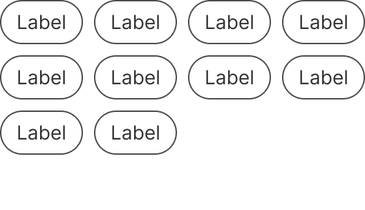 |

### Filter chips

| Unselected | Selected |
| --- | --- |
| 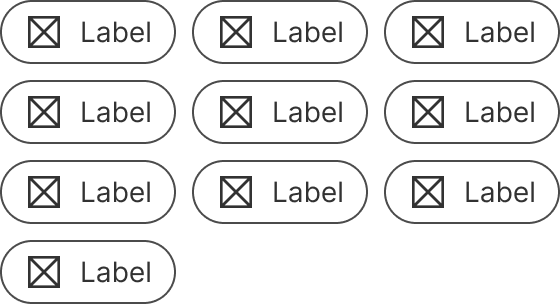 | 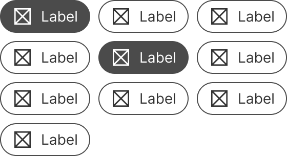 |

### Input chips

| Unselected | Selected |
| --- | --- |
| 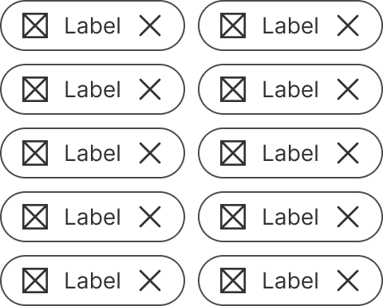 |  |

### Action chips

| Default |
| --- |
|  |

## Behavior & Responsiveness

### Interactive States & Loading

The states of the individual chips in the chip groups are the same as for [standalone chips](https://zeroheight.com/626199550/p/32f686-chip).

* **Filter chips:** Default, hover and pressed states; can be selected or unselected.
* **Input chips:** Default, hover and pressed states; can be selected or unselected.
* **Action chips:** Default, hover, and pressed states, but cannot be selected.

#### Touch target

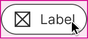

#### Wrapping

| One line | Wrapped on second line |
| --- | --- |
| 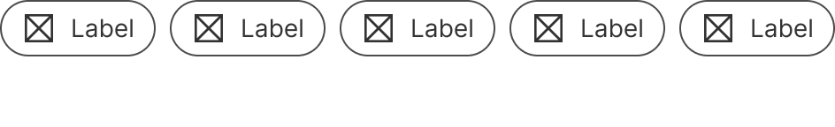 | 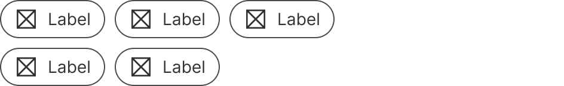 |

### Touch Target & Layout

* **Touch Target:** To ensure accessibility, the touch target of each chip has a height of 40px.
* **Width Adaptability:** Chips wrap to a new line if there is not enough space for all of them.

### Breakpoints & Platform Adaptations

Not documented

---

## Content & UX Writing

* **Capitalization:** Sentence case, without punctuation.
* **Label Formula:** For action chips, {Verb} + {Noun}, leading with an action verb in the infinitive tense.
* **Length Limits:** 2-3 words, about 20-30 characters in English.

**Filter chips:** Use concise, descriptive labels that clearly communicate the purpose of the filter. Keep labels consistent across similar filters.

**Input chips:** Write labels that are specific and relevant to the input or selection being represented. Maintain brevity while ensuring that users can easily identify the context or purpose of the input.

**Action chips:** Use action-oriented labels that clearly indicate the task being performed. Keep labels short and concise. To provide enough context to users, use the {verb} + {noun} content formula.

For more information on content guidelines, please refer to the [UX Writing principles](https://zeroheight.com/626199550/p/324518-intro).

---

## Accessibility (a11y)

Not documented
