<!-- Source: https://avivgroup.atlassian.net/wiki/spaces/ADS/pages/2831515736/Coach+mark | Last modified: Aug 17, 2026 -->

# Coach mark

Coach marks are temporary overlay messages that provide contextual information about user interface elements. They can be used successively to create a guided interface tour.


| Figma | Web | iOS | Android |
| --- | --- | --- | --- |
| Ready ✅ | WIP 🚧 | To Do 🚧 | WIP 🚧 |

* [Coach mark on Figma](https://www.figma.com/design/xxqSJcKOphrgimxRQbvtfe/2.-Gemini-Components-Library?node-id=13151-2940)

---

## Usage

Coach marks are temporary messages that provide contextual information to educate users about new or unfamiliar features. It appears as small overlay containers on top of the content, with an arrow indicator. Coach marks can be linked together in a sequence to create a tour.

| Single step | Multi step |
| --- | --- |
|  |  |

### When to use

**Coach mark** — contextual onboarding overlays pointing at specific UI elements.

### When NOT to use

| Instead, when… | Use |
| --- | --- |
| Persistent inline guidance not tied to onboarding | **Feedback message** |
| A single brief clarification rather than a guided tour | **Tooltip** |

### Variant Selection Flow

```
Elements
├─ Always present → Title and close icon
└─ Everything else is optional — hide what this step does not need

Tag position
├─ Title fits on one line → Tag aligned with the title
└─ Title runs to two lines → Tag placed above the title
```

### Usage Guidance

| DON'T |
| --- |
| **DON'T:** Limit the display of coach marks to one at a time to prevent distraction and cognitive overload for users. |
| **DON'T:** Avoid navigating between pages; clicking the next button should not lead to a transition between different pages within a flow. |
| **DON'T:** Use a coach mark to emphasize a specific user interface element rather than the entire page. Prefer a Modal for whole-page emphasis. |

### Related Components

| Component | Priority | Usage | Example Scenario |
| --- | --- | --- | --- |
| **Coach mark** | — | Coach marks are temporary overlay messages that provide contextual information about user interface elements. | — |
| **Tooltip** | High | Temporary short overlay messages that clarify the purpose of UI elements or provide additional context about their function. | A single, brief clarification rather than a guided, multi-step tour |
| [**Feedback message**](../feedback-message/feedback-message.md) | High | Feedback messages are non-disruptive, inline notifications that provide users with important information or contextual messages. | Persistent inline guidance not tied to onboarding |

---

## Variants & Modifiers

### Boolean

Only the title and the close icon are mandatory. All other elements can be hidden, offering a variety of layout.

| Full | Simple |
| --- | --- |
| 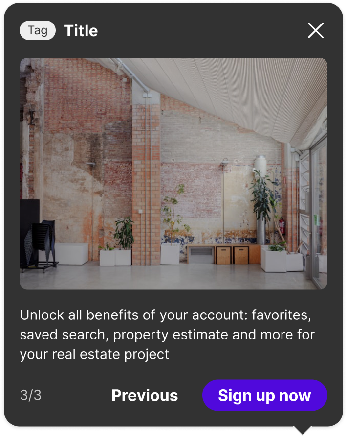 | 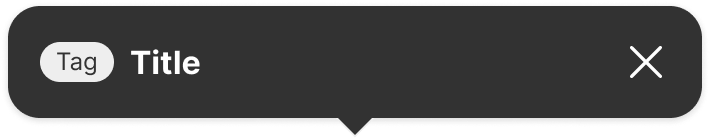 |

### Tag position

To ensure a perfect readability, the tag can be aligned with the title or placed on top when the title is on two lines. It's up to the consumer.

| Horizontally aligned | On-top |
| --- | --- |
| 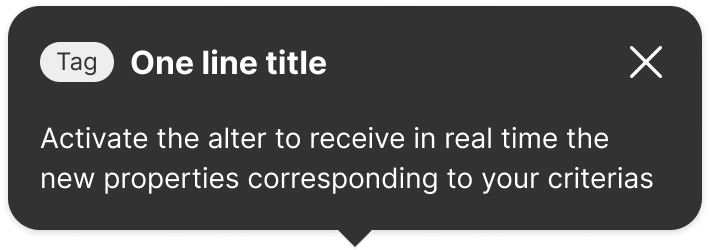 | 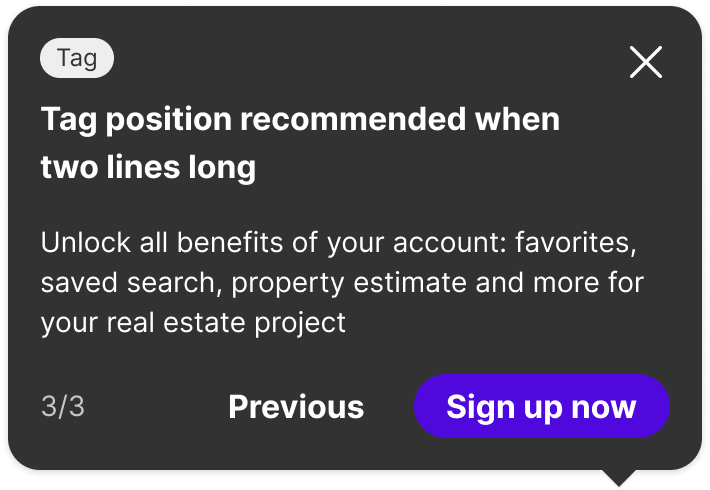 |

### Modifiers

Not documented

---

## Behavior & Responsiveness

### Interactive States & Loading

The coach mark appears automatically after the page loaded (decided by the consumer). A coach mark is an advisory overlay, not a modal dialog — it provides optional information, and its interaction model should reflect its subordinate nature. By allowing it to be dismissed easily, we reinforce that the coach mark is a temporary guide, not a mandatory step. This distinguishes it from critical alerts or dialogs that require an explicit user action before proceeding.

| Multi step | Single step |
| --- | --- |
| 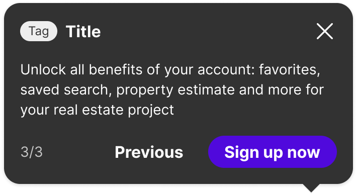 | 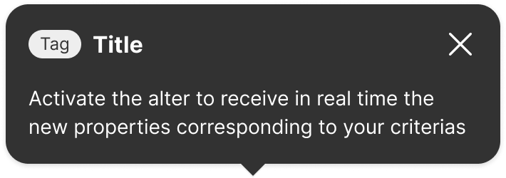 |

#### Dismissal on scroll

The coach mark should be dismissed on scroll. A user's scroll action is a clear signal that their focus is shifting — they are navigating to a different part of the page.

* **Respecting Focus:** Keeping the coach mark visible would actively work against the user's intent, pulling their attention back to a part of the UI they have chosen to move away from.
* **Reducing Intrusion:** The coach mark's job is to be a helpful, temporary guide. Once the user navigates away, its job is done. Dismissing it respects the "temporary" nature of the component.

#### Animation

An animation is used when the coach mark appears and disappears. During a tour, the first coach mark fades out before the second one becomes visible. The coach mark doesn't move on screen.

### Touch Target & Layout

* **Width Adaptability:** Size should be defined by the user, between 296 and 400px.

#### Position

The coach mark appears near the triggering object. The auto-placement feature identifies the best position from all available placement options, promoting effective use of space.

| Bottom Start | Bottom Middle | Bottom End | Left End |
| --- | --- | --- | --- |
| 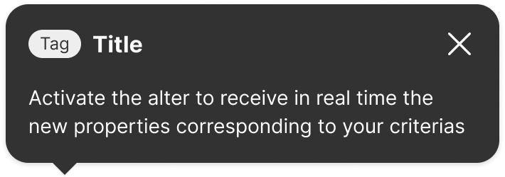 |  | 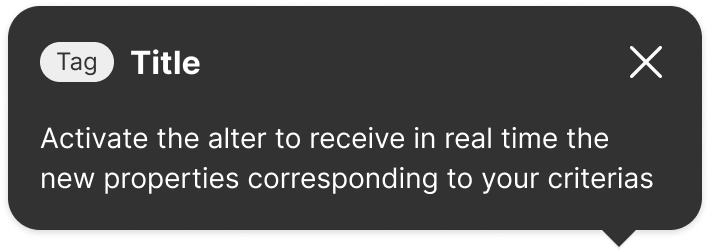 | 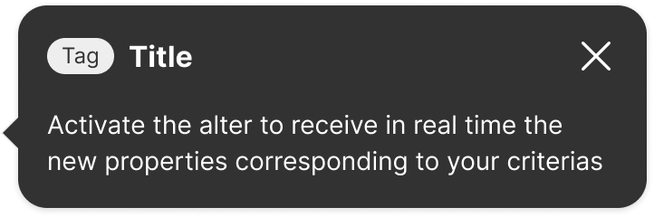 |

| Left Middle | Left End | Left Start | Left Middle |
| --- | --- | --- | --- |
| 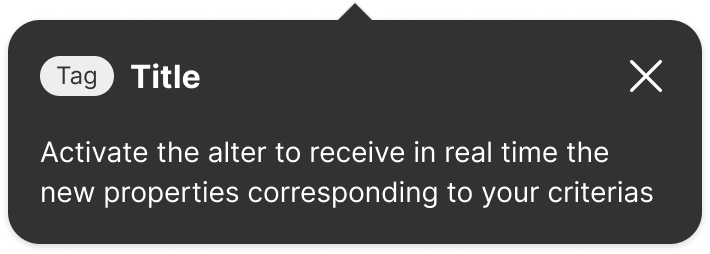 | 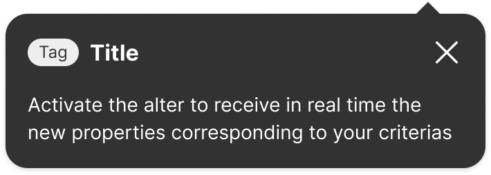 | 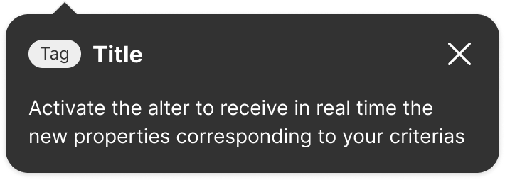 | 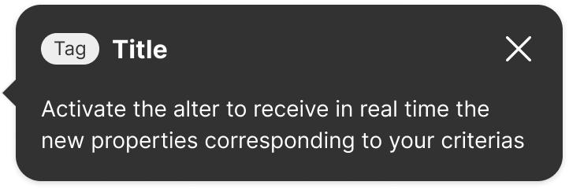 |

| Right End | Right Middle | Left Start | Right Start |
| --- | --- | --- | --- |
| 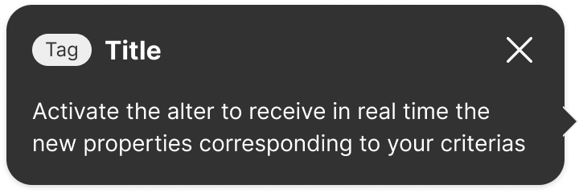 | 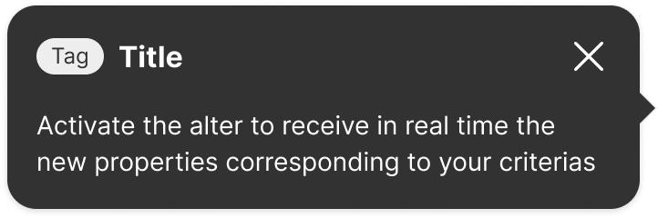 | 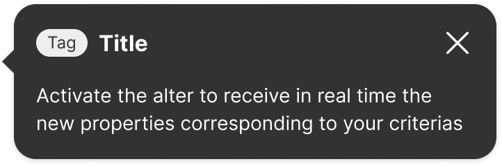 | 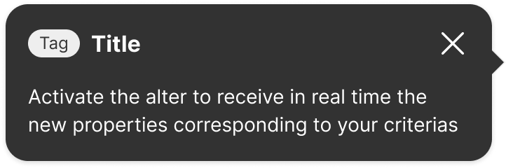 |

### Breakpoints & Platform Adaptations

Not documented

---

## Content & UX Writing

* **Label Formula:** Not documented.
* **Length Limits:** Title: a few words, ideally on one line. Body: at least a few words, no more than a few sentences.

**Keep body text succinct and informative:** Coach marks are quick overviews of functionality.

**Communicate the main benefit to the user:** For example, "Manage your issues" instead of "Issue types".

**Don't repeat content from the title:** Concise information is more effective, and placing the most important keywords at the beginning of each sentence enhances clarity.

For more information on content guidelines, please refer to the [UX Writing principles](https://zeroheight.com/626199550/p/324518-intro).

---

## Accessibility (a11y)

* **Keyboard Navigation:** When opened, the first focusable element within the content is focused, and focus is trapped and wrapped within it (Source: [Progress Design system kit](https://www.telerik.com/design-system/docs/components/popover/accessibility/)). Upon closing through the keyboard or by interacting with an element within the content, focus is returned to the anchor element. Focus order: Tag → Title → Subtitle → Close (positioned early to allow a quick close) → Steps → Button 1 → Button 2.
* **Screen Readers:** The illustrative picture is decorative and therefore ignored by screen readers.

#### Focus order

* **Tag**

* **Title**

* **Subtitle**

* Close (positioned here to allow an quick close)

* **Steps**

* **Button 1**

* **Button 2**

The picture is decorative and therefore ignored by the screen readers.
