<!-- Source: https://avivgroup.atlassian.net/wiki/spaces/ADS/pages/2832367723/Date+picker | Last modified: Aug 21, 2026 -->

# Date picker

Date pickers are used to select a date using text input or a calendar view.


| Figma | Web | iOS | Android |
| --- | --- | --- | --- |
| Ready ✅ | Ready ✅ | Ready ✅ | To Do 🚧 |

* [Date picker on Figma](https://www.figma.com/design/TSd5D0j4WIVxZTGk0ZgfK7/3.-Gemini-Patterns-Library?node-id=9-7270)
* [Date picker on Storybook](https://gemini-storybook.prompt-scorpion-preview.aws.aviv.eu/?path=/docs/ui-forms-datepicker--docs)

---

## Usage

Date pickers allow users to select a date from a calendar or manually enter a date in the input field. They can enter dates from the recent past, present, or future, with each date including the day, month, and year (dd/mm/yyyy).

### Platform

We use platform-specific date pickers that differ between Web, iOS and Android. The main differences are the behavior of labels and placeholders in the date field and the appearance of the calendar view.

#### Web

On the web, the label is always at the top of the date field. The placeholder is visible until a date is selected. On the web, we use a custom calendar.

| Date field | Date picker |
| --- | --- |
|  | 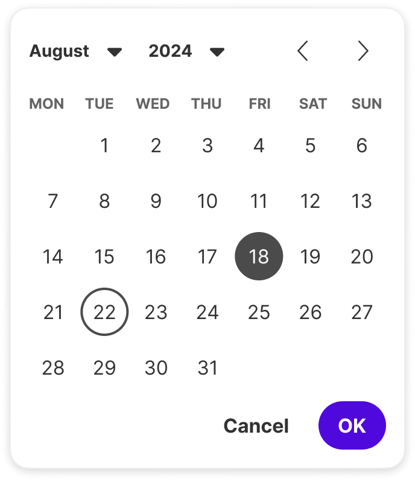 |

#### iOS

As on the web, the label is always at the top of the field on iOS. The placeholder is visible until a date is selected. On iOS we use the native calendar. On iOS, it's currently only possible to select the date using the calendar. It's not possible to type it directly into the field.

| Date field | Date picker |
| --- | --- |
|  | 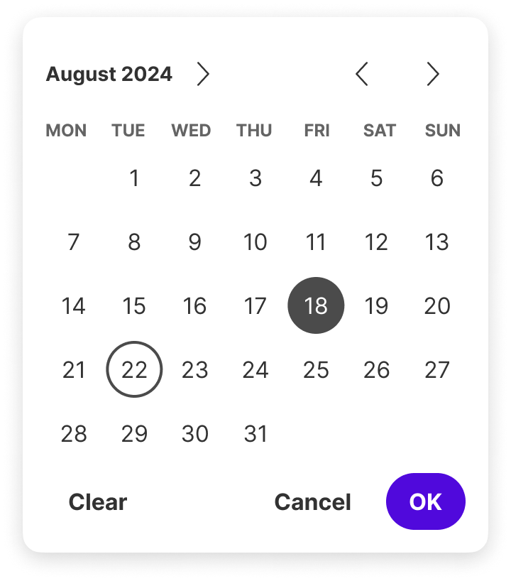 |

#### Android

On Android, the label is inside the field by default and only moves to the top when the field is active or filled. Instead of a placeholder, the date format is displayed with the helper text. On Android we use the native calendar.

| Date field | Date picker |
| --- | --- |
| 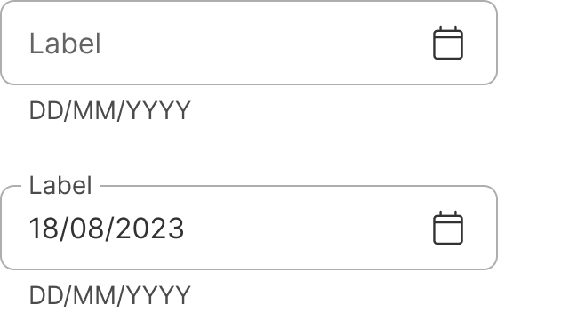 | 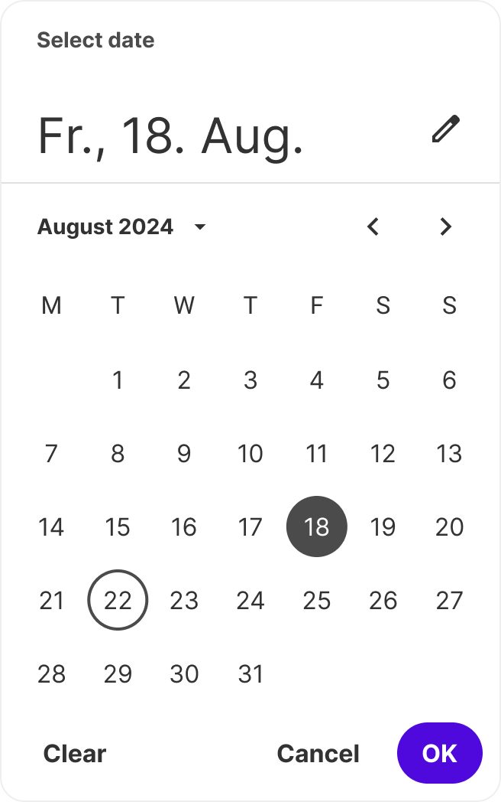 |

### When to use

**Date picker** — selecting a date using text input or a calendar view.

### When NOT to use

| Instead, when… | Use |
| --- | --- |
| Free-form single-line text | **Text field** |
| Date entry without a calendar view | **Date field** |
| A range along a continuous scale | **Slider** |

### Variant Selection Flow

```
Entry mode
├─ The user picks from a calendar → Calendar view
└─ The user types the date → Text input
   └─ Date entry with no calendar at all → use Date field instead

Header, as with every form component
├─ Mandatory field → Required asterisk to the right of the label
├─ Optional field → Optional mention to the right of the label
├─ Needs an explanation → Tooltip icon
└─ Needs persistent guidance → Helper text
```

### Usage Guidance

| DO | DON'T |
| --- | --- |
|  **DO:** Use the date picker to allow users to select a specific day in the past, present or future. |  **DON'T:** Don't use the date picker when users need to select a specific year. Instead, provide a text field where they can enter the year directly. |

| DON'T |
| --- |
| **DON'T:** The date picker doesn't currently support range selection. |

### Related Components

| Component | Priority | Usage | Example Scenario |
| --- | --- | --- | --- |
| **Date picker** | — | Date pickers are used to select or enter specific dates in the past, present or future. | — |
| [**Text field**](../text-field/text-field.md) | Medium | Text fields allow short single-line and free-form content. They can be used to enter years. | Text field redirects here when: A date |

---

## Variants & Modifiers

### Modifiers

#### Header

Like all form components, date pickers contain a header consisting of a label, a required asterisk or an optional mention, a tooltip icon, and a helper text. Go to the [form guidelines](https://zeroheight.com/626199550/p/81b84d-forms/t/page-81b84d-92550230-54) for more information.

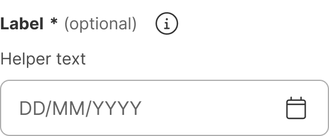

---

## Behavior & Responsiveness

### Interactive States & Loading

**Date field**

Like text fields, date fields have the states default, hover, active, and disabled. They can be empty or filled, and they can be in an error state. When in error state, they contain an error message.

They don't have a pressed state. Instead, they change to the active state when a user presses on the date field.

The icon button in the field has the states default, hover, pressed and disabled.

**Neutral**

| Default empty | Hover empty | Active empty | Disabled empty |
| --- | --- | --- | --- |
|  | 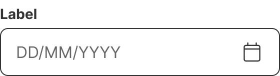 |  | 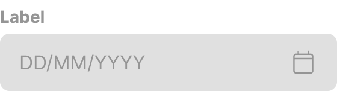 |

| Default filled | Hover filled | Active filled | Disabled filled |
| --- | --- | --- | --- |
|  |  | 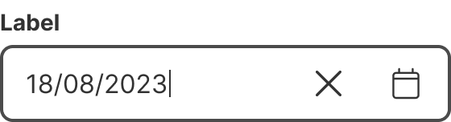 | 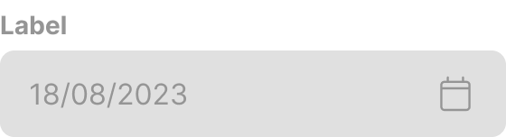 |

**Error**

| Default empty | Hover empty | Active empty | Disabled empty |
| --- | --- | --- | --- |
| 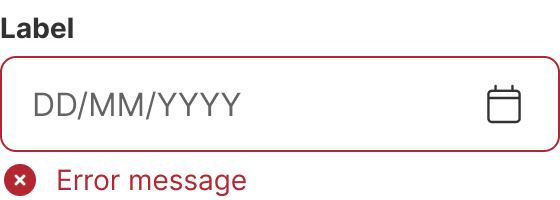 |  | 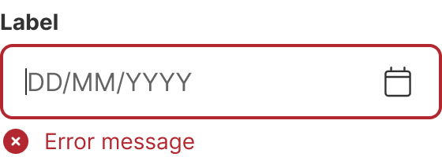 | 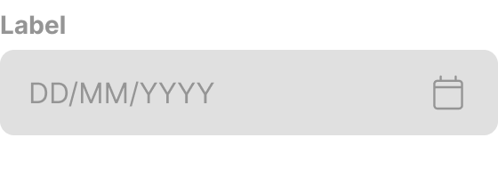 |

| Default filled | Hover filled | Active filled | Disabled filled |
| --- | --- | --- | --- |
|  | 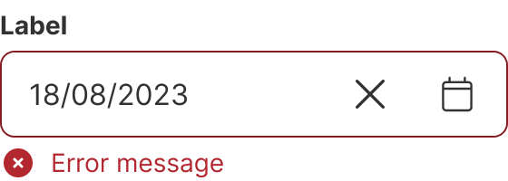 | 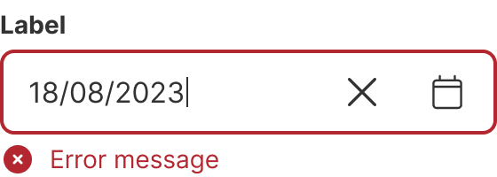 | 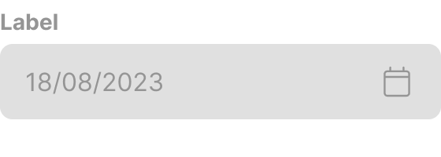 |

**Date picker**

The buttons in the date picker have the states default, hover, pressed and disabled. They can be selected or unselected.

**Day**

| Default | Hover | Pressed | Disabled |
| --- | --- | --- | --- |
|  |  |  |  |

| Default selected | Hover selected | Pressed selected | Disabled selected |
| --- | --- | --- | --- |
|  |  |  |  |

**Month/Year**

| Default | Hover | Pressed | Disabled |
| --- | --- | --- | --- |
|  |  |  |  |

| Default selected | Hover selected | Pressed selected | Disabled selected |
| --- | --- | --- | --- |
|  |  |  |  |

**Current day**

| Default | Hover | Pressed | Disabled |
| --- | --- | --- | --- |
|  |  |  |  |

| Default selected | Hover selected | Pressed selected | Disabled selected |
| --- | --- | --- | --- |
|  |  |  |  |

#### Date field interaction

#### Typing

The user can select a date by typing it into the date field. On the Web, we use a placeholder with progressive disclosure to help them understand the required format.

| Day | Month | Year |
| --- | --- | --- |
|  | 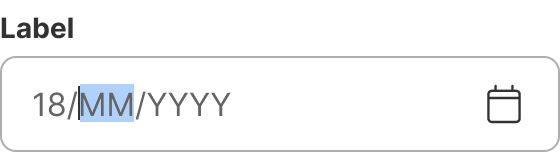 | 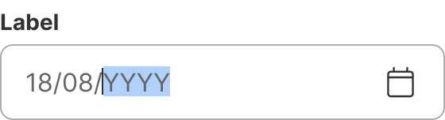 |

#### Clearing

Web only. Clearing on other platforms is done in the Date Picker.

The user can clear the date when the field is filled by clicking on the "clear" icon on the right. This button is optional.

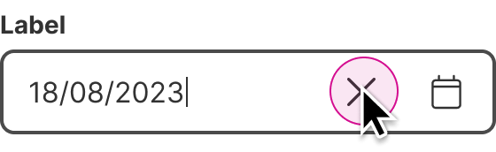

#### Calendar interaction

#### Opening and closing

**Modal view**

The calendar opens when the user clicks the Calendar button. It closes when the user clicks the button again, clicks the Okay or Cancel button, clicks outside the calendar, or presses the Esc key.

To select a date, the user must click a day and then press the Okay button.

| Opening and closing | Selecting and closing | Closing |
| --- | --- | --- |
| 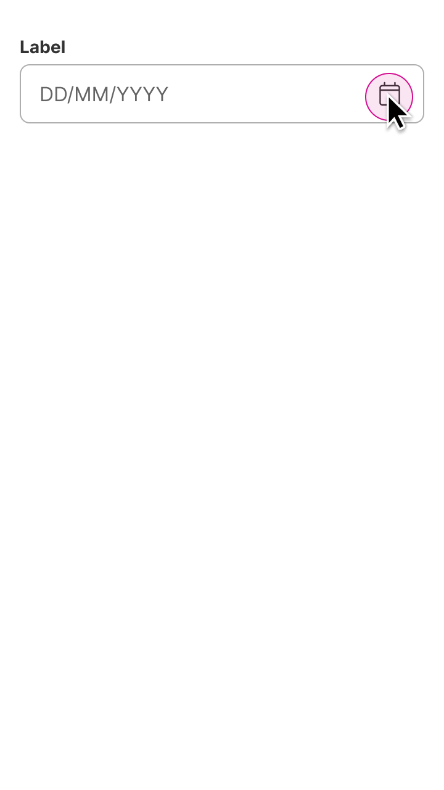 | 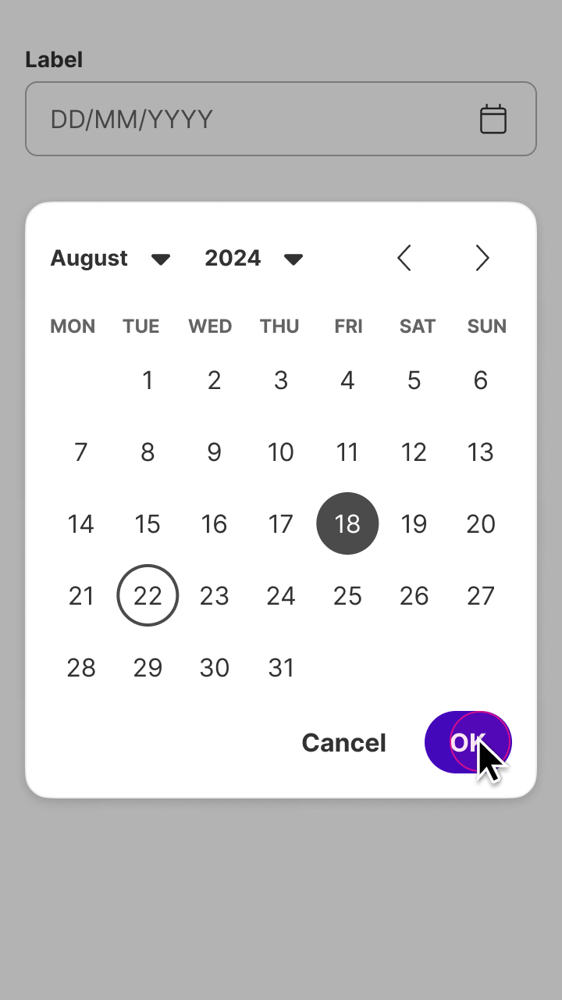 | 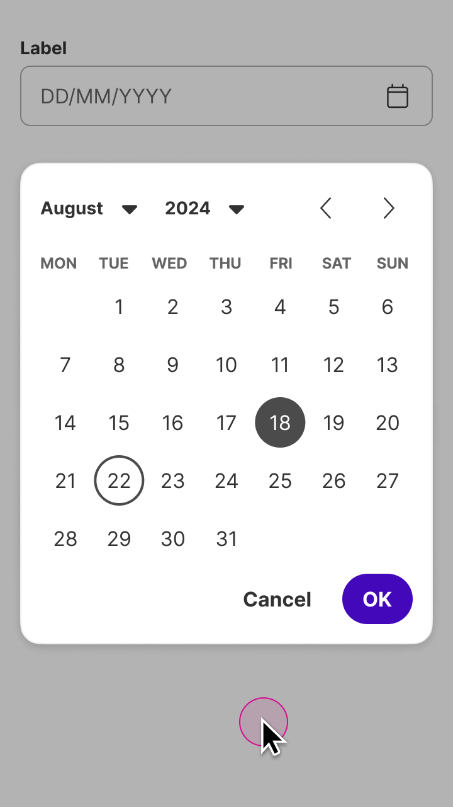 |

**Dropdown view**

The calendar opens when the user clicks on the calendar button. It closes when the user clicks on the button again, selects a day, clicks outside the calendar or presses the esc key.

To select a date, the user simply has to click on a day. The buttons are not needed in the dropdown view.

| Opening and closing | Selecting and closing | Closing |
| --- | --- | --- |
| 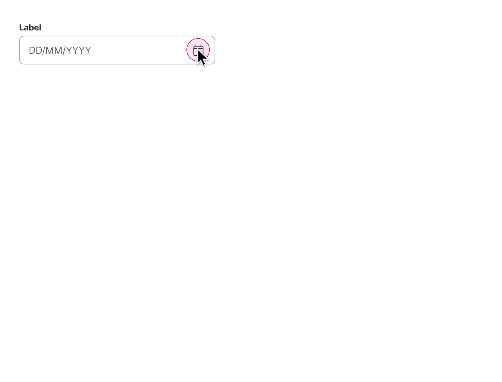 | 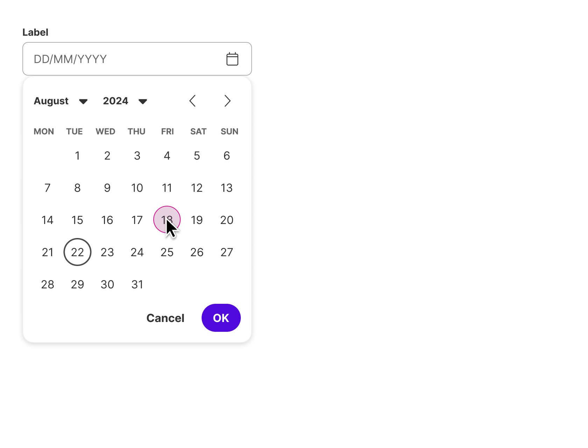 | 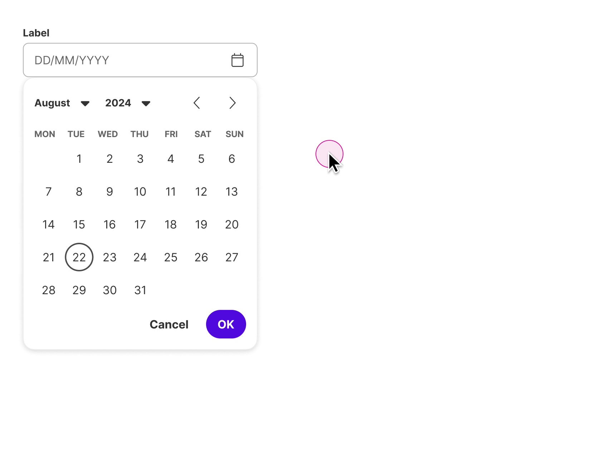 |

#### Changing months and year

Users can change the month and year by pressing the corresponding button and selecting an option from the dropdown list. In addition, they can change the month using the chevron buttons.

In the dropdown view, the user must change the month and year before selecting a day because the calendar closes when the day is selected. In the modal view, this is not relevant because the calendar only closes when the user presses a button.

| Calendar | Month selection | Year selection |
| --- | --- | --- |
| 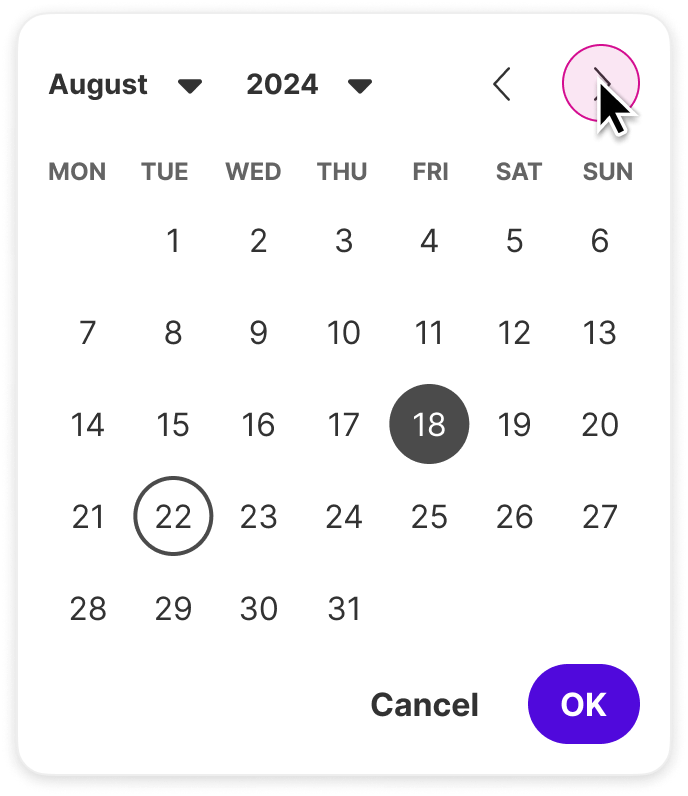 | 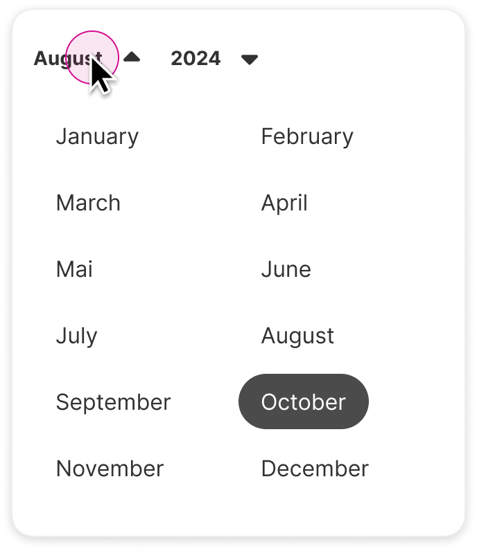 | 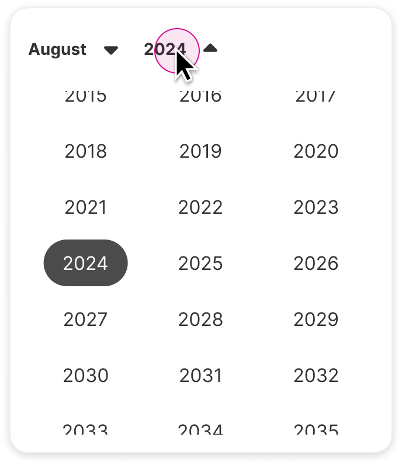 |

The month and year selection looks slightly different in the native iOS and Android picker. The native variants for this are currently not available in Figma.

On the web, we currently still use the native browser dropdowns for the month and year selection. This will be fixed and aligned with Figma in the future.

#### Clearing

The user can clear the date when the field is filled by clicking on the "clear" button in the datepicker. This button is optional.

| Android | iOS |
| --- | --- |
| 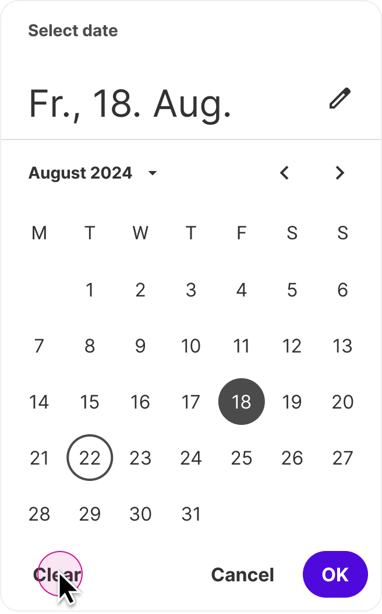 | 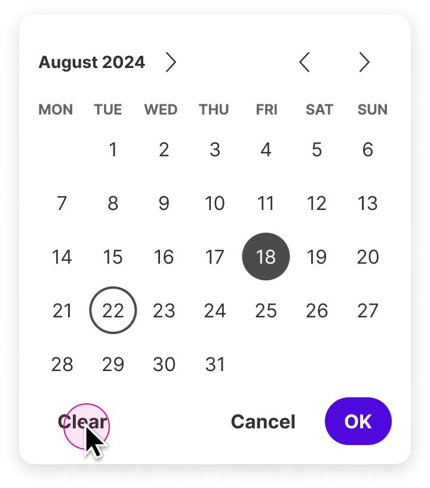 |

#### Position and scrolling

**Modal view**

The modal calendar is centered vertically in the middle of the screen.

| Centered |
| --- |
|  |

**Dropdown view**

By default, the calendar is positioned below the field. If there is not enough space below it, it is positioned on top of the field. If there are more options than space available, the calendar becomes scrollable. Whether the scrollbar is visible or not depends on the user's system settings.

| Below the field | On top of the field | Scrolling |
| --- | --- | --- |
| 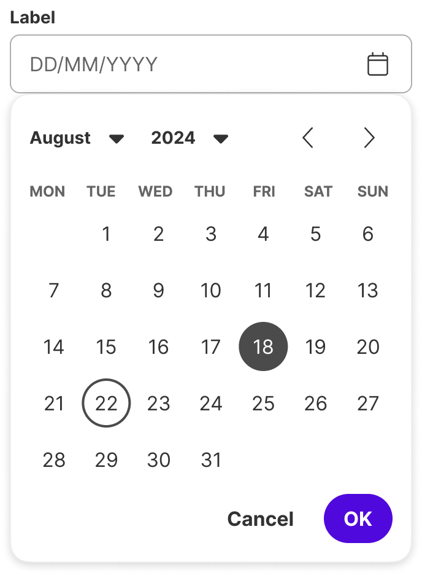 | 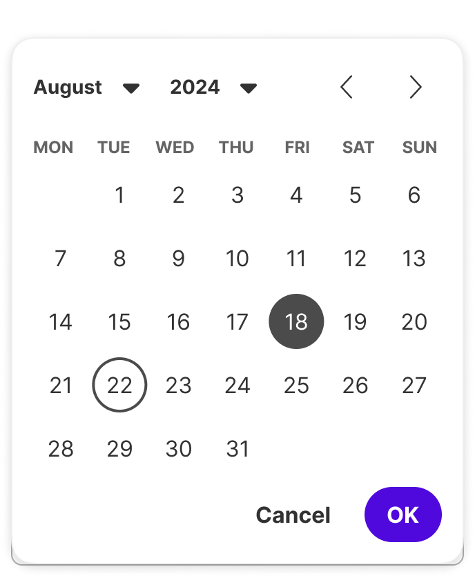 | 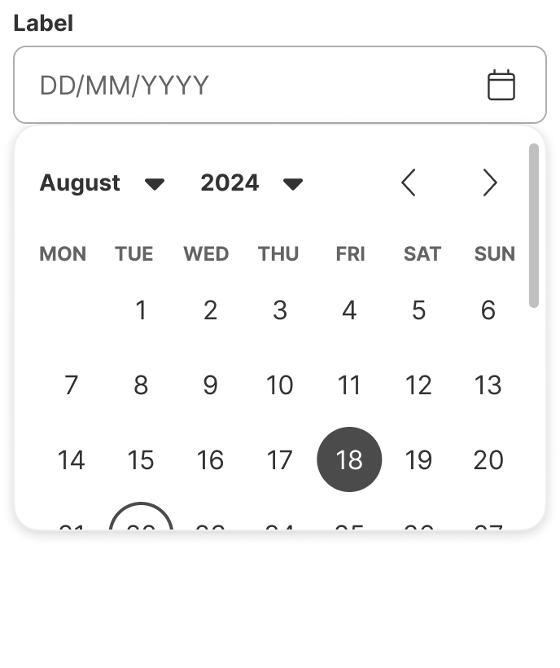 |

### Touch Target & Layout

Not documented

### Breakpoints & Platform Adaptations

Not documented

#### Breakpoints and width

##### Date field width

The width of the date fields can be set to 100% (full-width) or 50% of the container. It's also possible to set it to a fixed size.

According to our form guidelines, the form container should have a max-width of 448px.

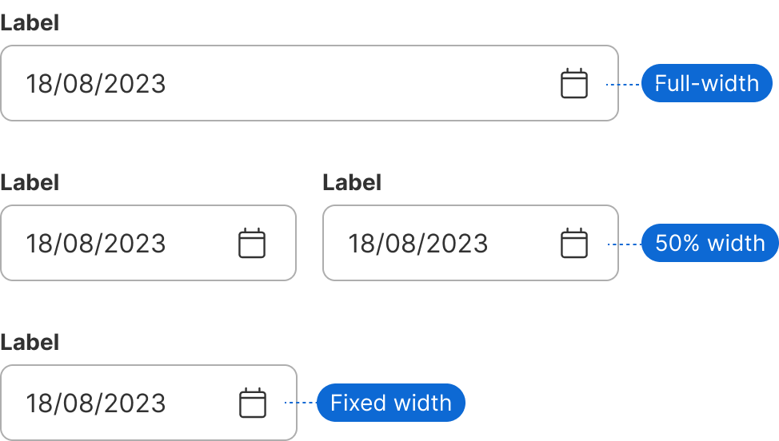

##### Calendar width and breakpoints

The appearance of the date picker changes depending on the platform and breakpoint. To learn more about our breakpoints, see our grids and breakpoint guidelines.

In the modal view, which is used on mobile web and apps, the calendar is full-width (minus 16px margin).

In the dropdown view, which is used on desktop, the calendar has a fixed width that can't be changed. The width depends on the brand and language. For example, in the aviv brand, in English, it has a width of 330px.

| Modal | Dropdown |
| --- | --- |
|  | 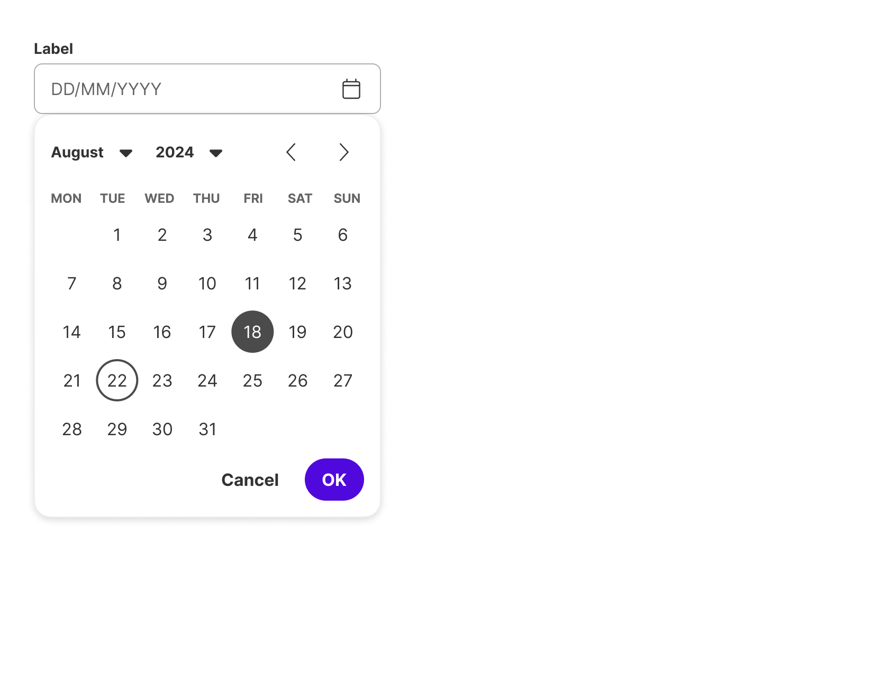 |

## Content & UX Writing

For English, French, German, Spanish and Dutch content, we use slashes and write the date as: dd/mm/yyyy. For more information please refer to the [Number guidelines](https://zeroheight.com/626199550/p/60fe5b-numbers).

---

## Accessibility (a11y)

Not documented
