Dropdowns are used to select one option from a list.


| Figma | Web | iOS | Android |
| --- | --- | --- | --- |
| Ready ✅ | Ready ✅ | Ready ✅ | Ready ✅ |

* [Dropdown on Figma](https://www.figma.com/design/xxqSJcKOphrgimxRQbvtfe/2.-Gemini-Components-Library?node-id=3-7279)
* [Dropdown on Storybook](https://gemini-storybook.prompt-scorpion-preview.aws.aviv.eu/?path=/docs/ui-forms-dropdown--docs)


_This component has a tool specification: [`dropdown-figma.md`](dropdown-figma.md) — what is true of it in the design tool, and nowhere else._

---

## Usage

Dropdowns allow users to select one option from a list. They are most commonly used in forms.

### Platform

We use platform-specific dropdowns that differ between Web, iOS and Android. The main differences are the behavior of labels and placeholders and the appearance of the dropdown list.

**Web:** The label is always on top of the field. The placeholder is visible until an option is selected.

**iOS:** As on the Web, the label is always on top of the field, and the placeholder is visible until an option is selected. On iOS, we use the native dropdown list.

**Android:** The label is inside the field by default and only moves to the top when the field is active or filled. The placeholder is only visible when the field is active.

| Default empty | Default selected | Active empty | Active selected |
| --- | --- | --- | --- |
| 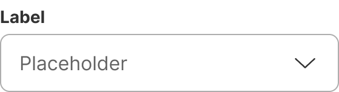 | 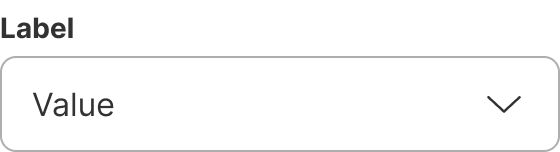 | 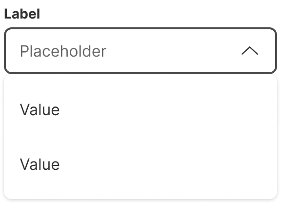 | 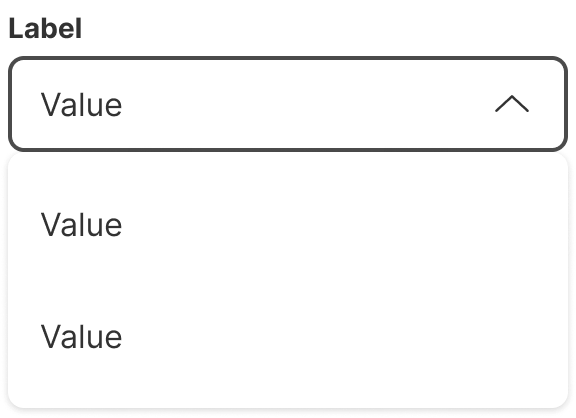 |

| Default empty | Default filled | Active empty | Active filled |
| --- | --- | --- | --- |
| 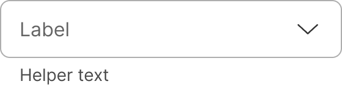 | 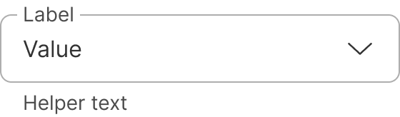 | 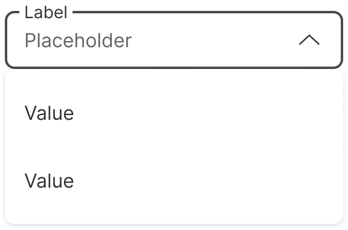 | 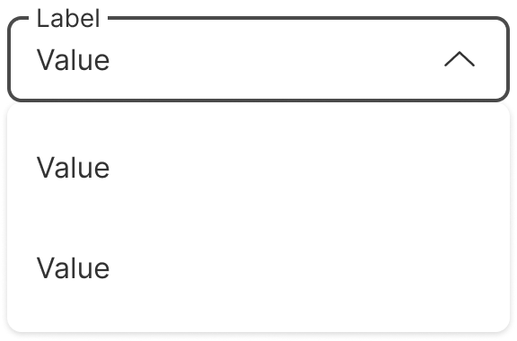 |

### When to use

**Dropdown** — single-select from a list in a form, or space too constrained to show options inline.

### When NOT to use

| Instead, when… | Use |
| --- | --- |
| 10 options or fewer, and the labels are short enough for the column count | **Radio button group** |
| Long list where typing to filter helps | **Autocomplete** |
| Items trigger actions rather than set a value | **Action menu** |

### Variant Selection Flow

```
Icons
├─ Every item has a meaningful icon → With icons, on the field and in the list; all are non-clickable
└─ Any item lacks one → Remove icons from every item; never mix

Suffix
└─ Extra context is needed after the value → Add a suffix

Header, as with every form component
├─ Mandatory field → Required asterisk to the right of the label
├─ Optional field → Optional mention to the right of the label
├─ Needs an explanation → Tooltip icon
└─ Needs persistent guidance → Helper text
```

### Usage Guidance

| DO | DON'T |
| --- | --- |
|  **DO:** Use dropdowns to allow users to select one option from a list. |  **DON'T:** Don't use the dropdown to display a list of actions. Use the action menu instead. |

| CAUTION |
| --- |
|  **CAUTION:** It's possible to use dropdowns to filter pages, but for consistency reasons we recommend using the action menu instead. For now the dropdown only supports single-select — for multi-select, please use another component, e.g. the [checkbox group](https://zeroheight.com/626199550/p/41df87-checkbox-group). |

### Related Components

| Component | Priority | Usage | Example Scenario |
| --- | --- | --- | --- |
| **Dropdowns** | — | Used in forms to allow users to select an option from a list. | — |
| [**Action menu**](../action-menu/action-menu.md) | High | Displays a list of context-specific actions. | The list represents actions to trigger, not options to select |
| [**Radio button group**](../radio-button-group/radio-button-group.md) | High | Radio button groups are used to select one option from a group of mutually exclusive choices. | 10 options or fewer, and the labels are short enough for the column count |
| [**Autocomplete**](../autocomplete/autocomplete.md) | High | Autocomplete components suggest possible matches for user input in real time as they type, helping them complete text fields more efficiently by… | Long list where typing to filter helps |
| [**Checkbox group**](../checkbox-group/checkbox-group.md) | Medium | Checkbox groups are used to select multiple options from grouped checkboxes. | Checkbox group redirects here when: Long list or constrained space |
| [**Chip group**](../chip-group/chip-group.md) | Medium | Chip groups are collections of chips that allow users to filter, select, or manage multiple related options simultaneously. | Chip group redirects here when: Constrained space or numerous options |
| [**Filter bar**](../filter-bar/filter-bar.md) | Medium | Filter bars are used to narrow down search results or displayed content based on selected criteria. | Filter bar redirects here when: A single filter criterion inside a form |
| [**Counter field**](../counter-field/counter-field.md) | Medium | Counter fields are used to enter or select numeric values. | Counter field redirects here when: Only a small fixed set of values |
| [**Slider**](../slider/slider.md) | Medium | A range slider can be used to select a single value or a range between minimum and maximum values. | Slider redirects here when: Only discrete values available |

---

## Variants & Modifiers

### Modifiers

#### Header

Like all form components, dropdowns contain a header consisting of a label, a required asterisk or an optional mention, a tooltip icon, and a helper text. Go to the [form guidelines](https://zeroheight.com/626199550/p/81b84d-forms/t/page-81b84d-92550230-54) for more information.

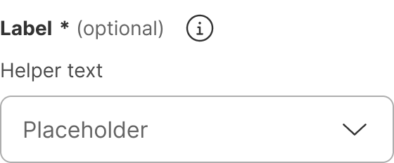

#### Icons

Icons can be added to the field and the dropdown list. They act as visual cues to provide clarity to the user. All icons are non-clickable.

| DO | DON'T |
| --- | --- |
|  **DO:** If some items don't have an icon, remove all icons. |  **DON'T:** Don't mix list items with and without icons, as it reduces readability. |

#### Suffix

The suffix can be added to provide additional context.

---

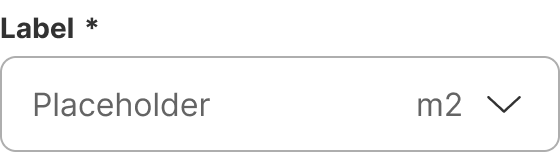

## Behavior & Responsiveness

### Interactive States & Loading

* **Default / Hover / Active / Disabled:** The field of the dropdown has the states default, hover, active, and disabled. It can be empty or filled, and it can be in an error state. When in an error state, the dropdown contains an error message. The field doesn't have a pressed state — instead, it changes to the active state when a user presses on it.
* **Dropdown list:** The rows in the dropdown list have the states default, hover and pressed. They can be selected or unselected.
* **Loading:** The loading state indicates to users that the data is loading and will appear shortly.

The dropdown list opens when the user clicks in the field. It closes when the user clicks on the button again, selects an option from the list, clicks outside the dropdown or presses the esc key.

| Unselected | Selected |
| --- | --- |
| 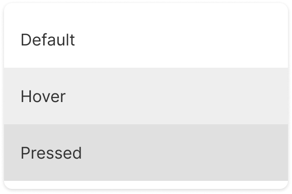 | 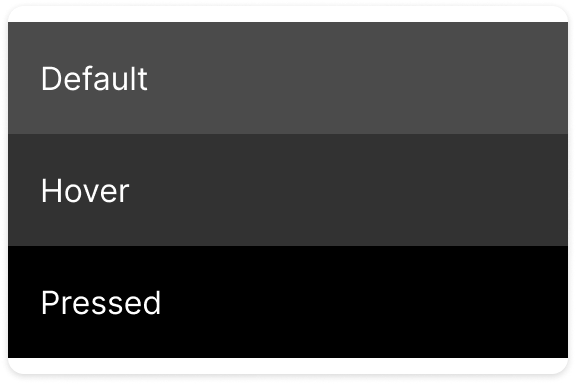 |

| Opening and closing | Selecting and closing | Closing |
| --- | --- | --- |
| 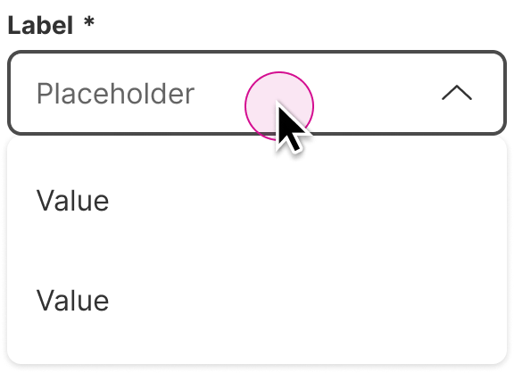 | 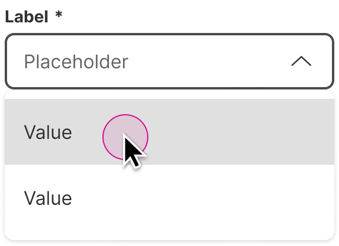 | 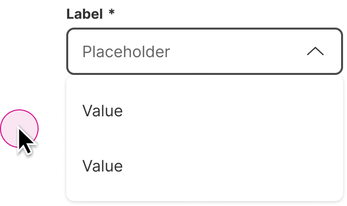 |

#### Neutral

| Default empty | Hover empty | Active empty | Disabled empty |
| --- | --- | --- | --- |
|  | 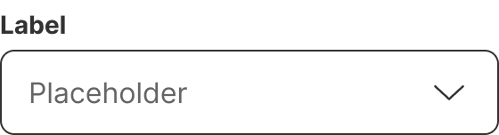 |  |  |

| Default filled | Hover filled | Active filled | Disabled filled |
| --- | --- | --- | --- |
|  | 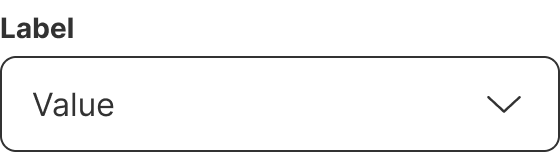 |  | 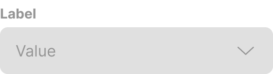 |

#### Error

| Default empty | Hover empty | Active empty | Disabled empty |
| --- | --- | --- | --- |
| 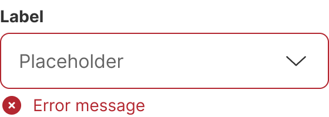 | 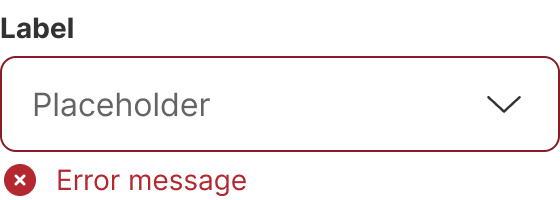 | 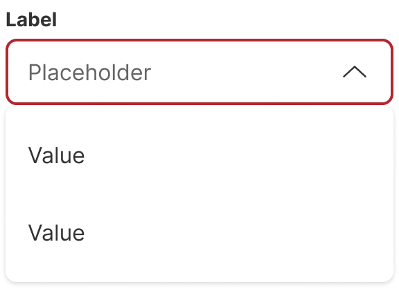 | 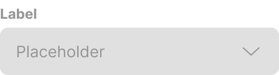 |

| Default filled | Hover filled | Active filled | Disabled filled |
| --- | --- | --- | --- |
| 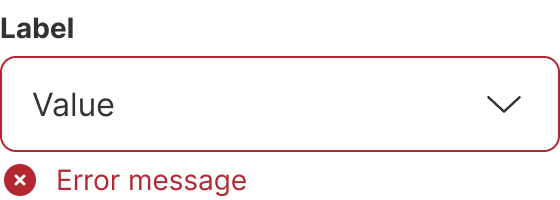 |  | 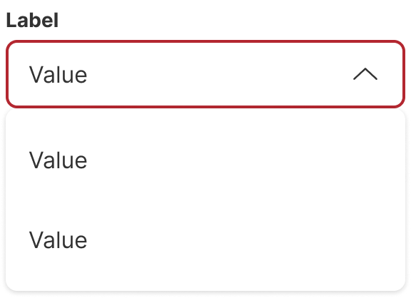 |  |

### Touch Target & Layout

* **Width Adaptability:** The width can be set to 100% (full-width) or 50% of the container. For special use cases it is also possible to define a fixed size. According to the [form guidelines](https://zeroheight.com/626199550/p/81b84d-forms/t/page-81b84d-92550230-13), the form container should have a max-width of 448px.

By default, the dropdown list is positioned below the field. If there is not enough space below it, it is positioned on top of the field. When the options exceed the available space, the dropdown becomes scrollable. Whether the scrollbar is visible or not depends on the user's system settings.

| Below the field | On top of the field | Scrolling |
| --- | --- | --- |
| 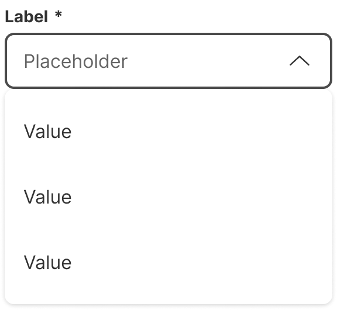 | 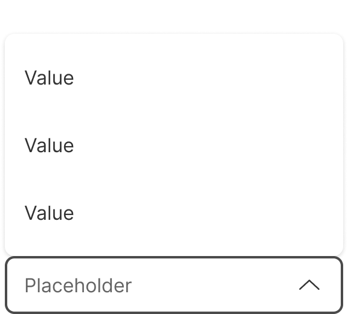 | 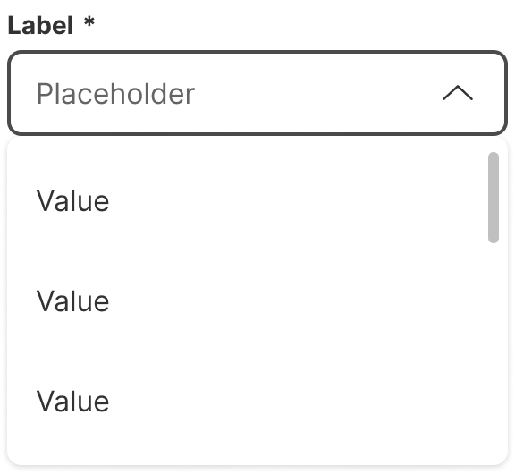 |

### Breakpoints & Platform Adaptations

Not documented

---

## Content & UX Writing

* **Capitalization:** Sentence-style capitalization for helper text, written as a full sentence with punctuation.
* **Label Formula:** Not documented.
* **Length Limits:** Labels: 1 line. Items: under 2 lines.

**Labels:** Labels inform users what to expect in the list of dropdown options. Keep the label short and concise by limiting it to 1 line of text.

**Placeholders:** Placeholder text is displayed in the field by default when no selection is made. This is important if the dropdown does not have a label above it. Use clear placeholder text for the dropdown trigger so that users understand the purpose.

**Helper text:** Should only be used when the user needs additional help to select the correct item from the dropdown menu.

**Items:** We recommend presenting the options in a logical or alphabetical order. Try to keep it under 2 lines.

For more information on content guidelines, please refer to the [UX Writing principles](https://zeroheight.com/626199550/p/324518-intro).

---

## Accessibility (a11y)

Not documented
