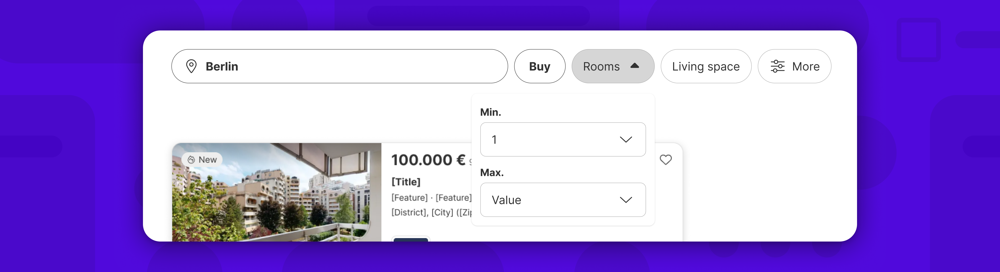
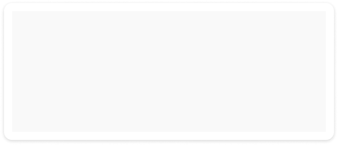
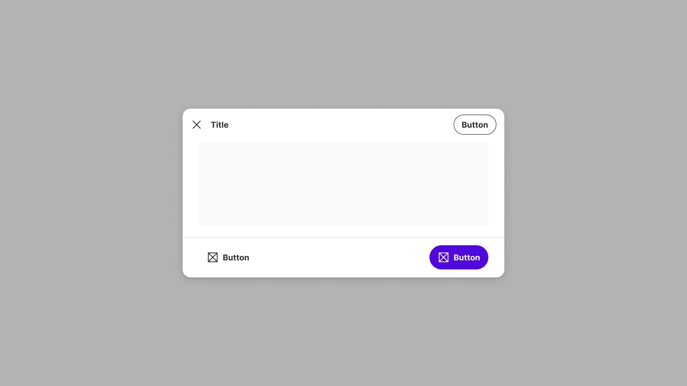
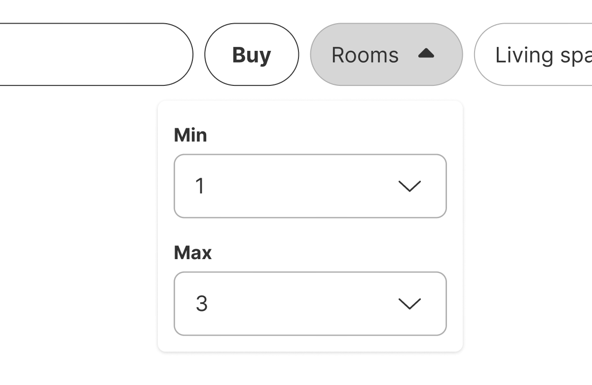
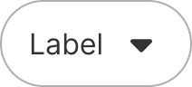
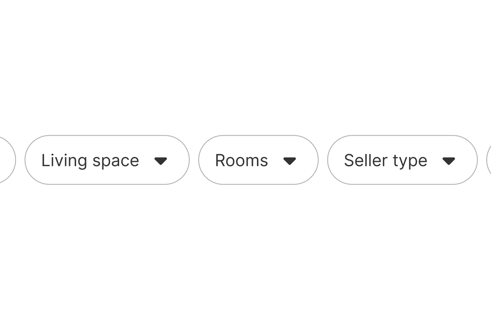
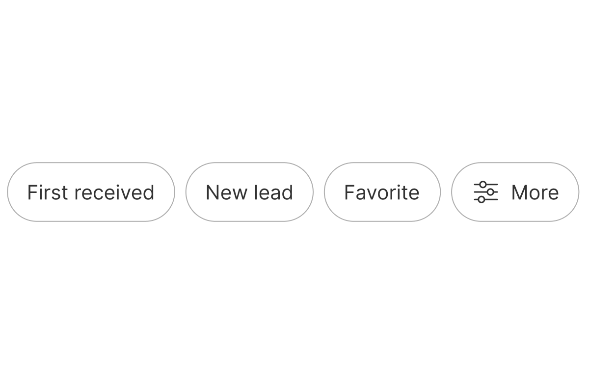
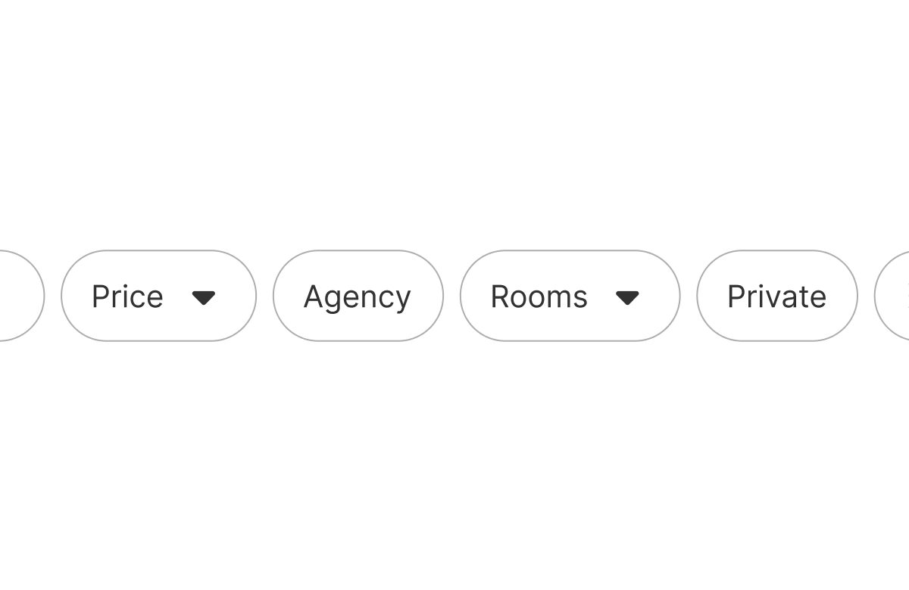
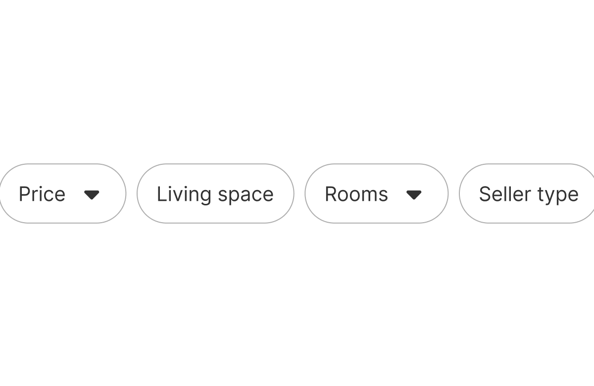

Filter bars are used to narrow down search results or displayed content based on selected criteria.



| Figma | Web | iOS | Android |
| --- | --- | --- | --- |
| Ready ✅ | N/A | N/A | N/A |

Figma only (owned by SERP team).
* [Filter bar on Figma](https://www.figma.com/design/TSd5D0j4WIVxZTGk0ZgfK7/3.-Gemini-Patterns-Library?m=auto&node-id=2240-119052&t=44YLeVrnPbcXxr0R-1)

---

## Usage

The filter bar allows users to set criteria to narrow down displayed content on a search results page or in a table. It consists of filter buttons that refine the results based on the user's selected criteria.

### When to use

**Filter bar** — narrowing search results or table content using structured criteria — SERP or data page.

**Pattern**-tier component. **Highest tier first**: do not compose a filter row from Chips or Buttons — this component already is it.

### When NOT to use

| Instead, when… | Use |
| --- | --- |
| Lightweight inline filters without dropdown panels | **Chip group** |
| A single filter criterion inside a form | **Dropdown** |
| Triggering filter-related actions rather than setting criteria | **Action menu** |

### Variant Selection Flow

```
Size
├─ Default, or a dense layout → 40px
└─ Roomier layout, or matching 48px controls beside it → 48px
```

### Usage Guidance

Not documented

### Related Components

| Component | Priority | Usage | Example Scenario |
| --- | --- | --- | --- |
| **Filter bar** | — | Filter bars are used to narrow down search results or displayed content based on selected criteria. | — |
| [**Chip group**](../chip-group/chip-group.md) | High | Chip groups are collections of chips that allow users to filter, select, or manage multiple related options simultaneously. | Lightweight inline filters without dropdown panels |
| [**Dropdown**](../dropdown/dropdown.md) | High | Dropdowns are used to select one option from a list. | A single filter criterion inside a form |
| [**Action menu**](../action-menu/action-menu.md) | High | Action menus display context-specific actions in a dropdown list. | Triggering filter-related actions rather than setting criteria |

---

## Variants & Modifiers

### Size

The filter bar is available with a height of 40 and 48px.

| 40px | 48px |
| --- | --- |
|  |  |

### Modifiers

Not documented

---

#### Show/hide filters button (desktop only)

All the filters button can be shown or hidden.

| All filters visible | Hidden filters |
| --- | --- |
|  |  |

#### Show/hide primary button

Since the primary button is not a validation button, it is optional and can be hidden.

| With primary button | Without primary button |
| --- | --- |
|  |  |

## Behavior & Responsiveness

### Interactive States & Loading

When the user click on a filter button either a dropdown or a modal opens. The dropdown/modal closes when the user click outside or on a submit button.

| Dropdown panel | Modal Bottom Sheet |
| --- | --- |
|  |  |

| DO |
| --- |
| <br>**DO:** When using the dropdown panel, align it to the right or left edge of the filter button. |

| CAUTION |
| --- |
| <br>**CAUTION:** It's possible to combine the filter bar with a modal, but it should be checked how it affects the usability. For a seamless flow, the dropdown panel is often the better choice. |

#### Breakpoints and width

To learn more about our breakpoints, see our grids and breakpoint guidelines.

| Desktop | Tablet | Mobile 1 | Mobile 2 |
| --- | --- | --- | --- |
|  |  |  |  |

### Touch Target & Layout

| 40px | 48px |
| --- | --- |
|  |  |

#### Filter button types

There are three types of filter buttons, each offering a different user interaction:

| Opens Modal | Opens dropdown | Boolean |
| --- | --- | --- |
|  |  |  |

| DO |
| --- |
| <br>**DO:** Place all of the dropdown filter buttons together. |
| <br>**DO:** Place all boolean filter buttons together, even if they exist next to another type of filter button. |

| CAUTION |
| --- |
| <br>**CAUTION:** Try not to mix alternating boolean filter buttons with dropdown filter buttons, as this can cause confusion. |
| <br>**CAUTION:** Try not to mix alternating boolean filter buttons with open modal filter buttons, as this may cause confusion. |

#### Filter number counter

Optionally an open modal filter button can display a counter with the number of filter applied.

* In the filter bar, in the filter button clicked on step 1, the badge is shown with the amount of filters selected.

* In the filter bar, in the "More" button, the badge is shown with the total amount of filters selected in all the filters.


### Breakpoints & Platform Adaptations

The appearance of the filter bar changes depending on the breakpoint. To learn more about our breakpoints, see our grids and breakpoints guidelines.

| Platform / Breakpoint | Layout & Width Behavior |
| --- | --- |
| **Desktop** |  Web: XL - XXXL (> 1279 px) |
| **Tablet** |  Web: SM - LG (600 - 1279 px) |
| **Mobile 1** |  Web: XXS - XS (0 - 599 px) |
| **Mobile 2** |  Web: XXS - XS (0 - 599 px) |

We don't recommend stretching the filter bar over the entire width on desktop as this can cause usability issues.

---

## Content & UX Writing

Filter buttons should be clear and concise. Our users should be able to anticipate what will happen when they click the button. Use consistent terminology and structure across all filters. If one label reads "Price Range," another should not read "Select Area," but rather "Location."

* Use sentence case without punctuation.
* Try to keep it under 4 words and/or 30 characters maximum in English.

For more information on content guidelines, please refer to the [UX Writing principles](https://zeroheight.com/626199550/p/324518-intro).

---

## Accessibility (a11y)

Not documented
