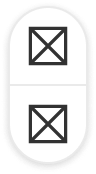
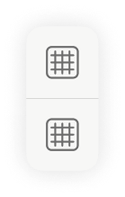
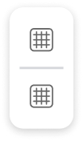
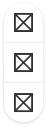
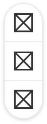
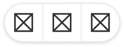
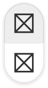
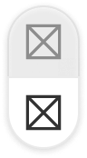

The floating button group is used to display icon-only actions on top of images and maps.


| Figma | Web | iOS | Android |
| --- | --- | --- | --- |
| Ready ✅ | Ready ✅ | N/A | N/A |

⚠️ Web only

* [Floating button group on Figma](https://www.figma.com/design/xxqSJcKOphrgimxRQbvtfe/2.-Gemini-Components-Library?node-id=3-7292)
* [Floating button group on Storybook](https://gemini-storybook.prompt-scorpion-preview.aws.aviv.eu/?path=/docs/ui-overlay-floatingbuttongroup--docs)

---

## Usage

The floating button group is used for quick access to important actions without taking up much screen space. They are mainly used for zooming on maps.

### Platform

The component is only used on the web. On iOS and Android, native components are used instead. The native components are not available in the gemini figma libraries.

| Web | iOS | Android |
| --- | --- | --- |
|  |  |  |

### When to use

**Floating button group** — actions that float above scrolling content, typically overlaying media.

### When NOT to use

| Instead, when… | Use |
| --- | --- |
| Actions sit in normal page flow | **Button group** |
| A dropdown list of contextual actions | **Action menu** |
| A single action | **Button** |

### Variant Selection Flow

```
Number of buttons
└─ Two or three

Alignment
├─ Wide space available → Horizontal
└─ Narrow space, or anchored to a screen edge → Vertical
```

### Usage Guidance

| DO | DON'T |
| --- | --- |
|  **DO:** Use the floating button group for related actions, such as zooming on maps. |  **DON'T:** Don't use the floating button group for unrelated actions. Instead, use individual floating buttons. |

### Related Components

| Component | Priority | Usage | Example Scenario |
| --- | --- | --- | --- |
| **Floating button group** | — | Floating button groups are used to group related actions together and position them on top of images and maps. | — |
| **Button (floating)** | Medium | Floating buttons are used for unrelated actions on top of images and maps. | — |

---

## Variants & Modifiers

### Buttons

The floating button group is available with 2 - 3 buttons.

| 2 buttons | 3 buttons |
| --- | --- |
|  |  |

### Alignment

The floating button group is available with a vertical and horizontal alignment.

| Vertical | Horizontal |
| --- | --- |
|  |  |

### Modifiers

Not documented

---

## Behavior & Responsiveness

### Interactive States & Loading

The buttons in the floating button group have the states default, hover, pressed and disabled.

| Default | Hover | Pressed | Disabled |
| --- | --- | --- | --- |
|  |  |  |  |

### Touch Target & Layout

Not documented

### Breakpoints & Platform Adaptations

Not documented

---

## Content & UX Writing

Not documented

---

## Accessibility (a11y)

Not documented
