Floor selection components are used to select floors.


| Figma | Web | iOS | Android |
| --- | --- | --- | --- |
| Ready ✅ | Ready ✅ | Ready ✅ | Ready ✅ |

* [Floor selection on Figma](https://www.figma.com/design/w5XQs0VtHaiaCs3YYQ48Xw/4.-Gemini-Experiences-Library?node-id=2610-13607)

---

## Usage

Floor selections allow users to enter or select a floor number. They contain "GF" as an abbreviation for the ground floor.

### Platform

Unlike other form components, we use the same floor selection on all platforms.

### When to use

Not documented

### When NOT to use

Not documented

### Variant Selection Flow

```
Field width
├─ Default, one field on its own row → 144px
├─ Two fields share the same row → 50% of the container
└─ Not recommended at full-width — the form container caps at 448px

Header
├─ Always → A label, 1 to 3 words, noun form, starting with a capital letter, no punctuation
├─ The field is mandatory → Required asterisk; otherwise an optional mention
├─ The label alone is not enough → Add a tooltip icon
└─ Recommended → Keep the default helper text, which explains how to enter the ground floor
```

### Usage Guidance

| DO | DON'T |
| --- | --- |
| 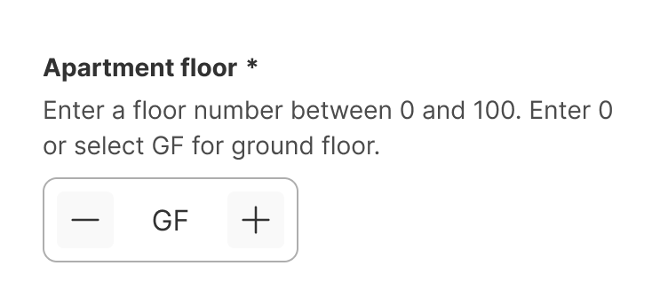<br>**DO:** Use the floor selection to allow users to enter or select their floor number. | 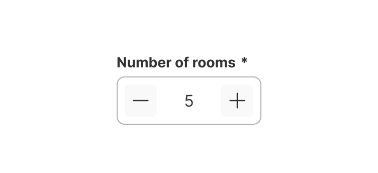<br>**DON'T:** Don't use the floor selection for other use cases, such as selecting the number of rooms. Use the counter field instead. |

| DON'T |
| --- |
| 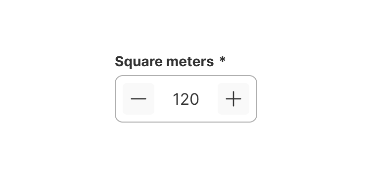<br>**DON'T:** Don't use the floor selection for other uses cases where larger numbers are needed. Use text fields instead. |

### Related Components

| Component | Usage |
| --- | --- |
| Floor selection | The floor selection component is used to select floors. The component contains "GF" (ground floor) as a word. |
| [Counter field](https://zeroheight.com/626199550/p/273135-counter-field) | The counter field allows only numeric values. The component doesn't support letters or words. |
| [Text field](https://zeroheight.com/626199550/p/980e7b-text-field) | Text fields allow all kinds of free-form content. They should be used for larger numbers such as prices, square meters, zip codes, or street numbers. |

## Variants & Modifiers

### Modifiers

#### Header

Like all form components, floor selections contain a header consisting of a label, a required asterisk or an optional mention, a tooltip icon, and a helper text.

Go to the [form guidelines](https://zeroheight.com/626199550/p/81b84d-forms/t/page-81b84d-92550230-54) for more information.

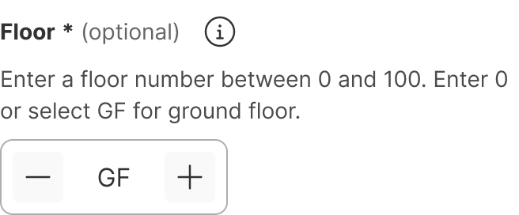

We recommend using the default helper text to help the user understand how to enter the ground floor.

## Behavior & Responsiveness

### Interactive States & Loading

Floor selections have the states default, hover, active, and disabled. They don't have a pressed state. Instead, they change to the active state when a user presses on the field. When in error state, they contain an error message.

#### Neutral

| Default | Hover | Active | Disabled |
| --- | --- | --- | --- |
| 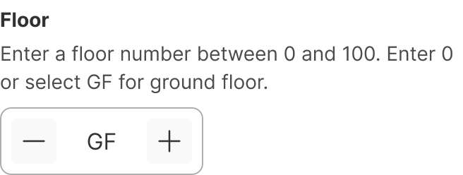 | 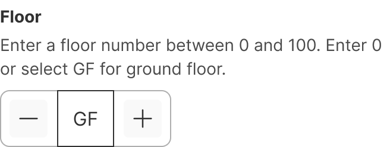 | 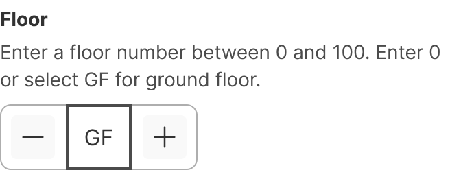 | 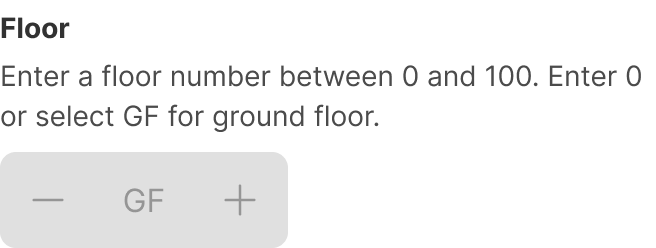 |

#### Error

| Default | Hover | Active | Disabled |
| --- | --- | --- | --- |
| 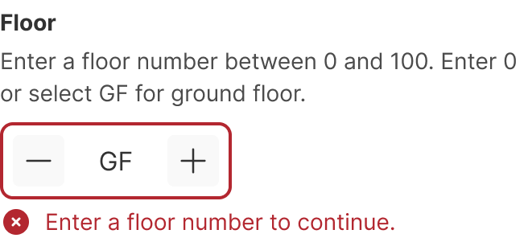 |  | 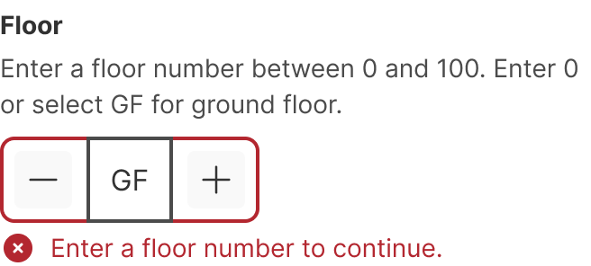 |  |

#### Buttons

The +/- buttons have the states default, hover, pressed and disabled.

| Default | Hover | Pressed | Disabled |
| --- | --- | --- | --- |
|  | 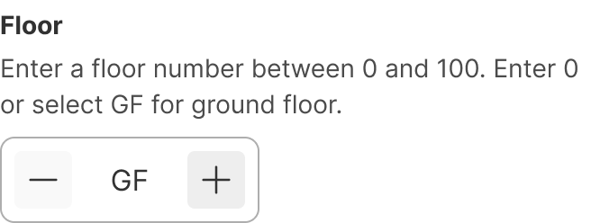 | 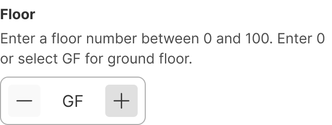 |  |

Numbers can be entered into the floor selection using the keyboard. It is not possible to enter or copy/paste letters in the floor selection component. To select the ground floor, users must enter 0 or select GF with the +/- keys.

#### Limit

The floor selection allows values from 0 to 100. Negative values are currently not possible. If the user input is greater than the limit, the field is reset to the limit.

| Entering with keyboard | Selecting with buttons |
| --- | --- |
| 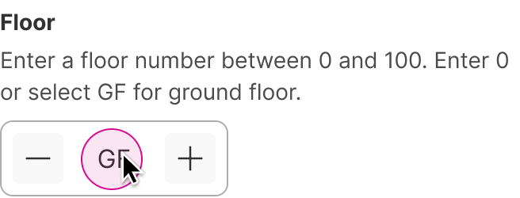 | 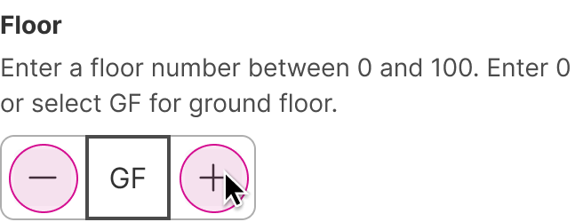 |

### Touch Target & Layout

The default size of the floor selection field is 144px. The width can also be set to 50% of the container, if two fields are in the same row. We don't recommend using the floor selection at 100% (full-width).

According to our [form guidelines](https://zeroheight.com/626199550/p/81b84d-forms/t/page-81b84d-92550230-13), the form container should have a max-width of 448px.

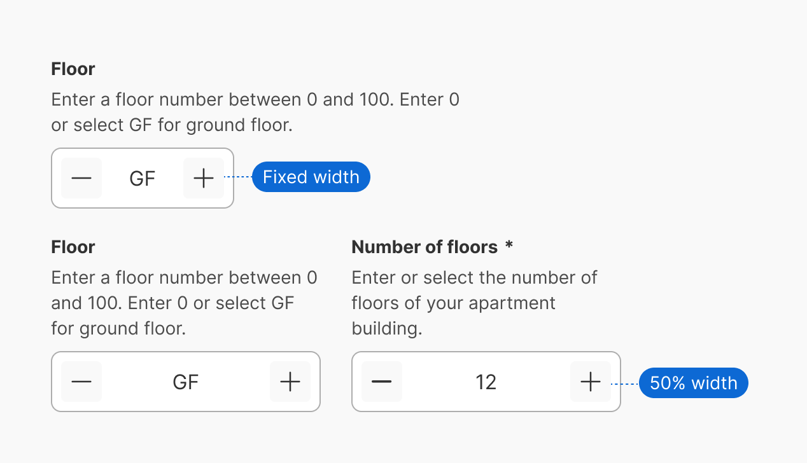

### Breakpoints & Platform Adaptations

Not documented

## Content & UX Writing

### Digit

The floor selection supports positive numbers between 0 and 100 and the wording "GF" for the ground floor.

### Labels

Floor selections should always have a label, to help the user understand what information to enter.

* Keep the label short and concise (1-3 words) and in noun form.

* Start with a capital letter and use no punctuation (including colons).

### Helper text

We recommend using the default helper text to help the user understand how to enter the ground floor.

When used, helper text is always available when the input is focused and appears below the field. The exceptions are when an error or warning message replaces the helper text in Android.

For more information on content guidelines, please refer to the [UX Writing principles](https://zeroheight.com/626199550/p/324518-intro).

## Accessibility (a11y)

Not documented
