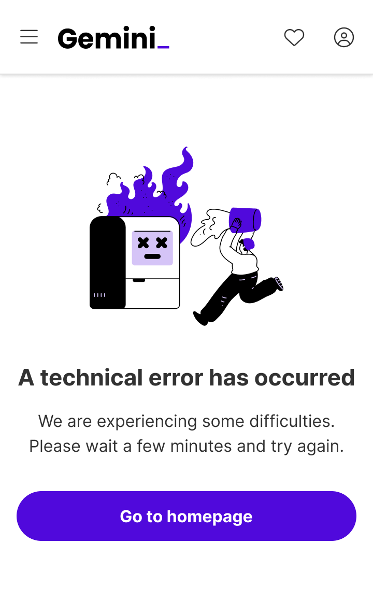
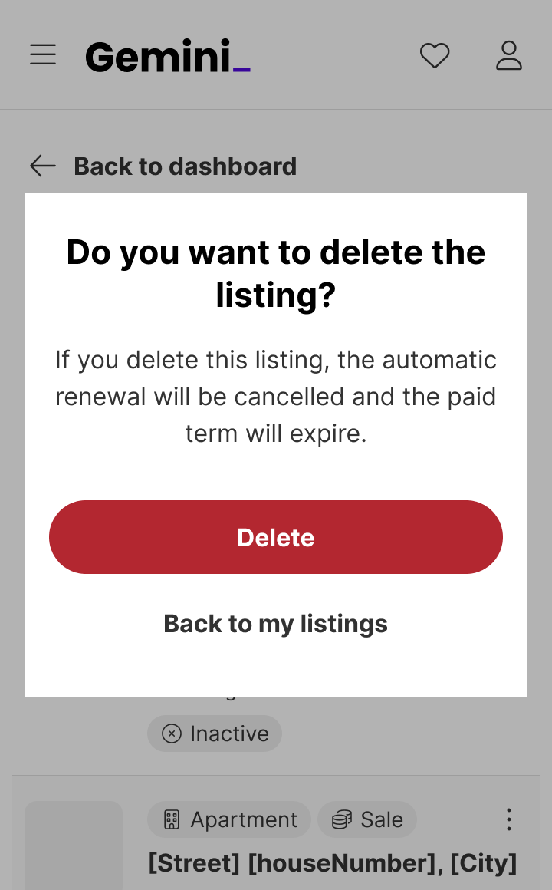
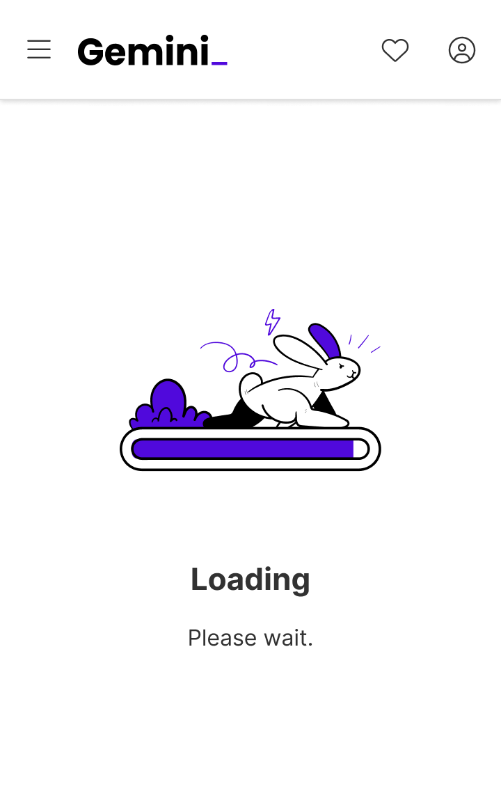
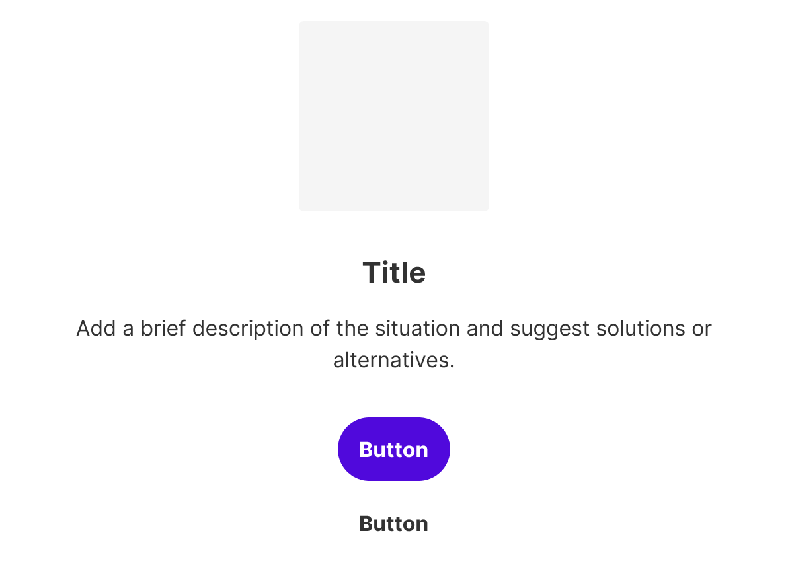
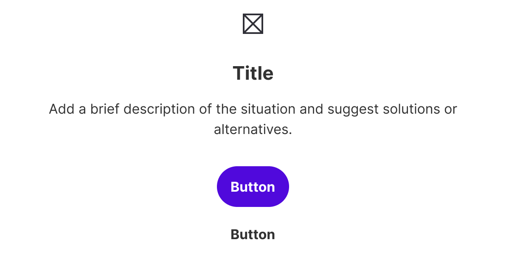
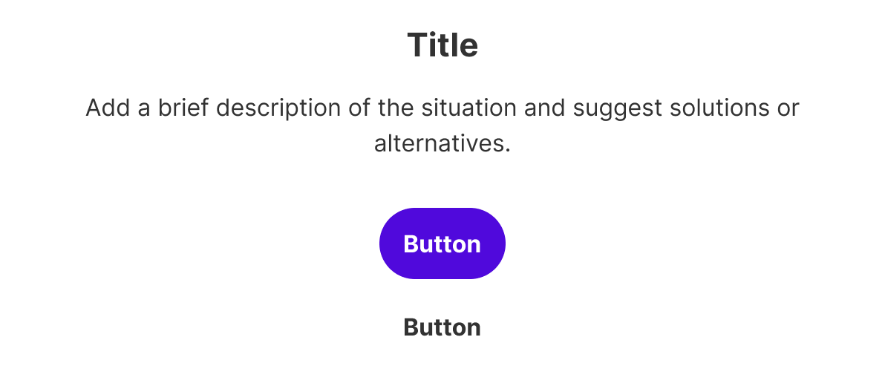
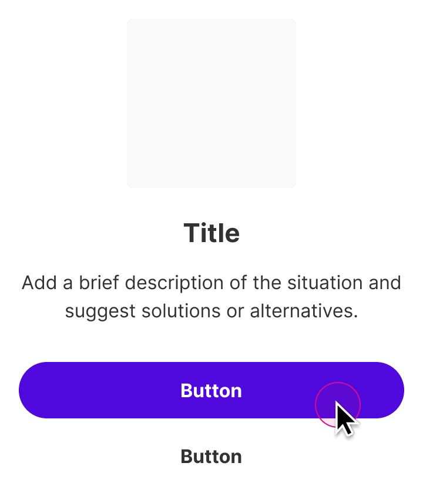
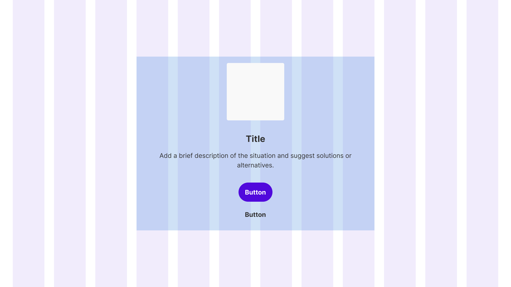

Info states are placeholders used to inform users about success, error and empty states.


| Figma | Web | iOS | Android |
| --- | --- | --- | --- |
| Ready ✅ | Ready ✅ | Ready ✅ | Ready ✅ |

* [Info state on Figma](https://www.figma.com/design/TSd5D0j4WIVxZTGk0ZgfK7/3.-Gemini-Patterns-Library?node-id=9-7261)
* [Info state on Storybook](https://gemini-storybook.prompt-scorpion-preview.aws.aviv.eu/?path=/docs/ui-feedback-infostate--docs)


_This component has a tool specification: [`info-state-figma.md`](info-state-figma.md) — what is true of it in the design tool, and nowhere else._

---

## Usage

Info states are used to communicate system status, errors, or other relevant information to users. They typically include:

* **Empty states:** Shown when there is no content to display or resources are missing
* **Error states:** Indicates problems such as network outages
* **Success states:** Acknowledge successful actions, such as submitting a form
* **Loading states:** Notifies users that data or content is being processed or loaded

### When to use

**Info state** — full-area states — empty, error, success, loading.

**Pattern**-tier component. **Highest tier first**: do not compose an empty/error/loading screen from Illustration + Text + Button — this component already is it.

### When NOT to use

| Instead, when… | Use |
| --- | --- |
| Inline section-level messages | **Feedback message** |
| A blocking decision is required | **Alert** |

### Variant Selection Flow

```
Device
├─ Phone → Phone variant
├─ Tablet → Tablet variant
└─ Desktop → Desktop variant

Content and actions
├─ The state needs a way forward → Show buttons
├─ A secondary way forward as well → Add the tertiary button
└─ Purely informational → No buttons

State being communicated
├─ Nothing to show yet → Empty
├─ Something failed → Error
├─ Something completed → Success
└─ Content is still arriving → Loading
```

### Usage Guidance

| DO |
| --- |
|  **DO:** Use the info state component for empty states, when there is no data to display. |

| DO | DON'T |
| --- | --- |
| <br>**DO:** Use the info state component for empty states, when there is no data to display. | <br>**DON'T:** Don't use info states for quick inline notifications. Use feedback messages instead. |
| <br>**DO:** Use info states to display errors such as network outages. | <br>**DON'T:** Don't use info states for warnings or errors that should block the user flow. Use alerts instead. |

| DO |
| --- |
| <br>**DO:** Use info states to confirm successful actions. |
| <br>**DO:** Use info states to inform users that content is loading. |

### Related Components

| Component | Priority | Usage | Example Scenario |
| --- | --- | --- | --- |
| **Info state** | — | Info states are placeholders used to inform users about success, error and empty states. | — |
| [**Feedback message**](../feedback-message/feedback-message.md) | High | Feedback messages are non-disruptive, inline notifications that provide users with important information or contextual messages. | Inline section-level messages |
| [**Alert**](../alert/alert.md) | High | Alerts are modals that provide users with critical information they need immediately. | A blocking decision is required |

---

## Variants & Modifiers

Not documented

---

### Modifiers

Not documented

#### Illustration/Icon

Info states can be used with an icon, an illustration, or neither. You can't use them with an icon and an illustration at the same time.

If you use an illustration we recommend the usage of hero illustrations.

| With illustration | With icon | No icon/illustration |
| --- | --- | --- |
|  |  |  |


#### Title and description

Both title and description are mandatory.


#### Buttons

Info states can be used with 1-2 buttons, or without any. If two buttons are used, we recommend combining the primary and tertiary buttons.

They should be used when they provide clear next steps or actions for users, such as retrying after an error, navigating to another page, or resolving an issue.

| With two buttons | With one button | Without buttons |
| --- | --- | --- |
|  |  |  |

## Behavior & Responsiveness

### Interactive States & Loading

Info states appear in response to system events such as errors, loading processes, empty content, or successful actions.

They disappear when the user takes action, such as retrying or navigating away, or when the system resolves the problem on its own, such as completing a load process. In some cases, they disappear automatically after a short period of time, or they may require manual dismissal by clicking an action button.

| Closing |
| --- |
|  |

#### Breakpoints and width

| Width: 100% | Reduced width |
| --- | --- |
|  |  |

### Touch Target & Layout

Not documented

### Breakpoints & Platform Adaptations

The width of the info state and its buttons depends on the breakpoint. To learn more about our breakpoints, see our [grids and breakpoint guidelines](https://zeroheight.com/626199550/p/04fc9a-grids-and-breakpoints).

| Layout | Breakpoint behavior |
| --- | --- |
|  **Width: 100%** | - Web: XXS - XS (0 - 599 px) - Android: Compact (0 - 599 dp) - iOS: device 0 - 523 px |
|  **Reduced width** | - Web: SM - XXXL (> 599 px) → width: 50%, max-width: 570px - Android: Medium - Expanded (> 599 dp) → max-width: 429 dp - iOS: device > 524 px → max-width 524 px |

---

## Content & UX Writing

* **Title:** The mandatory title should be short and concise. It should contain a brief and clear statement or question.
* **Description:** Descriptions are mandatory and are used to give additional context and details. Use clear and simple language and don't overwhelm the user with too much information. Tell the user what happened and what they need to do to proceed. Don't blame the user. Stay positive and empathetic but don't say please and sorry. Don't use "Oops". Keep the description to 1-2 sentences.
* **Buttons:** Buttons should be clear and inciting. Users should be able to anticipate what will happen when they click a button. Buttons should always lead with an action verb in the infinitive tense, using the {verb} + {noun} formula, except for common actions like "Done," "Close," "Cancel," or "OK." Use sentence case without punctuation. Keep it under 4 words and/or 30 characters maximum in English.

For more information, see the [UX Writing principles](https://zeroheight.com/626199550/p/324518-intro) and [Info state guidelines](https://zeroheight.com/626199550/v/latest/p/85a997-info-state).

---

### Buttons

Buttons should always lead with an action verb that encourages action, in the infinitive tense. To provide enough context to our users, use the {verb} + {noun} content formula on buttons except in the case of common actions like “Done,” “Close,” “Cancel,” or “OK.”

Try to keep it under 4 words and/or 30 characters maximum in English.

For more information on content guidelines, please refer to the UX Writing principles and Info state guidelines.

## Accessibility (a11y)

Not documented
