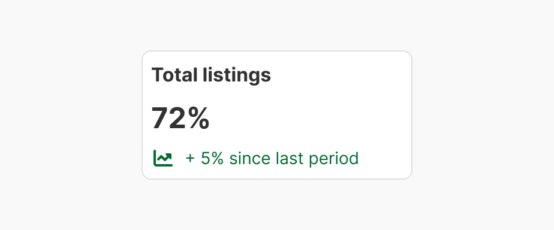
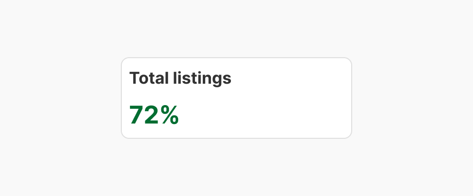

Key Performance Indicators (KPIs) are measurable values that demonstrate how effectively a key objective is achieved. In data visualization, KPIs are critical for providing at-a-glance insights into performance and guiding decision-making.


| Figma | Web | iOS | Android |
| --- | --- | --- | --- |
| Ready ✅ | To Do 🚧 | To Do 🚧 | To Do 🚧 |

---

## Usage

A KPI can be displayed alone or in a chart to emphasize some data or trends.

### When to use

**KPI** — a single key metric value needs prominent standalone display.

### When NOT to use

| Instead, when… | Use |
| --- | --- |
| Trends, comparisons or distributions | **Charts** |

### Variant Selection Flow

```
Layout
├─ An additional indicator is shown and space is wide → Horizontal
└─ An additional indicator is shown and space is narrow → Vertical

Display context
├─ Paired with a graph → With a graph
└─ Standing on its own → Independent
```

### Usage Guidance

| DO | DON'T |
| --- | --- |
| <br>**DO:** Use icon, tags or any other elements that don't need color to be understood | <br>**DON'T:** Green and red can be the same color for some type of color-blind issues. |

### Related Components

| Component | Priority | Usage | Example Scenario |
| --- | --- | --- | --- |
| **Kpi** | — | Key Performance Indicators (KPIs) are measurable values that demonstrate how effectively a key objective is achieved. | — |
| [**Charts**](../charts/charts.md) | High | Charts are data visualisation components used to represent numerical data and trends clearly and accessibly. | Trends, comparisons or distributions |

---

## Variants & Modifiers

### Layout

You can change the alignment to horizontal or vertical when an additional indicator is shown.

| Horizontal | Vertical |
| --- | --- |
|  |  |

### Display Context

| With a graph | Independent |
| --- | --- |
|  |  |

### Modifiers

Not documented

#### Elements


| Element | Description | Mandatory | Customisable |
| --- | --- | --- | --- |
| Title | Concise KPI title | Yes | Yes |
| KPI | Unique number highlighting important data or conclusion | Yes | Yes |
| Additional indicator | Messages provide context or additional data, usually trending or comparing with other data. Use a state message or a tag to highlight more of the data. | No | Yes |

---

## Behavior & Responsiveness

### Interactive States & Loading

Not documented

### Touch Target & Layout

Not documented

### Breakpoints & Platform Adaptations

Not documented

---

## Content & UX Writing

Not documented

---

## Accessibility (a11y)

Not documented
