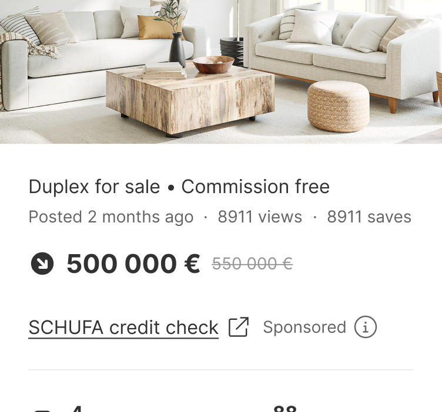
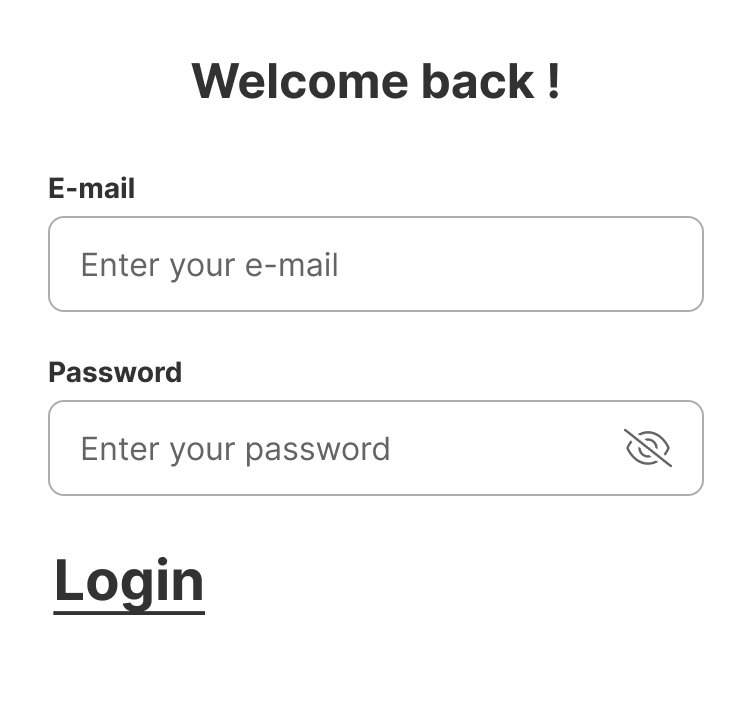
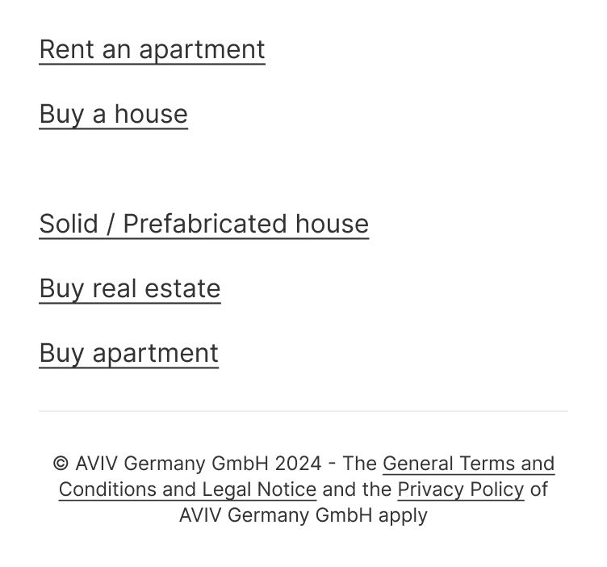
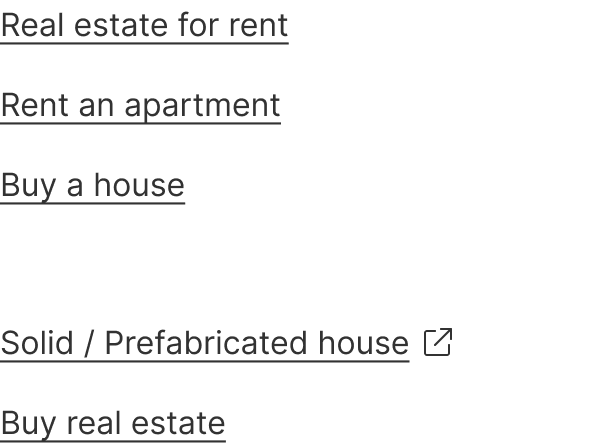
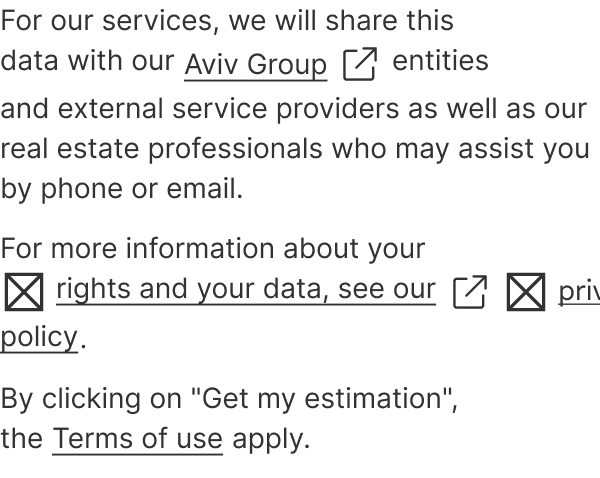
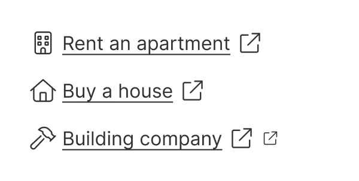

Links are navigational elements that are used to direct users to another location or resource.


| Figma | Web | iOS | Android |
| --- | --- | --- | --- |
| Ready ✅ | Ready ✅ | Ready ✅ | To Do 🚧 |

* [Link on Figma](https://www.figma.com/design/xxqSJcKOphrgimxRQbvtfe/2.-Gemini-Components-Library?node-id=3-7288)
* [Link on Storybook](https://gemini-storybook.prompt-scorpion-preview.aws.aviv.eu/?path=/docs/ui-navigation-link--docs)

---

## Usage

Links are used to navigate users to a new page, an external website, or a different section of the current page.


### When to use

**Link** — the intent is navigation to another page or section — not action.

### When NOT to use

| Instead, when… | Use |
| --- | --- |
| An action is triggered | **Button** |
| Navigation needs button weight, e.g. an empty-state CTA | **Button, tertiary** |

### Variant Selection Flow

```
Type
├─ The link stands on its own, outside running text → Standalone
└─ The link sits inside a sentence or paragraph → Inline

Size
├─ Standalone → 16px
└─ Inline → Inherits the size of the surrounding text

Context
├─ Normal surface → Default
├─ Dark or inverted region → Inverted
└─ On a brand-primary fill → On-primary

Icons
├─ Standalone → No icon, icon left, or icon right; external-link icon for external targets
└─ Inline → No icon, except the external-link icon for external targets
   └─ Never add any other icon to an inline link
```

### Usage Guidance

| DO |
| --- |
|  **DO:** Use links to redirect users to different internal pages or to a different section of the current page. |
|  **DO:** Use links with the external link icon to link to external websites. |

| DON'T |
| --- |
|  **DON'T:** Don't use links to trigger actions. Use buttons instead. |

| DO | DON'T |
| --- | --- |
| <br>**DO:** Use links to redirect users to different internal pages or to a different section of the current page. | <br>**DON'T:** Don't use links to trigger actions. Use buttons instead. |

### Related Components

| Component | Priority | Usage | Example Scenario |
| --- | --- | --- | --- |
| **Link** | — | Links are navigational elements that take users to different pages or sections. | — |
| [**Button**](../button/button.md) | High | Buttons trigger actions. | Navigation needs button weight, e.g. an empty-state CTA |
| **Text button** | Medium | A distinct component from Button, for when full button weight is too heavy. | Text button redirects here when: The control leaves the page |

---

## Variants & Modifiers

### Type

Links can be standalone or inline. Both types can be used to link to internal or external pages or files.

| Standalone | Inline |
| --- | --- |
|  |  |

#### Standalone


Standalone links are used on their own. They should not be used within a sentence or paragraph.

#### Inline


Inline links are used within a sentence or paragraph.

### Size

**Standalone:** The standalone links have a font size of 16px.

**Inline:** The inline link automatically adapts to the font size of the text in which it's placed.

### Context

Links change their appearance depending on their context and background to better adapt to the environment while maintaining the same level of accessibility and usability.

| Default | Inverted | On-primary | On-secondary |
| --- | --- | --- | --- |
|  |  |  |  |

### Modifiers

#### Icons

Icons are used to emphasize the text content in the link label.

**Standalone link:** The standalone link can have a left, right, or external icon to indicate external links.

| No icon | Icon left | Icon right | External icon |
| --- | --- | --- | --- |
|  |  |  |  |

| DO |
| --- |
|  **DO:** Use icons in standalone links. |

**Inline link:** To ensure readability, the inline link doesn't have any icons other than the external link icon.

| No icon | External icon |
| --- | --- |
|  |  |

| DO | DON'T |
| --- | --- |
|  **DO:** Use inline links without icons to ensure readability. Use only the external link icon for external inline links. |  **DON'T:** Don't add other icons to inline links. |

---

## Behavior & Responsiveness

### Interactive States & Loading

All link types have the states default, hover, pressed and disabled.

| Default | Hover | Pressed | Disabled |
| --- | --- | --- | --- |
|  |  |  |  |

### Touch Target & Layout

**Standalone**

**Inline**

### Breakpoints & Platform Adaptations

Not documented

---

## Content & UX Writing

Link texts should be clear and inciting. Our users should be able to anticipate where the links lead to.

Start links with verbs to encourage action. Avoid phrases like "click here". Instead, use language that describes the destination or content you're referring to. For example: "Download our catalog". This helps users understand where they're likely to go and encourages them to go there.

For more information on content guidelines, please refer to the [UX Writing principles](https://zeroheight.com/626199550/p/324518-intro).

---

## Accessibility (a11y)

Not documented
