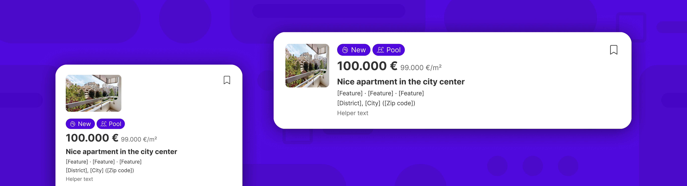
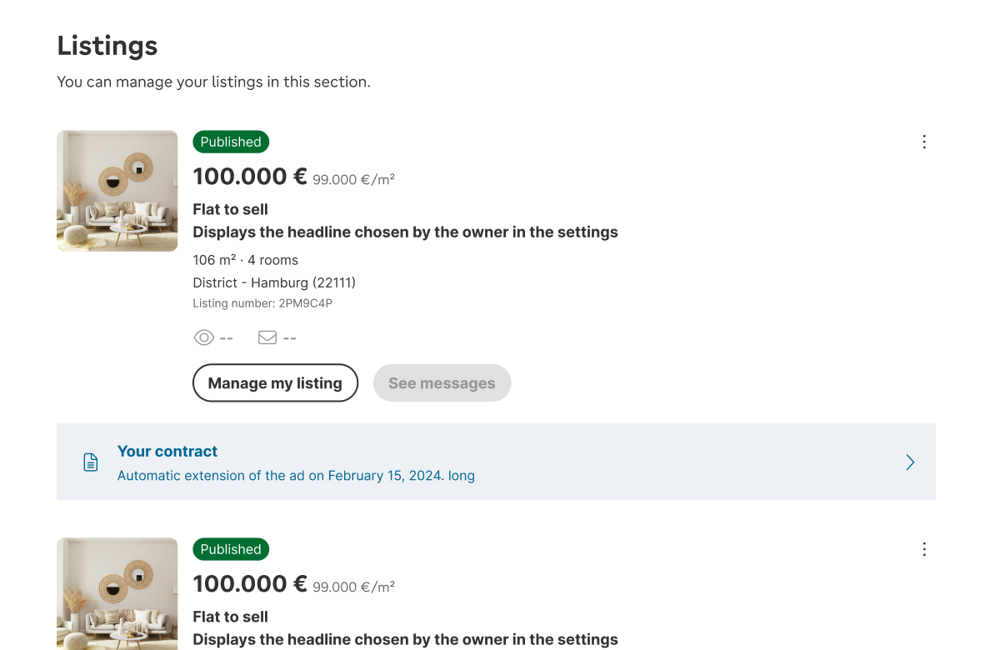
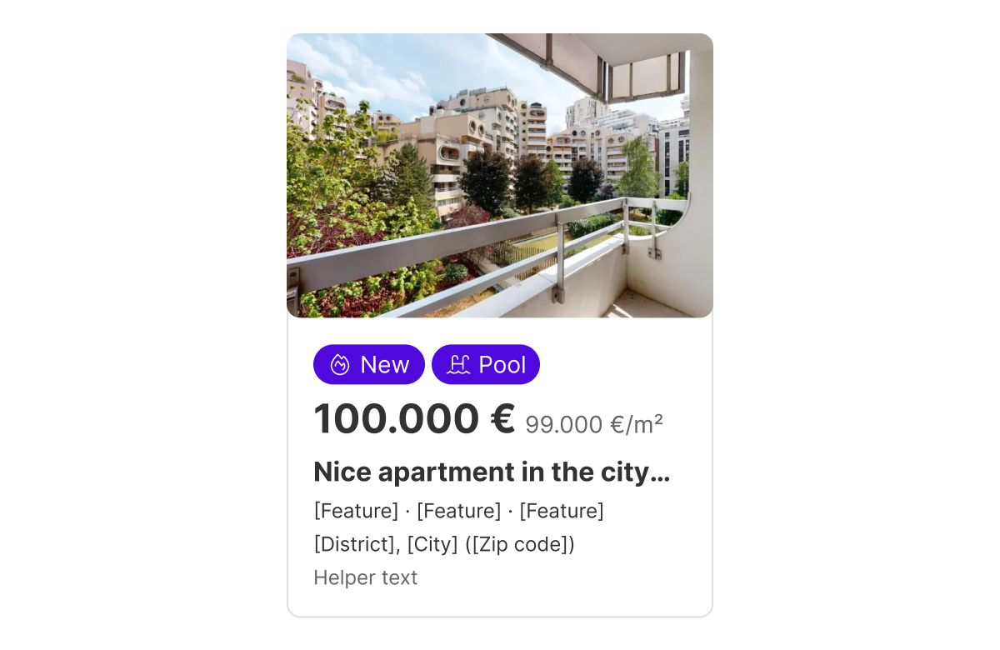
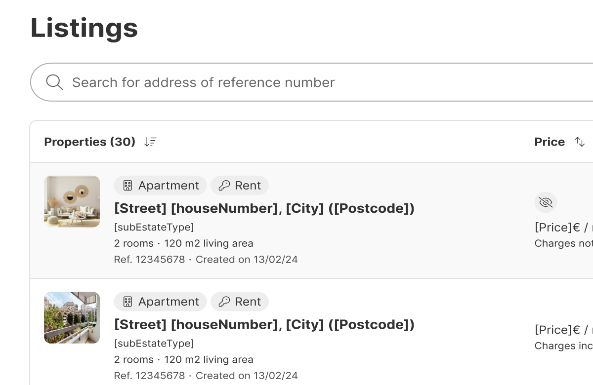
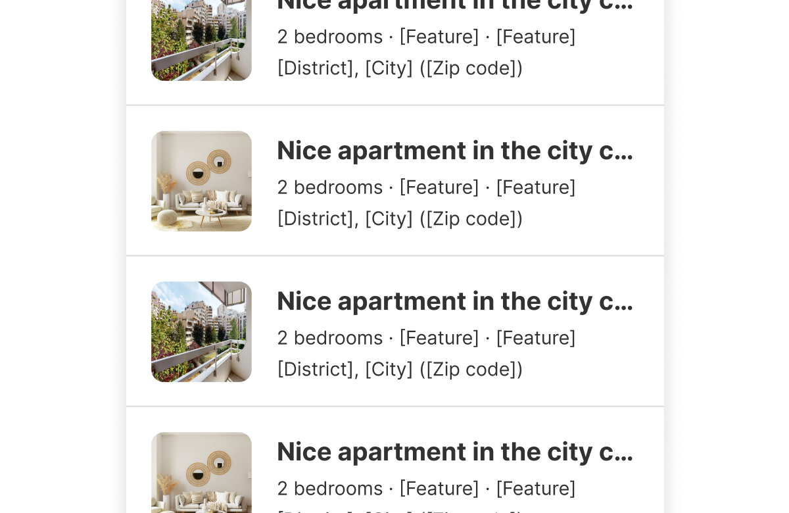
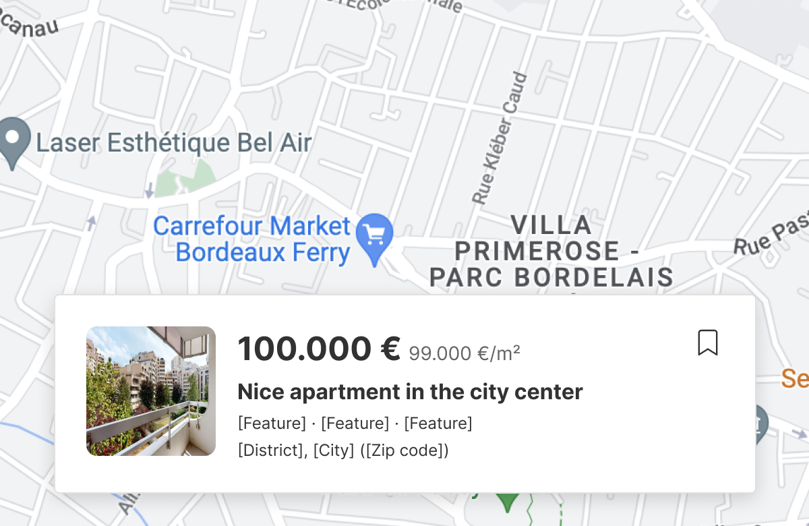
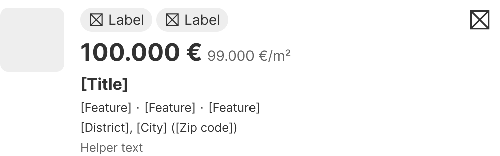
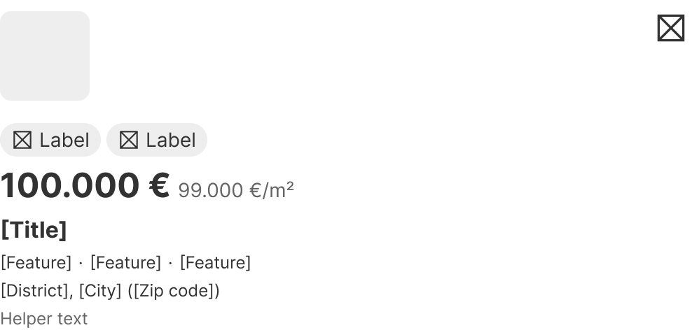
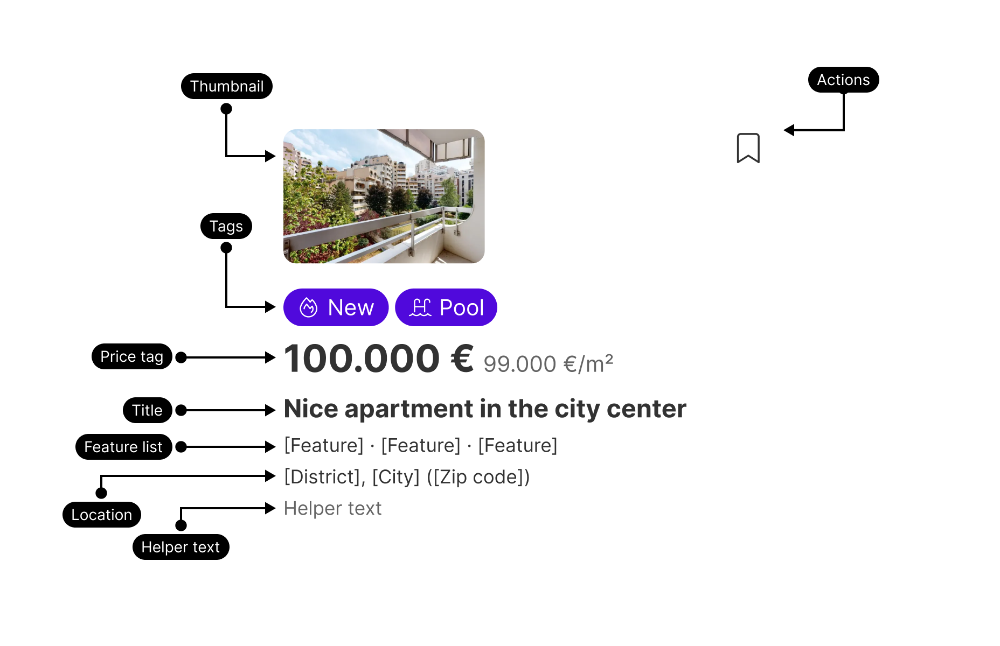

Listing summaries are concise versions of listings featured on any AVIV Group website. Designed for high flexibility, they adapt to a wide range of use cases. While they provide an overview of the listings, they may not always include actionable elements.



| Figma | Web | iOS | Android |
| --- | --- | --- | --- |
| Ready ✅ | Non-gemini component | Ready ✅ | Ready ✅ |

* [Listing summary in Figma](https://www.figma.com/design/w5XQs0VtHaiaCs3YYQ48Xw/4.-Experiences?m=auto&node-id=2115-63352&t=Wjql7VOThGReKVmi-1)
* [Listing summary in Storybook (non-Gemini)](https://bff.balanced-werewolf-dev.aws.aviv.eu/storybook/app/index.html?path=/story/ui-ui-classified-info--default)

---

## Usage

Listing summaries are concise versions of listings featured on any AVIV Group website. They are versatile and can be tailored to include as much or as little information as needed, ranging from a couple of details to a fuller overview.

The Listing summary component can function as a standalone short version of a listing, as part of larger patterns, or as an individual entity. It can be made interactive and can include various actions or additional components alongside it.

### When to use

**Listing summary** — a concise, flexible summary of a property listing, carrying as much or as little detail as the context needs.

**Experience**-tier component, **composed**. **Highest tier first**: do not assemble a property summary from Card + Tag + Price + Title yourself — this component already is it. It stands alone, sits inside a Card or a table row, or forms part of a larger pattern, and it can trigger an action such as opening the listing's detail page.

### When NOT to use

| Instead, when… | Use |
| --- | --- |
| A full, actionable property card on a search results page | **Listing card** |
| The result would carry Listing card's layout and its functions | **Listing card** |
| Grouping generic content that does not summarise a property | **Card** |

### Variant Selection Flow

```
Thumbnail position
├─ Row layouts — tables, dense lists → Thumbnail on the left
└─ Narrow columns or stacked layouts → Thumbnail on top

Thumbnail size
├─ Shown → Width 64, 72, 84, 96, 104, 112, 128 or 256; aspect ratio 1:1, 4:3 or 3:2
└─ Not needed → Disable it

Content slots — each is enabled or disabled independently
├─ Tags → 1, 2 or 3
├─ Price tag → Headline 24 with €m² 14 (default), or Headline 20 with €m² 12
├─ Title → 16 (default), 14, or Headline 24
├─ Feature list → 3 or 4 features, at 12 (default), 14 or 16; icons on or off
├─ Location → 12 (default), 14 or 16
├─ Helper text → 12 (default), 14 or 16
└─ Action → 1 or 2 buttons, at button size 40

Beyond the default slots
└─ Any custom arrangement is possible — but a summary that mimics Listing card's
   layout and functions is Listing card; see **Highest tier first**
```

### Usage Guidance

| DO | DON'T |
| --- | --- |
| <br>**DO:** Add more elements next to the Listing Summary to make it part of a bigger pattern if needed | <br>**DON'T:** Don't use the Listing Summary to mimic the layout and functions of the Listing Card. You can use the Listing Card component for that |

| DO |
| --- |
| <br>**DO:** Listing Summaries can be part of larger layouts like tables |
| <br>**DO:** Listing Summaries can also trigger an action, like going to the detail page of a listing |
| <br>**DO:** Listing Summaries can be placed inside a Card component or any other container for your convenience |

### Related Components

| Component | Priority | Usage | Example Scenario |
| --- | --- | --- | --- |
| **Listing summary** | — | Listing summaries are concise versions of listings featured on any AVIV Group website, designed for high flexibility. | — |
| [**Listing card**](../listing-card/listing-card.md) | High | Listing cards are actionable cards that summarize the details of a property listed on any AVIV Group website. | A full, actionable property card on a search results page |
| [**Card**](../card/card.md) | Medium | Cards are flexible containers used to visually group content. | Grouping generic content that does not summarise a property — and the container a listing summary is often placed inside |
| [**Table**](../tables/tables.md) | Low | Tables are used to organize and display all information from a data set. | A listing summary placed as a row inside a larger table layout |

## Variants & Modifiers

Listing Summaries come with two default variants that change the position of the thumbnail. However, using the Listing Summary component, you can create an infinite number of custom variants.

| Listing summary (Thumbnail on the left) | Listing summary (Thumbnail on top) |
| --- | --- |
|  |  |

### Modifiers

#### Sub-components

While Listing Summaries provide a high degree of flexibility, enabling designers to customize and organize them according to specific needs, they come with a default set of elements.



| Sub-component | Enable/Disable capability | Quantity | Sizes | Other |
| --- | --- | --- | --- | --- |
| Thumbnail | Yes | N/A | Width: 64, 72, 84, 96, 104, 112, 128, 256 | Aspect ratio: 1:1, 4:3, 3:2<br>Alignment: Left, Top |
| Tags | Yes | 1,2,3 | N/A |   |
| Price tag | Yes | N/A | Headline 24 / €m2 14 (default)<br>Headline 20 / €m2 12 |   |
| Title | Yes | N/A | 16 (default), 14, Headline 24 |   |
| Feature list | Yes | 3, 4 | 12 (default), 14, 16 | Icons enabled/disabled<br>12 Size (16px icon)<br>14 Size (16px icon)<br>16 Size (20px icon) |
| Location | Yes | N/A | 12 (default), 14, 16 |   |
| Helper text | Yes | N/A | 12 (default), 14, 16 |   |
| Action | Yes | 1,2 | Button size 40 |   |

## Behavior & Responsiveness

Not documented

### Interactive States & Loading

Not documented

### Touch Target & Layout

Not documented

### Breakpoints & Platform Adaptations

Not documented

## Content & UX Writing

Not documented

## Accessibility (a11y)

Not documented
