Modal bottom sheets are containers that appear above the content and block interaction with the rest of the screen.


| Figma | Web | iOS | Android |
| --- | --- | --- | --- |
| [Modal bottom sheet on Figma](https://www.figma.com/design/xxqSJcKOphrgimxRQbvtfe/2.-Gemini-Components-Library?node-id=3-7293) | Ready ✅ | Ready ✅ | Ready ✅ |

[Modal bottom sheet on Storybook](https://gemini-storybook.prompt-scorpion-preview.aws.aviv.eu/?path=/docs/ui-overlay-modal--docs)

---

## Usage

Modal bottom sheets are used to display contextual information that is related to the current screen or to offer actions that are relevant to the user's current context.

### Platform

We use platform-specific modal bottom sheets that differ between Web, iOS and Android.

#### Web

On the Web, the component appears as a bottom sheet on phones and as a modal on desktop. The modal bottom sheet is not draggable on the Web.

Desktop

| Phone | Dektop |
| --- | --- |
| 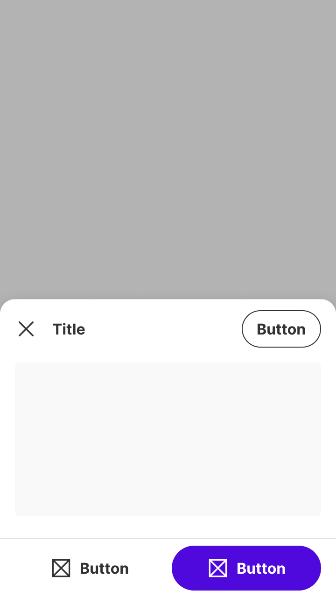 |  |

#### iOS

On iOS, we use native, draggable modal bottom sheets. As on the web, the component looks like a bottom sheet on phones and a modal on tablets. The tablet modals have a fixed height on iOS. If you have a small amount of content, please use the pop-up component instead.

| Phone | Tablet Portrait | Tablet Landscape |
| --- | --- | --- |
| 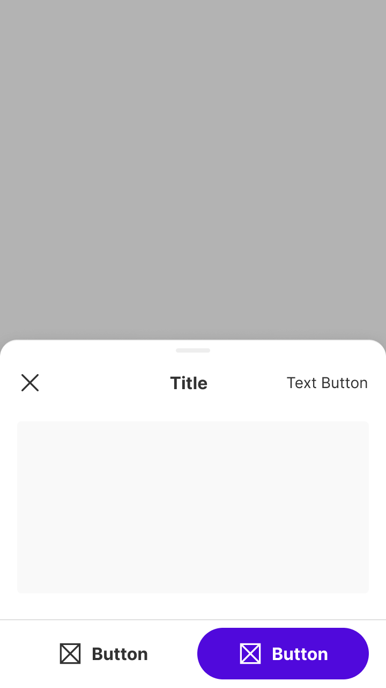 | 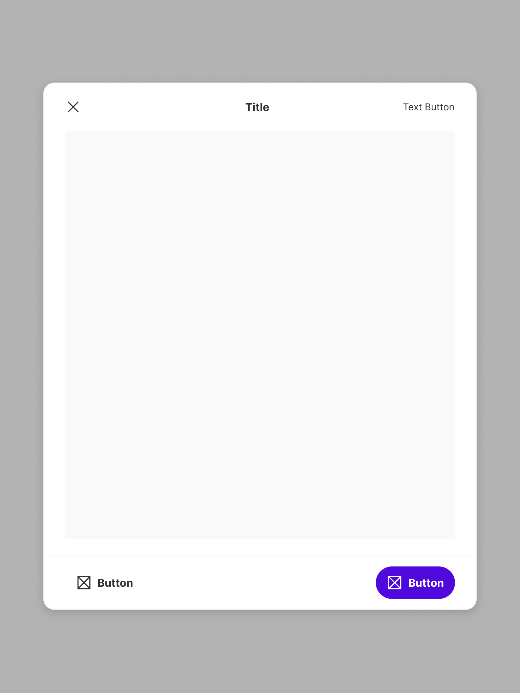 | 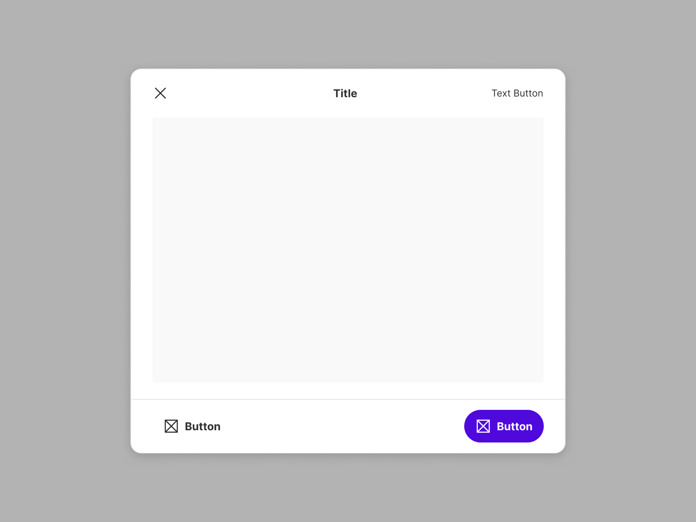 |

#### Android

On Android we use native, draggable modal bottom sheets. The component appears as a bottom sheet on phones. On tablet you can choose between a bottom sheet (`ModalBottomSheet`) or a modal (`SheetSuite`).

| Phone | Tablet Portrait | Tablet Landscape |
| --- | --- | --- |
|  | 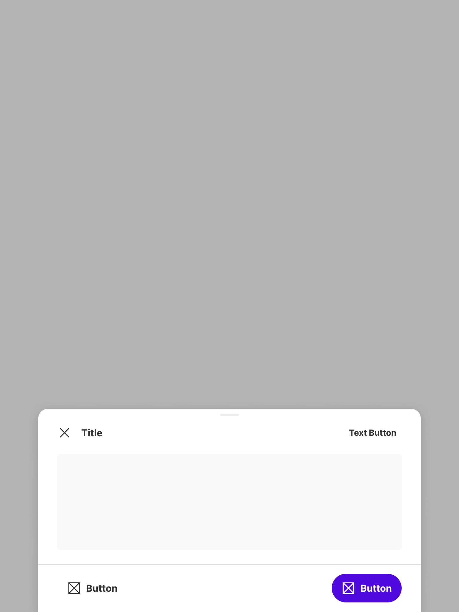 | 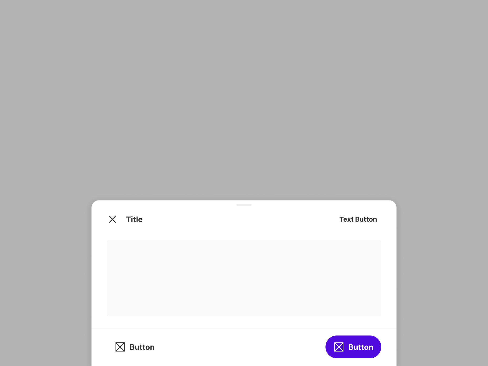 |

| Phone | Modal Bottom Sheet | Modal Bottom Sheet |
| --- | --- | --- |
|  | 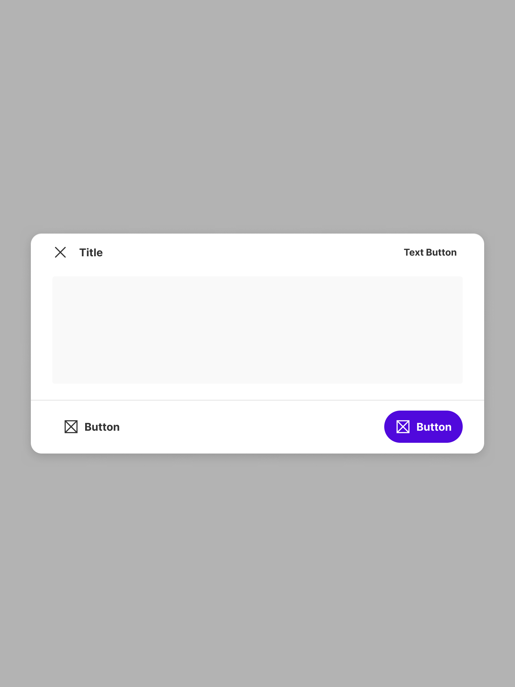 | 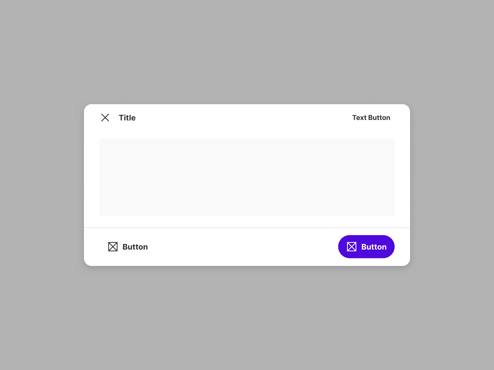 |

### When to use

**Modal bottom sheet** — contextual content must overlay the screen and block interaction.

### When NOT to use

| Instead, when… | Use |
| --- | --- |
| Content is a simple action list | **Modal bottom sheet menu** |
| Content should persist on the page | **Card** |
| An immediate, blocking decision is required | **Alert** |

### Variant Selection Flow

```
Surface, by platform and device — this is not a free choice
├─ Web
│  ├─ Phone → Bottom sheet
│  ├─ Desktop → Modal
│  └─ Never draggable on the web
├─ iOS → Native, draggable
│  ├─ Phone → Bottom sheet
│  └─ Tablet → Modal, portrait and landscape
└─ Android → Native, draggable
   ├─ Phone → Bottom sheet
   └─ Tablet → Bottom sheet or modal

Content volume
├─ Content exceeds the available space → Scrollable
└─ Small amount of content → Use Pop-up instead; see **Which component**
```

### Usage Guidance

| DO | DON'T |
| --- | --- |
|  **DO:** Use modals when it's important to get the user's full attention. |  **DON'T:** Don't use modal bottom sheets when the information or action isn't urgent or can be completed inline without interrupting the user's flow. They can be disruptive if overused. Use other components such as feedback messages, snackbars or info states. |

| DO |
| --- |
|  **DO:** In most use cases, the close button is located in the upper left corner. The "X" is quick to locate and is best for quick exits. |
|  **DO:** When using modals as alerts that require users to take action or make a decision, include a "Cancel" button next to the primary action. |

### Related Components

| Component | Priority | Usage | Example Scenario |
| --- | --- | --- | --- |
| **Modal bottom sheet** | — | Modal bottom sheets are containers that appear above the content and block interaction with the rest of the screen. | — |
| [**Modal bottom sheet menu**](../modal-bottom-sheet-menu/modal-bottom-sheet-menu.md) | High | Modal bottom sheet menus display a list of context-specific actions on mobile screens or on apps. | Content is a simple action list |
| [**Card**](../card/card.md) | High | Cards are flexible containers used to visually group content. | Content should persist on the page |
| [**Alert**](../alert/alert.md) | High | Alerts are modals that provide users with critical information they need immediately. | An immediate, blocking decision is required |

## Variants & Modifiers

Not documented

### Modifiers

Not documented

---

#### Padding

The modal bottom sheet can be used with or without padding.

| With padding | Without padding |
| --- | --- |
| 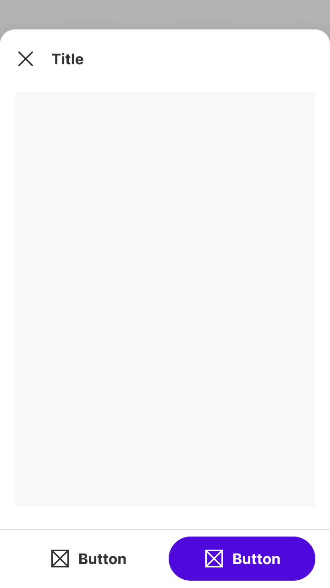 | 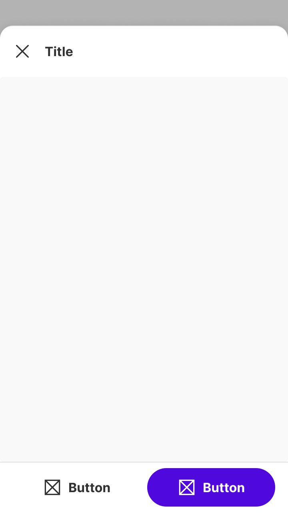 |

| DO |
| --- |
| 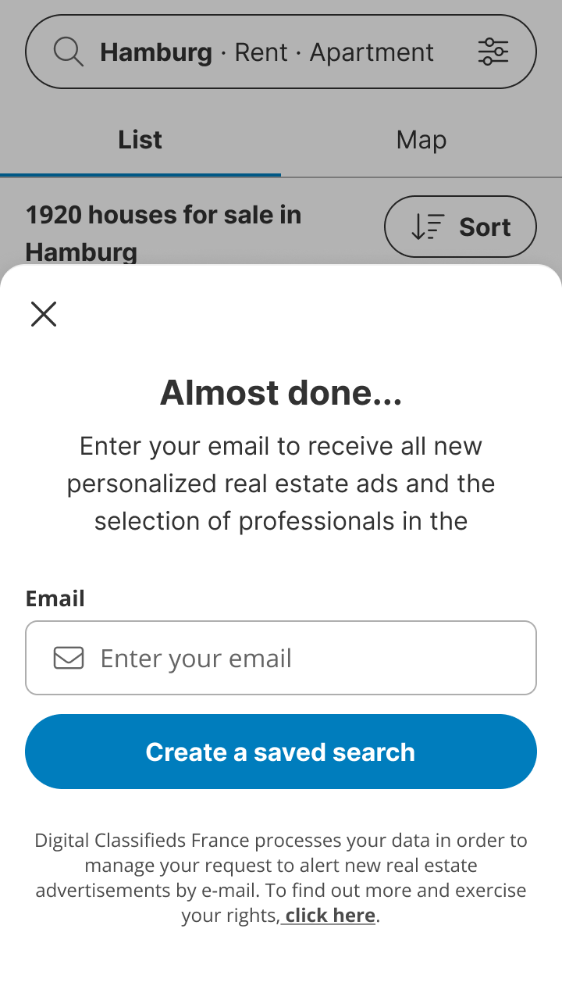<br>**DO:** Use the modal bottom sheet with padding for most use cases. The padding helps separate text, illustrations and components from the border. |
| 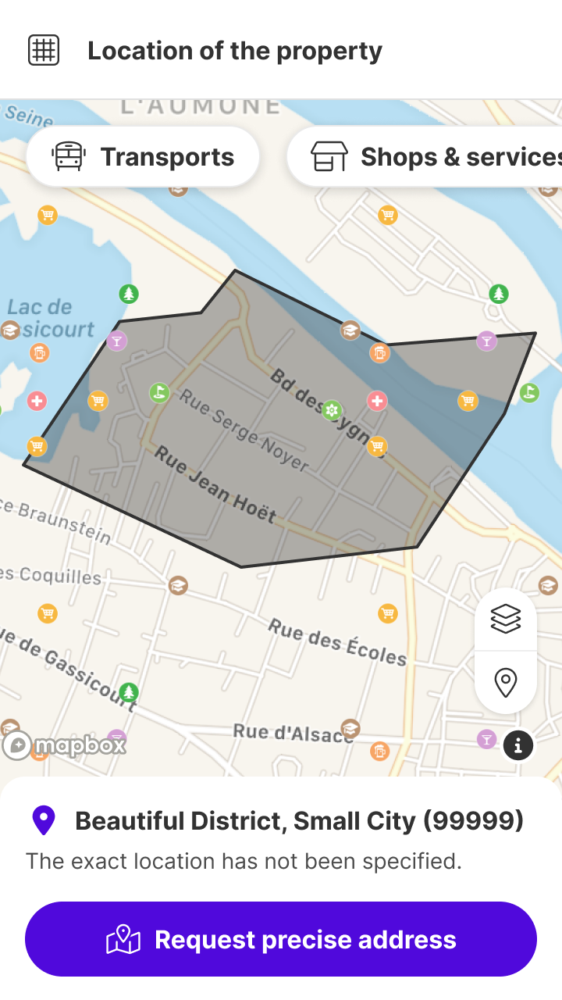<br>**DO:** Use the modal bottom sheet without padding when you want to display maps or images in full width. |

#### Header and footer

The modal bottom sheet contains an optional header and footer.

| Header and footer | Only footer | Only header |
| --- | --- | --- |
|  | 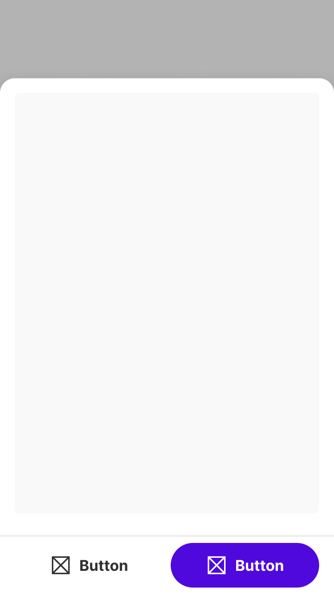 | 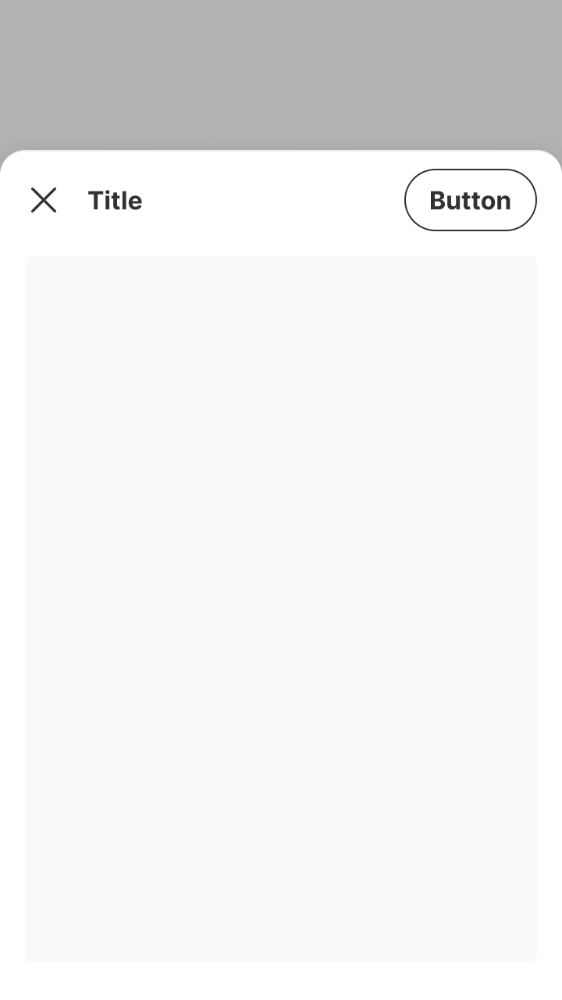 |

**Header**

The header has a close button on the left, a title in the middle and either a secondary button or up to 2 icons on the left. All elements of the header are optional.

| Header with button | Header with 1 - 2 icons |
| --- | --- |
| 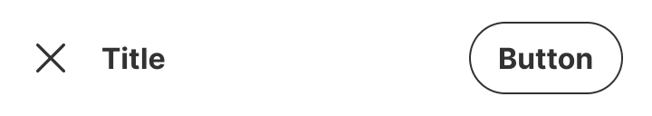 | 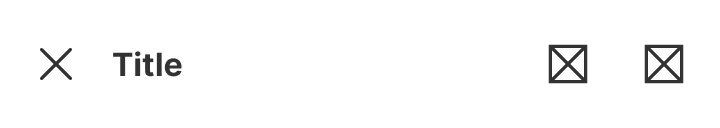 |

ℹ️ If a close button is needed, it should be on the left. Please don't change the position in the top bar.

**Footer**

The footer (bottom bar) has 1 - 2 buttons. They can be aligned horizontally or vertically. We recommend vertical alignment only if there is not enough space to align them side by side.

| Footer with 1 button | Footer with 2 horizontal buttons | Footer with 2 vertical buttons |
| --- | --- | --- |
| 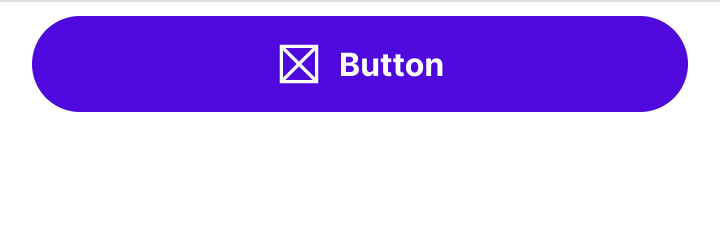 | 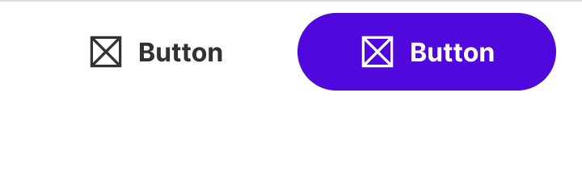 | 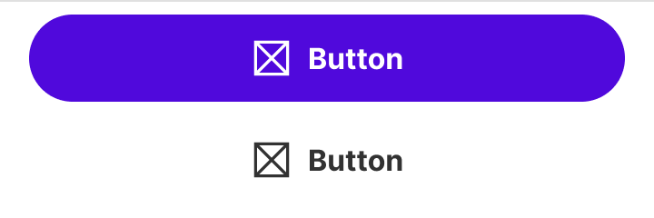 |

### Sizes

The modal bottom sheet is available in different heights.

| Default (hug content) | Full-Height | Full-Screen |
| --- | --- | --- |
|  | 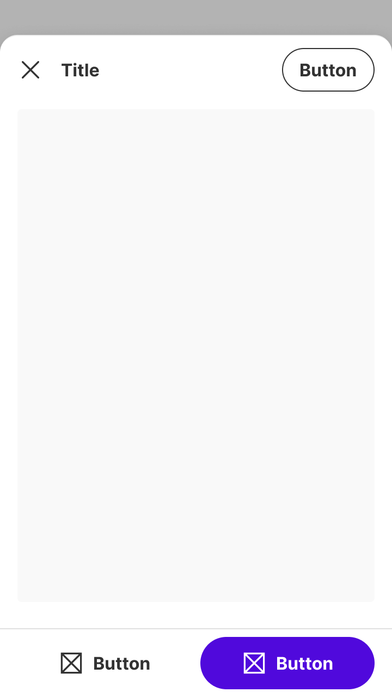 | 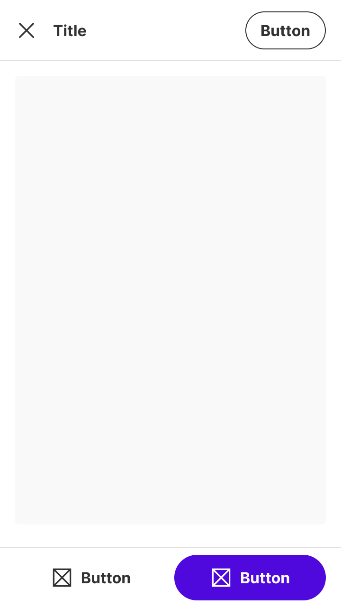 |

| DO |
| --- |
| 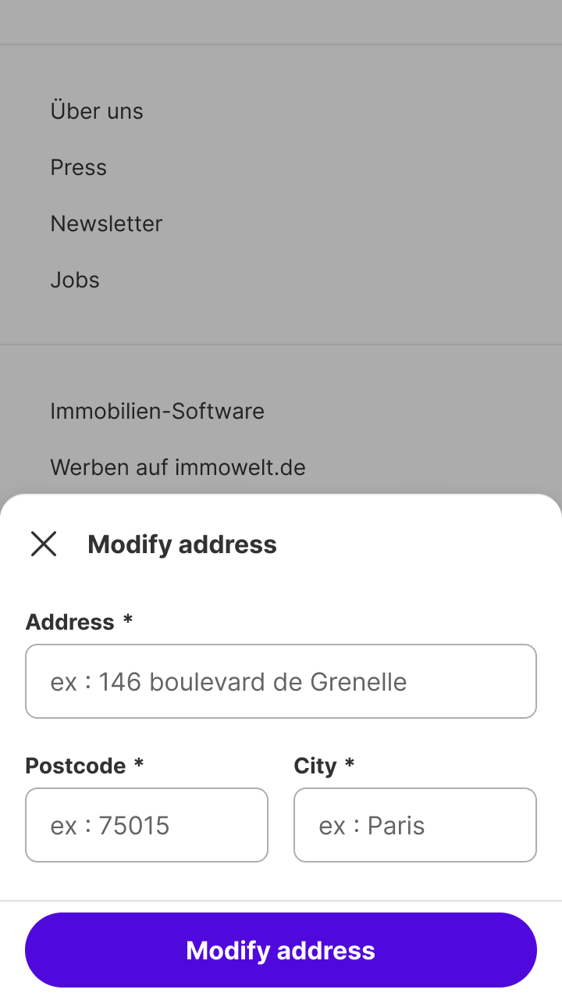<br>**DO:** Use the default size when the modal contains a small amount of content. Since the height adjusts to fit the content, it's ideal for compact information or simple actions that don't require scrolling. |
| 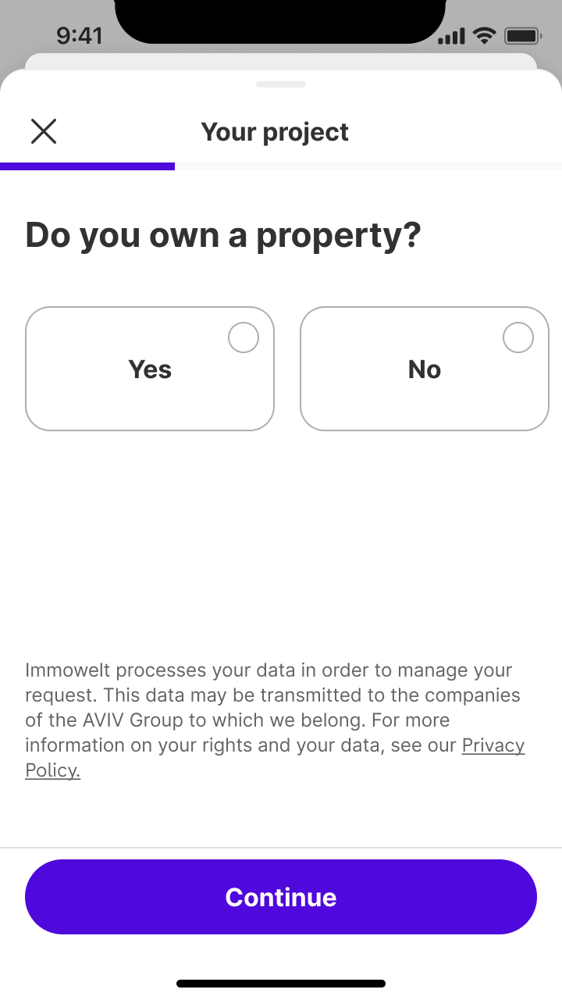<br>**DO:** Use the full-height size when the modal contains a large amount of content and may require scrolling. The fixed height ensures consistency within flows. |
| <br>**DO:** Use full-screen size for extensive content or detailed data entry. Full-screen modals are ideal when users need to focus solely on the modal content without distractions. It's useful for displaying maps or full-width images. |

## Behavior & Responsiveness

Not documented

### Interactive States & Loading

Modal bottom sheets appear in response to a user action, such as clicking a button, submitting a form, or completing a task. They can also appear automatically based on user behavior, such as reaching a certain scroll depth, spending time on a page, or attempting to exit.

They can be closed by clicking the close button, performing an action, or clicking outside the modal. On iOS and Android, they can also be closed by dragging them down.

| Clicking the x-button | Clicking an action | Clicking outside | Dragging modal |
| --- | --- | --- | --- |
| 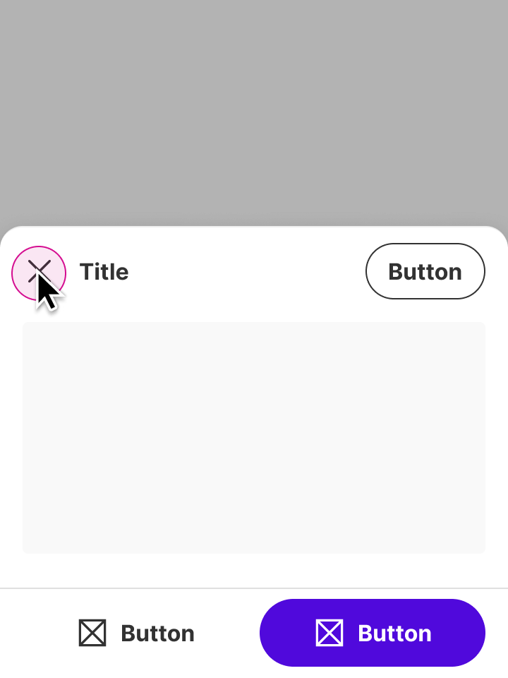 | 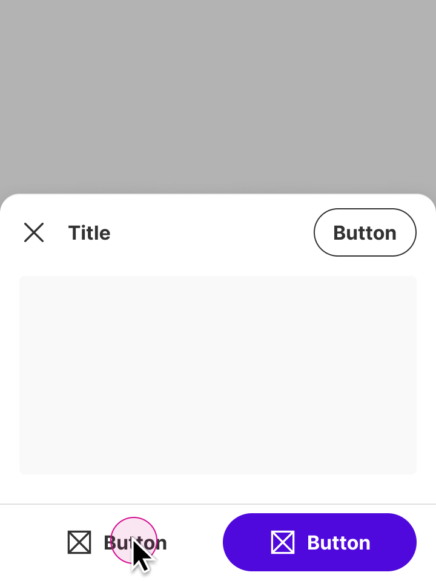 | 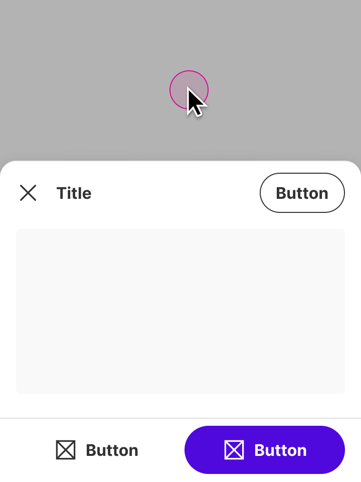 | 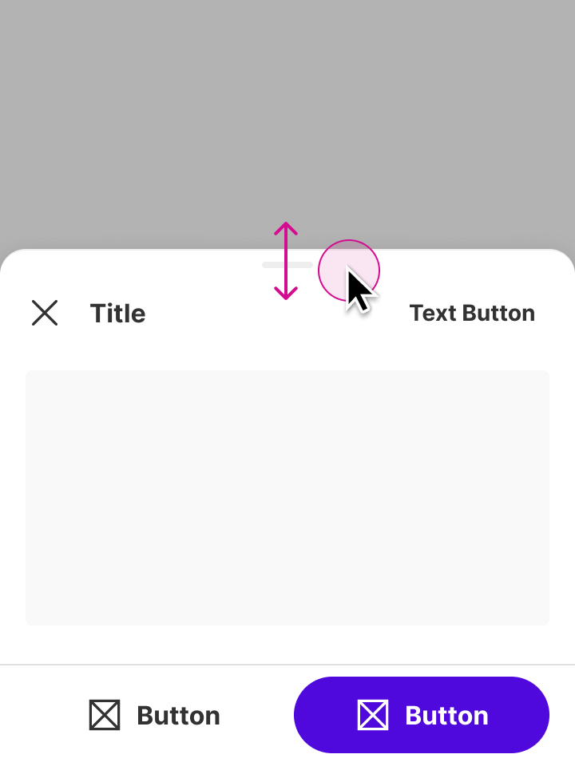 |

X-button vs. cancel button

| DO |
| --- |
| 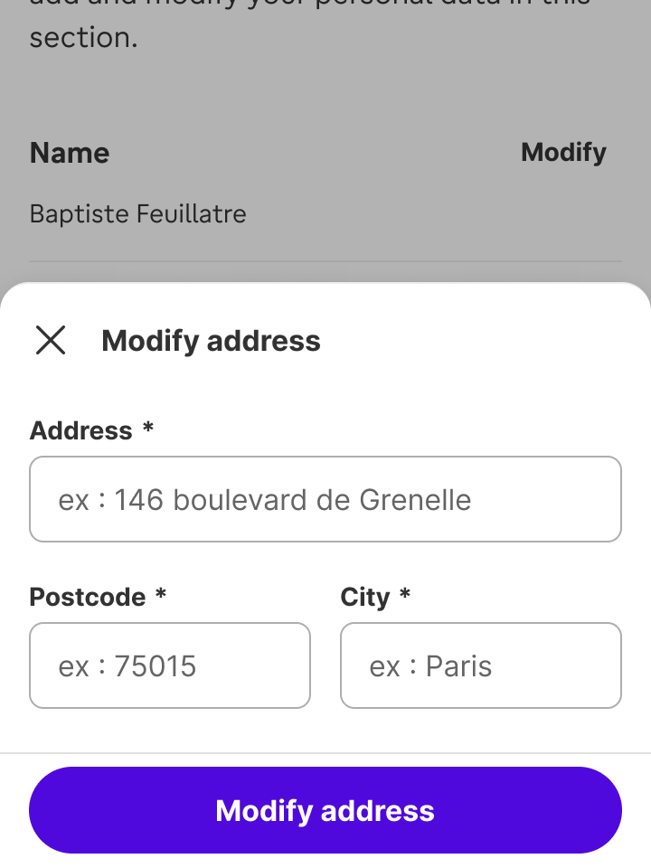<br>**DO:** In most use cases, the close button is located in the upper left corner. The "X" is quick to locate and is best for quick exits. |
| <br>**DO:** When using modals as alerts that require users to take action or make a decision, include a "Cancel" button next to the primary action. |

### Touch Target & Layout

When the content exceeds the available space, the modal becomes scrollable, allowing users to access all the information without having to resize or close the modal. Whether the scrollbar is visible or not depends on the user's system settings. To better separate the content from the header, a divider line appears when the user scrolls the modal.

| Default | Scrolling |
| --- | --- |
|  |  |

### Breakpoints & Platform Adaptations

The style of the modal bottom sheet depends on the breakpoint. To learn more about our breakpoints, see our [grids and breakpoint guidelines](https://zeroheight.com/626199550/p/04fc9a-grids-and-breakpoints). Breakpoints are different on iOS and Android. Check the [platform documentation](https://gemini.zeroheight.com/styleguide/s/92948/p/5942fd-modal-bottom-sheet/t/a053439e7a) to see the differences.

| Bottom sheet | Modal |
| --- | --- |
|  Web: XXS - SM (0 - 767 px) Android: Compact (0 - 599 dp) iOS: iPhone |  Web: MD - XXXL (> 767 px) Android Medium - Expanded (> 599 dp) iOS: iPad |

---
## Content & UX Writing

* **Title:** The title should be short and concise. Titles are optional, but recommended to improve clarity and explain the purpose of the modal.
* **Content:** Give users enough context within the modal itself to understand what they're being asked to do without having to refer to the main screen. Format the modal content with headings, bulleted lists, or short paragraphs to make it easy to read quickly. Include only essential information; remove anything irrelevant to the decision or action the user needs to take.
* **Buttons:** Buttons should be clear and inciting. Users should be able to anticipate what will happen when they click a button.
  - **Capitalization:** Sentence case without punctuation.
  - **Label Formula:** {Action Verb} + {Noun}, in the infinitive tense, leading with an action verb — except for common actions like "Done," "Close," "Cancel," or "OK."
  - **Length Limits:** Keep it under 4 words and/or 30 characters maximum in English.

For more information on content guidelines, please refer to the [UX Writing principles](https://zeroheight.com/626199550/p/324518-intro).

---

## Accessibility (a11y)

Not documented
