The phone number field is used to input and format phone numbers.

  <!-- MISSING LOCAL IMAGE: z4fLAt6uS1qLwK_92x3F2A.png -->

| Figma | Web | iOS | Android |
| --- | --- | --- | --- |
| Ready ✅ | Ready ✅ | To do 🚧 | Ready ✅ |

* [Phone number field on Figma](https://www.figma.com/design/w5XQs0VtHaiaCs3YYQ48Xw/4.-Gemini-Experiences-Library?node-id=3696-294)
* [Phone number field on Storybook](https://gemini-storybook.prompt-scorpion-preview.aws.aviv.eu/?path=/docs/patterns-phonenumber--docs)

---

## Usage

The phone number field allows users to enter phone numbers commonly used in forms for contact information, registration, and verification. It includes intuitive country code selection for accurate entry across platforms.

### Platform

We use platform-specific phone number fields for Web/iOS and Android, with main differences in label and placeholder behavior.

**Web/iOS:** the label is always on top of the field. The placeholder is visible until the field is filled.

| Default empty | Default filled | Active empty | Active filled |
| --- | --- | --- | --- |
| 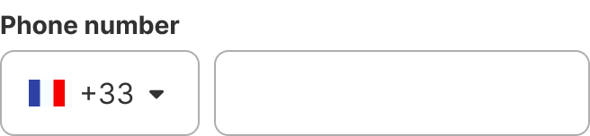 |  |  |  |

**Android:** the label is inside the field by default and only moves to the top when the field is active or filled. The placeholder is only visible if the field is active.

| Default empty | Default filled | Active empty | Active filled |
| --- | --- | --- | --- |
|  | 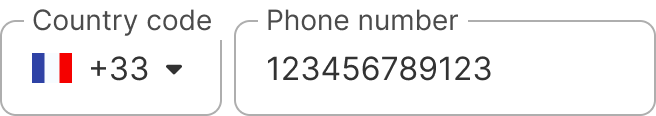 | 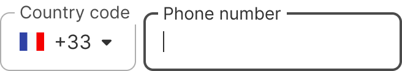 | 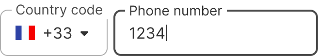 |

### When to use

**Phone number field** — inputting and formatting a phone number, including its country prefix.

**Experience**-tier component. **Highest tier first**: do not compose a phone input from a Text field + country Dropdown — this component already is it.

### When NOT to use

| Instead, when… | Use |
| --- | --- |
| Free-form single-line input with no country prefix | **Text field** |
| Selecting a country on its own | **Dropdown** |
| Numeric input with +/− controls | **Counter field** |

### Variant Selection Flow

```
Platform
└─ Web · iOS · Android — the country selector and its flag adapt per platform

Content state
├─ Nothing entered yet → Empty
└─ A number has been entered → Filled

Validation
├─ The number is valid or not yet checked → No error
└─ The number fails validation → Error, with the state message

Interaction state
└─ Default · Hover · Active · Disabled — follows the underlying text field
```

### Usage Guidance

| DO | DON'T |
| --- | --- |
|  **DO:** Always display phone number fields at full width (100%). |  **DON'T:** Avoid using 50% width for input fields when they are grouped with other fields. |

| DO | DON'T |
| --- | --- |
| 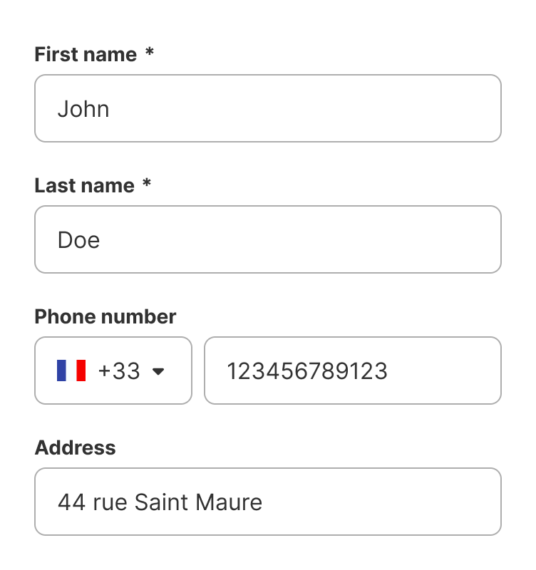<br>**DO:** Use the phone number field with a country code selector in forms, and prefill the country code based on the user’s location whenever possible to improve usability. | 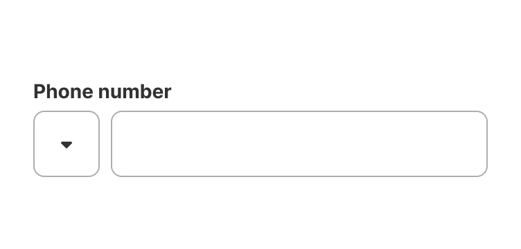<br>**DON'T:** Leave the country code unselected, as this can cause user confusion and incorrect phone number formatting. |

### Related Components

| Component | Priority | Usage | Example Scenario |
| --- | --- | --- | --- |
| **Phone number field** | — | The phone number field is used to input and format phone numbers. | — |
| [**Text field**](../text-field/text-field.md) | High | Text fields are used to enter and edit single-line text content. | Free-form single-line input with no country prefix |
| [**Dropdown**](../dropdown/dropdown.md) | Medium | Dropdowns are used to select one option from a list. | Selecting a country on its own, outside a phone input |
| [**Counter field**](../counter-field/counter-field.md) | Low | Counter fields are used to enter or select numeric values. | Numeric input with +/− controls, not a phone number |

## Variants & Modifiers

Not documented

### Modifiers

Not documented

---

#### Header

Like all form components, phone number fields contain a header consisting of a label, a required asterisk or an optional mention, a tooltip icon, and a helper text.

Go to the form guidelines for more information.

| Web / iOS | Android |
| --- | --- |
| 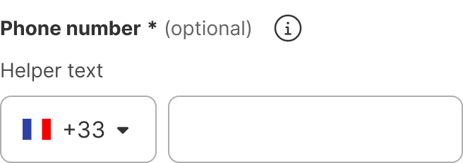 | 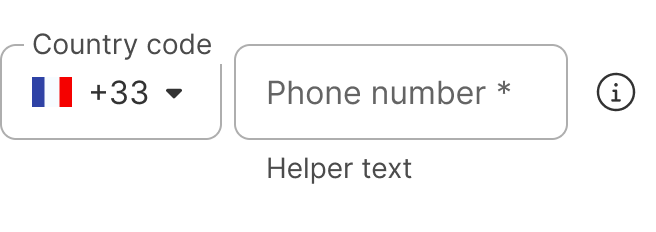 |

Phone Number fields should always have a label. Only in rare cases, where the context is clear, can the label be hidden. For accessibility, an invisible aria-label should be used.

## Behavior & Responsiveness

Not documented

### Interactive States & Loading

The phone number field allows users to change the country code and enter a number when focused. The country code dropdown and the phone number text field have different active and hover states.

They don't have a pressed state. Instead, they change to the active state when a user presses on the text field.

| Default | Hover field | Hover dropdown | Active | Disabled |
| --- | --- | --- | --- | --- |
|  | 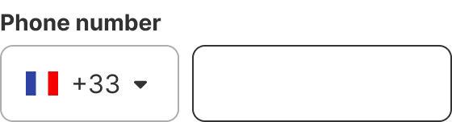 |  |  |  |

| Default | Hover field | Hover dropdown | Active | Disabled |
| --- | --- | --- | --- | --- |
| 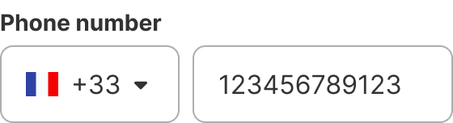 | 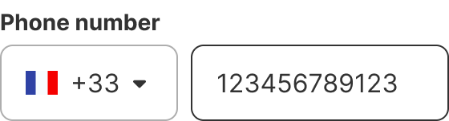 | 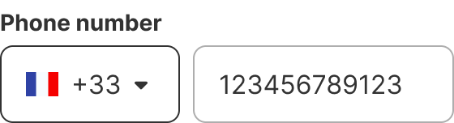 |  | 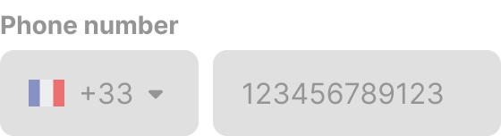 |

#### Country code selection

It is autofilled based on geolocation or defaults to the brand's default country. It can't be deselected, always stays filled, and automatically updates the phone number field when changed.

| Desktop active | Mobile / iOS active |
| --- | --- |
| 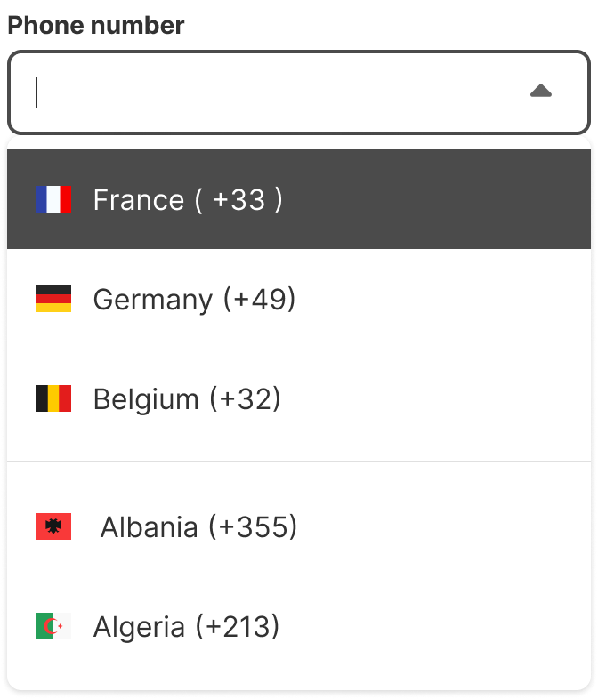 | 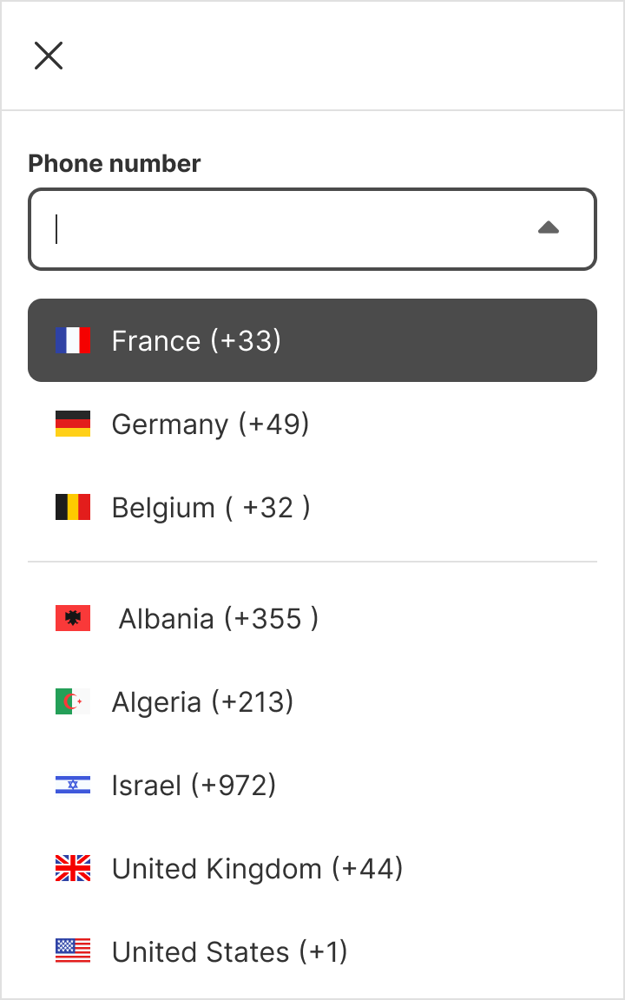 |

The rows in the the dropdown list have the states default, hover and pressed. They can be selected or unselected.

| Unselected | Selected |
| --- | --- |
|  | 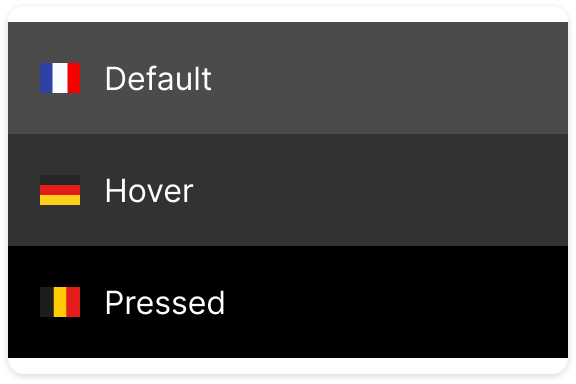 |

#### Errors

Phone number field saves entered phone numbers even when the country code changes. It has filled and empty states, with potential errors.

| Default empty | Hover empty | Active empty | Disabled empty |
| --- | --- | --- | --- |
| 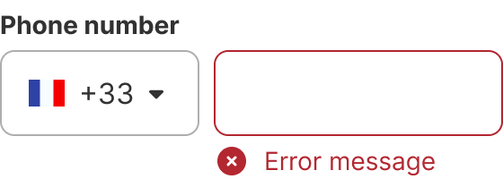 | 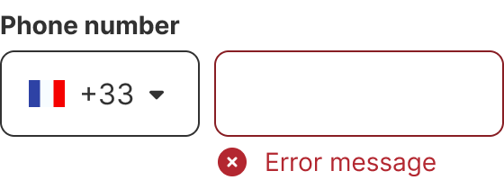 | 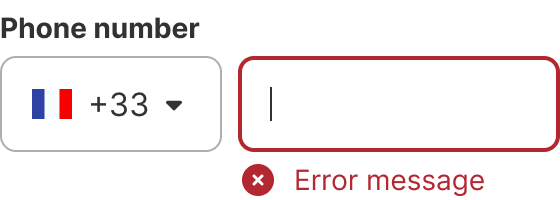 | 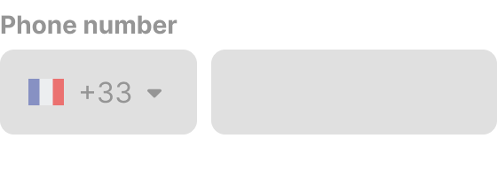 |

| Default filled | Hover filled | Active filled | Disabled filled |
| --- | --- | --- | --- |
| 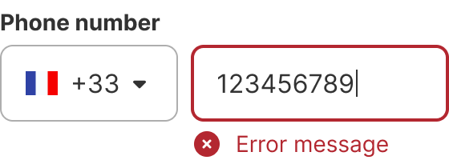 |  | 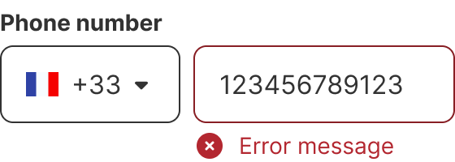 | 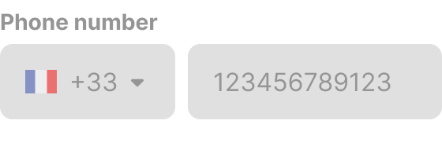 |

### Touch Target & Layout

* **Overflow in a text input:** if user input exceeds the single text input line, the content scrolls horizontally within the field container as the cursor is moved.
* **Overflow in Dropdown:** the country code in the dropdown will be truncated if it exceeds the available space.

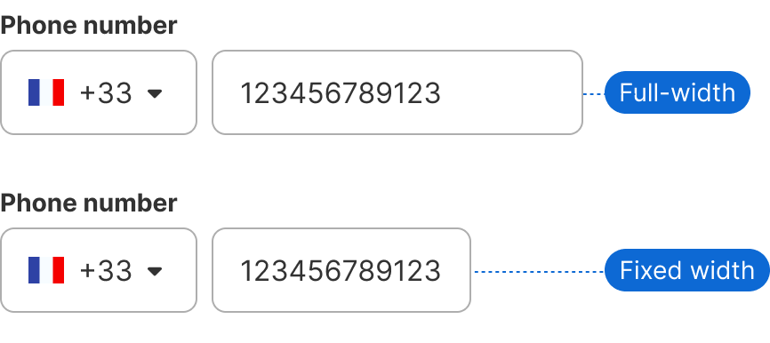

| DO | DON'T |
| --- | --- |
| <br>**DO:** Use the full width of the container for input fields. | <br>**DON'T:** Avoid using 50% width for input fields when they are grouped with other fields. |

### Breakpoints & Platform Adaptations

The style of the country code selector depends on the breakpoint. To learn more about our breakpoints, see our [grids and breakpoint guidelines](https://zeroheight.com/626199550/p/04fc9a-grids-and-breakpoints).

| Platform / Breakpoint | Layout & Width Behavior |
| --- | --- |
| **Web: XXS - XS (0 - 599 px)** | Dropdown  |
| **Web: SM - XXXL (> 599 px)** | Bottom Sheet  |

---
| Dropdown | Bottom Sheet |
| --- | --- |
|  |  |

## Content & UX Writing

Placeholder text provides hints or examples, but disappears when the user starts entering data. It should not contain crucial information and is mandatory in text input fields by default.

* **Helper text:** if the second input field doesn't have a specific label, the helper text provides information to help users fill it correctly, usually explaining the correct data format. It is mandatory and replaces a tooltip. The helper text is always visible.
* **Placeholder:** the best way to display the phone number is to format it by country rather than language.
  - **Default:** if you can't implement separate spacing for the main countries, just stick with no spacing to avoid frustrating the user. Example: **+33 XXXXXXXXX**
  - **International:** we use the [E.123 standard](https://en.wikipedia.org/wiki/E.123) for international phone numbers. Example: **+22 XXX XXX XXXX**
  - **🇬🇧 UK:** use spaces in phone numbers. Examples: **07986 123 456**, **0300 123 4567** (for companies)
  - **🇫🇷 France:** use spaces between sets of 2 numbers. Example: **06 24 55 32 14**
  - **🇩🇪 Germany:** when designing in German, we use the DIN 5008 international format, represented as **+49 AAAA BBBBBB**
  - **🇧🇪 Belgium:** Belgian telephone numbers consist of three parts: first '0', secondly the "zone prefix" (A) which is 1 or 2 digits long for landlines and 3 digits long for mobile phones, and thirdly the "subscriber's number" (B). Landlines: **0AA BB BB BB** or **0A BBB BB BB**. Mobile phones: **04AA BB BB BB**
* **Number Display:** for more information please refer to the [number guidelines](https://zeroheight.com/626199550/v/latest/p/60fe5b-numbers).

---

## Accessibility (a11y)

Labels or instructions are provided for user input as needed. A label for a form control clarifies its purpose, and while it can be visually hidden, it must still be included in the code for various presentations and interactions.

* **Labels for code:**
  - Dropdown: Country code
  - Text field: Phone number input
