Select cards are used for single- or multi-selection inside forms.


| Figma | Web | iOS | Android |
| --- | --- | --- | --- |
| Not documented | Ready ✅ | Ready ✅ | Partially developed |

* [Select card group on Figma](https://www.figma.com/design/xxqSJcKOphrgimxRQbvtfe/2.-Gemini-Components-Library?node-id=3-7282)
* [Select card group on Storybook](https://gemini-storybook.prompt-scorpion-preview.aws.aviv.eu/?path=/docs/ui-forms-selectcardgroup--docs)

---

## Usage

Select card groups are collections of cards organized together to allow users to choose between related options. They provide a visually engaging alternative to traditional radio buttons or checkboxes. They support single- and multi-select and include icons, illustrations and descriptions.

### Platform

Select cards contain custom checkboxes on Web/iOS and native checkboxes on Android.

| Web/iOS | Android |
| --- | --- |
|  | 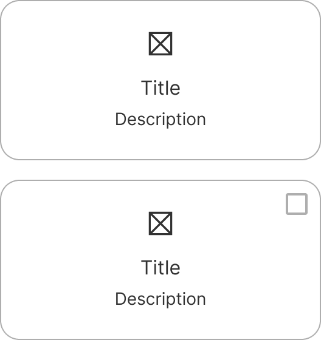 |

### When to use

**Select card group** — form selection benefits from a visual, card-based layout with icons or illustrations.

### When NOT to use

| Instead, when… | Use |
| --- | --- |
| Simpler single-select | **Radio button group** |
| Simpler multi-select | **Checkbox group** |
| The intent is navigation, not selection | **Button card** |

### Variant Selection Flow

```
Grouping
├─ Several related cards → Group
└─ One standalone choice → Individual select card

Selection type
├─ One option only → Single-select, no indicator
└─ Several options → Multi-select, with a checkbox

Alignment
├─ Wide space, longer content → Horizontal
└─ Narrow space → Vertical

Leading visual
├─ Illustration → 40px or 64px; pictograms recommended
└─ Icon → When an illustration would be too heavy

Text
├─ Title → Mandatory
└─ Description → Optional, for extra explanation
```

### Usage Guidance

| DO | DON'T |
| --- | --- |
|  **DO:** Use select cards to display more visual engaging choices, that are enhanced with icons, illustrations and descriptions. |  **DON'T:** Don't use select cards when you need to display more than 6 options, or when there is limited space available. Use radio and checkbox groups instead. |

### Related Components

| Component | Priority | Usage | Example Scenario |
| --- | --- | --- | --- |
| **Select card group** | — | Select cards are used for single- or multi-selection inside forms. | — |
| [**Radio button group**](../radio-button-group/radio-button-group.md) | High | Radio buttons allow users to make mutually exclusive choices. They are used in forms that must be submitted before the change takes effect. | Simpler single-select |
| [**Checkbox group**](../checkbox-group/checkbox-group.md) | High | Checkbox groups allow users to select one or more choices independently. They are used in forms that must be submitted before the change takes effect. | Simpler multi-select |
| [**Button card**](../button-card/button-card.md) | High | Button cards are prominent calls to action that can be used alone or in a group, with icons or pictograms. | The intent is navigation, not selection |
| [**Button card**](../button-card/button-card.md) | High | Button cards are prominent calls to action that can be used alone or in a group, with icons or pictograms. | The intent is navigation, not selection |

---

## Variants & Modifiers

### Group

Select cards are available as a group or individual select cards.

| In a group | Individual card |
| --- | --- |
| 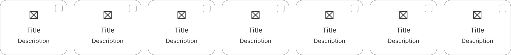 |  |

### Type

Select cards are available as single or multi-selection component. The multi-selection variant contains a checkbox, the single-selection one doesn't contain an indicator.

| Single-select (radio) | Multi-select (checkbox) |
| --- | --- |
|  | 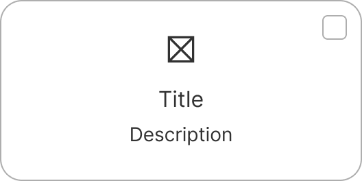 |

### Alignment

The content inside select cards can be in a vertical or horizontal alignment, depending on the use case and layout structure.

| Vertical | Horizontal |
| --- | --- |
|  |  |

### Modifiers

#### Icons and illustration

Select cards contain optional icons and illustrations. The illustrations are available in the size 40 and 64px. If you use an illustration we recommend the usage of pictograms.

| Icon | 40px illustration | 64px illustration |
| --- | --- | --- |
|  | 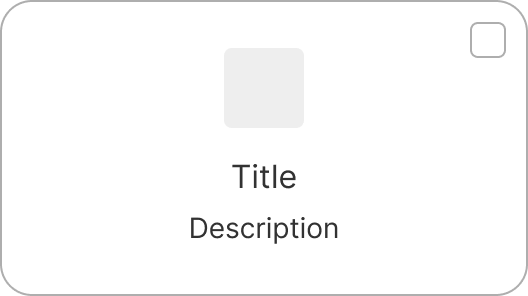 | 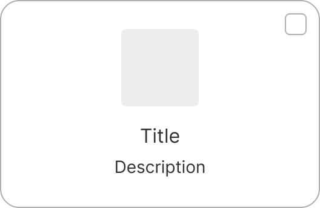 |

| Icon | 40px illustration | 64px illustration |
| --- | --- | --- |
|  |  | 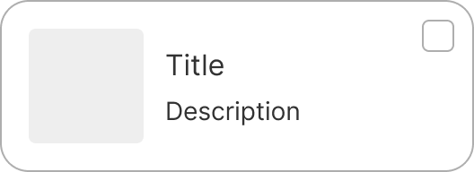 |

#### Title and description

The select cards contain a mandatory title and an optional description, that can be added to provide additional explanations.

---

| With description | Without description |
| --- | --- |
|  |  |

## Behavior & Responsiveness

### Interactive States & Loading

* **Default / Hover / Pressed:** Select cards support default, hover, and pressed states, and can be selected or unselected.
* **Disabled State Guidance:** Select cards support a disabled state and an error state; not documented further.

| Default | Hover | Pressed | Disabled |
| --- | --- | --- | --- |
|  |  |  | 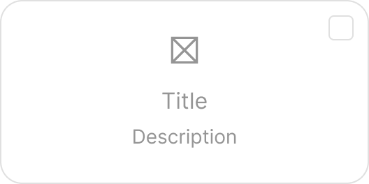 |

| Default selected | Hover selected | Pressed selected | Disabled selected |
| --- | --- | --- | --- |
| 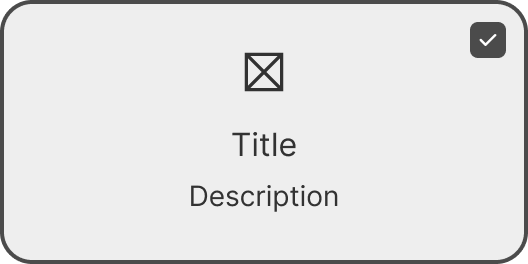 | 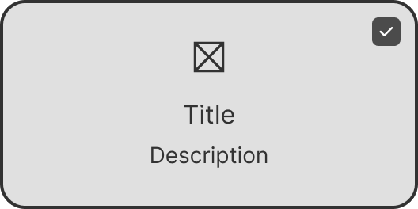 | 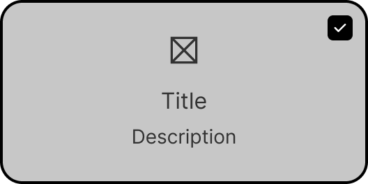 |  |

#### Error

| Default | Hover | Pressed |
| --- | --- | --- |
| 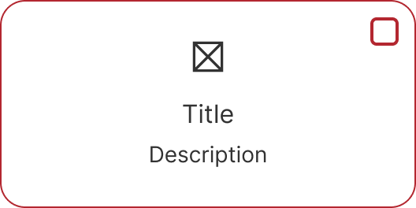 |  | 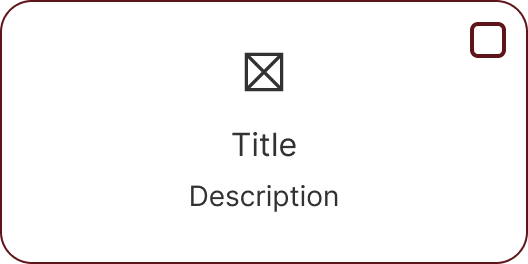 |

| Default selected | Hover selected | Pressed selected |
| --- | --- | --- |
| 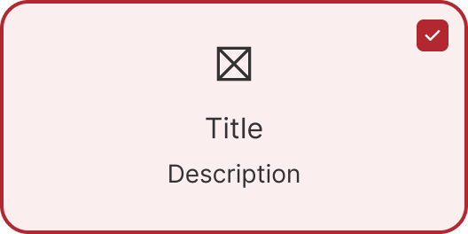 |  | 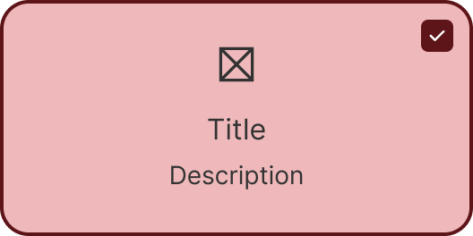 |

#### Error message

| Select card group with error message |
| --- |
| 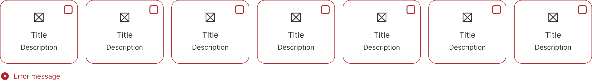 |

### Touch Target & Layout

Not documented

### Breakpoints & Platform Adaptations

Not documented

---

## Content & UX Writing

* The title is mandatory, the description is optional. Both title and description can be multi-line.
* The **title** helps to structure the content. It's concise and has no punctuation.
* If you need to give additional guidance to the user, use the **description**.
* For more information on content guidelines, please refer to the [UX Writing principles](https://zeroheight.com/626199550/p/324518-intro).

---

## Accessibility (a11y)

Not documented
