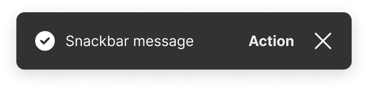

<!-- Source: https://avivgroup.atlassian.net/wiki/spaces/ADS/pages/2831843417/Snackbar | Last modified: Aug 21, 2026 -->

# Snackbar

Snackbars are used to provide quick feedback after an action is taken.


| Figma | Web | iOS | Android |
| --- | --- | --- | --- |
| Not documented | Ready ✅ | Ready ✅ | Ready ✅ |

* [Snackbar on Figma](https://www.figma.com/design/xxqSJcKOphrgimxRQbvtfe/2.-Gemini-Components-Library?node-id=3-7301)
* [Snackbar on Storybook](https://gemini-storybook.prompt-scorpion-preview.aws.aviv.eu/?path=/docs/ui-feedback-snackbar--docs)

---

## Usage

Snackbars are short messages that appear at the bottom of the screen to inform users of the outcome of an action without interrupting their current activity. They should be used to provide quick, non-intrusive feedback that doesn't require user confirmation before proceeding. They don't block the user from continuing their task. An action may be encouraged, but not required.

### Platform

The snackbar has a close button (x-icon) on the web. On iOS/Android, it doesn't have a close button, but disappears automatically after 4 seconds.

| Web | iOS/Android |
| --- | --- |
|  |  |

### When to use

**Snackbar** — brief, transient feedback confirming the outcome of a user action.

### When NOT to use

| Instead, when… | Use |
| --- | --- |
| Persistence and inline placement needed | **Feedback message** |
| Critical and blocking | **Alert** |

### Variant Selection Flow

```
Type
├─ Neutral context → Info
├─ An action succeeded → Success
├─ Needs attention but is not blocking → Warning
└─ Something failed → Error
   └─ Type icons are standardised — never substitute another icon

Action
├─ Short action label → On the same line as the message
├─ Longer action label → Below the message
└─ Nothing to act on → Without action
```

### Usage Guidance

| DO |
| --- |
|  **DO:** Use snackbars to provide non-critical feedback after an action has been taken. For example, saving, sending, or deleting items. |
|  **DO:** Use snackbars for non-intrusive feedback on actions that doesn't require user confirmation before proceeding. |

| DON'T |
| --- |
|  **DON'T:** Don't use snackbars for static information that are not a result of a user action. Use feedback messages instead. |
|  **DON'T:** Don't use snackbars for error messages that point to a specific part of the page. Use feedback messages instead. |
|  **DON'T:** Don't use snackbars for critical messages that require the users attention. Use feedback messages or alerts instead. |
|  **DON'T:** Don't use snackbars if you need to block the users flow. Use alerts instead. |

### Related Components

| Component | Priority | Usage | Example Scenario |
| --- | --- | --- | --- |
| **Snackbar** | Low | Snackbars are used to provide brief, non-critical, and non-intrusive feedback on actions that doesn't require user confirmation before proceeding. They don't block the user from continuing their task. An action may be encouraged, but not required. | Seeker saves listing to favorites |
| [**Feedback message**](../feedback-message/feedback-message.md) | High | Feedback messages are non-disruptive, inline notifications that provide users with important information or contextual messages. | Persistence and inline placement needed |
| **Banner (not a gemini component)** | Medium | Banners are used for important, persistent information. They remain until the user closes them or the problem that caused the banner is solved. | Seeker is shown static information about search results on map |
| **State message** | Medium | State messages are used for inline feedback in forms to guide users, correct errors, or provide additional information. | User enters incorrect password |
| [**Alert**](../alert/alert.md) | High | Alerts are used for critical information that requires immediate attention or confirmation before proceeding. They block user flow until an action is taken. | Agent deletes listings |
| [**Info State**](../info-state/info-state.md) | High | Info states are used to communicate system status, errors, or other relevant information that prevent users from progressing and require their full attention. They include empty, error, success and loading states. | User is not connected to the Internet |
| [**Feedback message**](../feedback-message/feedback-message.md) | High | Feedback messages are non-disruptive, inline notifications that provide users with important information or contextual messages. | Persistence and inline placement needed |

---

## Variants & Modifiers

### Type

Snackbars come in the following types: info, success, warning, and error. These variations help users quickly understand the nature of the message, whether it's informational, confirms success, issues a warning, or highlights an error.

| Info | Success | Warning | Error |
| --- | --- | --- | --- |
|  |  |  |  |

The icons associated with each snackbar type are standardized and shouldn't be changed to ensure consistency and clarity across our products.

### Actions

Snackbars contain optional action buttons. Short actions appear on the same line as the snackbar message, longer actions appear below the snackbar message.

| Short action | Long action | Without action |
| --- | --- | --- |
|  |  |  |

### Modifiers

Not documented

---

## Behavior & Responsiveness

### Interactive States & Loading

Snackbars appear in response to a user action, such as clicking a button, submitting a form, or completing a task.

**Web:** On the web, snackbars remain on the screen until the user clicks the close or action button to dismiss them. For accessibility reasons we can't make snackbar disappear automatically on web. Learn more: [WCAG SC 2.2.1](https://www.w3.org/WAI/WCAG21/Understanding/timing-adjustable.html)

**App:** On iOS and Android, snackbars can be either auto-dismissable or persistent. Auto-dismissable snackbars disappear automatically after 5 seconds (default value) or when the action button is clicked. Persistent snackbars remain until the user takes an action. We recommend using auto-dismissable snackbars only for noncritical messages.

| Web — clicking the close button | Web — clicking the close button | iOS/Android — clicking action button or waiting 5 seconds |
| --- | --- | --- |
|  |  |  |

### Touch Target & Layout

Not documented

### Breakpoints & Platform Adaptations

Snackbars are positioned on the bottom of the screen. On web the spacing from the bottom depends on the breakpoint. To learn more about our breakpoints, see our [grids and breakpoint guidelines](https://zeroheight.com/626199550/p/04fc9a-grids-and-breakpoints).

#### Single snackbars

| Phone | Phone (above navigation bar) | Phone (above button bar) | Tablet | Desktop |
| --- | --- | --- | --- | --- |
|  Web: XXS - XS (0 - 599 px) |  Web: XXS - XS (0 - 599 px) |   <!-- MISSING LOCAL IMAGE: 056490bc-c129-4c67-86c8-6fb091b82192.png --> Web: XXS - XS (0 - 599 px) |  Web: SM - LG (600 - 1279 px) |  Web: XL - XXXL (> 1279 px) |

#### Stacked snackbars (Web only)

| Phone | Phone (above navigation bar) | Phone (above button bar) | Tablet | Desktop |
| --- | --- | --- | --- | --- |
|  Web: XXS - XS (0 - 599 px) |  Web: XXS - XS (0 - 599 px) |  Web: XXS - XS (0 - 599 px) |  Web: SM - LG (600 - 1279 px) |  Web: XL - XXXL (> 1279 px) |

Snackbars can only be stacked on the web. On apps, only one snackbar is visible at a time. When a second snackbar appears, the previous one disappears.

---

## Content & UX Writing

* **Capitalization:** Not documented
* **Voice & Tone:** Write in an active voice and clearly state what happened as a result of the user's action, avoiding unnecessary details. Make sure the message is straightforward and easy to understand at a glance. For example: "Message sent."
* **Label Formula:** Use a concise, verb-based label for the action button. For example: "Undo"
* **Length Limits:** Keep the message to 1-2 sentences.

For more information on content guidelines, please refer to the [UX Writing principles](https://zeroheight.com/626199550/p/324518-intro).

---

## Accessibility (a11y)

* **Keyboard Navigation:** Not documented
* **Screen Readers:** Not documented
