<!-- Source: https://avivgroup.atlassian.net/wiki/spaces/ADS/pages/2831024238/Tabs | Last modified: Aug 21, 2026 -->

# Tabs

Tabs are used to organize related content into different views and allow users to seamlessly switch between them.


| Figma | Web | iOS | Android |
| --- | --- | --- | --- |
| Ready ✅ | Ready ✅ | Ready ✅ | Ready ✅ |

* [Tabs on Figma](https://www.figma.com/design/xxqSJcKOphrgimxRQbvtfe/2.-Gemini-Components-Library?node-id=3-7291)
* [Tabs on Storybook](https://gemini-storybook.prompt-scorpion-preview.aws.aviv.eu/?path=/docs/ui-navigation-tabs--docs)

---

## Usage

Tabs organize related content that is at the same level of hierarchy. By separating content into distinct views, tabs help reduce clutter and allow users to easily switch between tasks or categories without leaving the page.

### When to use

**Tabs** — organising related content at the same hierarchy level into switchable views.

### When NOT to use

| Instead, when… | Use |
| --- | --- |
| Switching view modes within a single content area | **Segmented control** |
| Steps must be completed in sequence | **Wizard** |
| Switching between top-level destinations | **Navigation bar** |

### Variant Selection Flow

```
Number of items
└─ 2 to 5 — more than that overwhelms the user
   └─ More sections than fit → reconsider Tabs; see **Which component**

Icon position
├─ Wider screens → Icon to the left of the label
└─ Smaller screens with limited space → Icon above the label, avoiding horizontal scrolling

Badge
└─ Notifications or updates, such as messages or alerts → Badge next to the tab label
```

### Usage Guidance

| DO |
| --- |
|  **DO:** Use tabs to group related content into different views. |

| DON'T |
| --- |
|  **DON'T:** Don't use tabs for linear step-by-step processes. Use the wizard instead. |
|  **DON'T:** Don't use tabs for primary navigation or to move between pages of different hierarchy levels. |
| 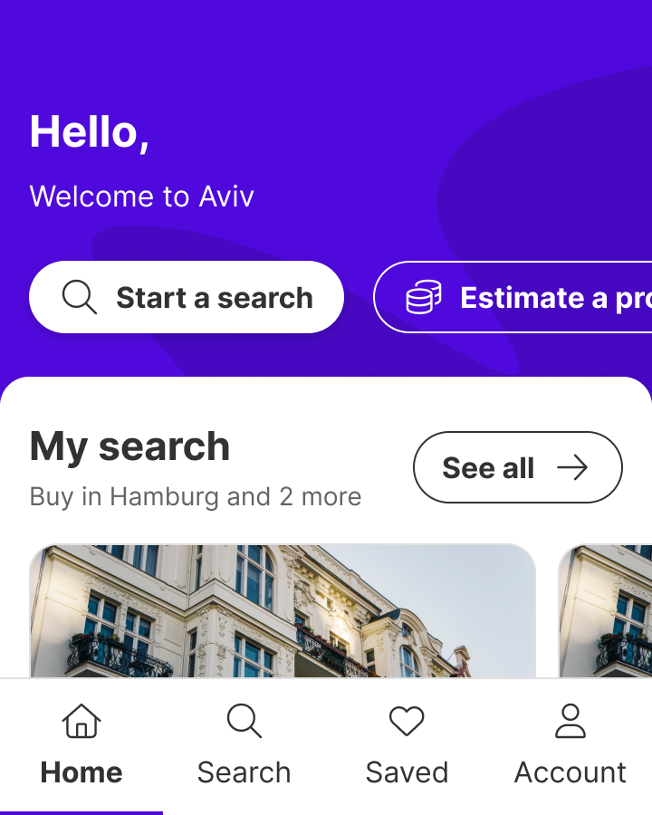 **DON'T:** Don't use tabs to move between top-level pages in an app. Use the navigation bar instead. |

| DO | DON'T |
| --- | --- |
| 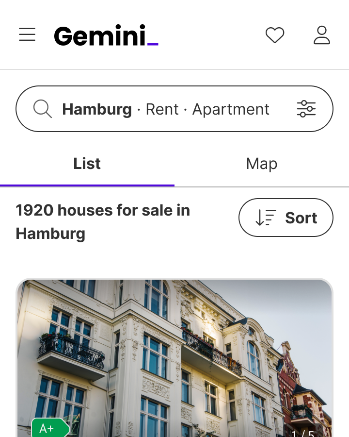<br>**DO:** Use tabs to group related content into different views. | 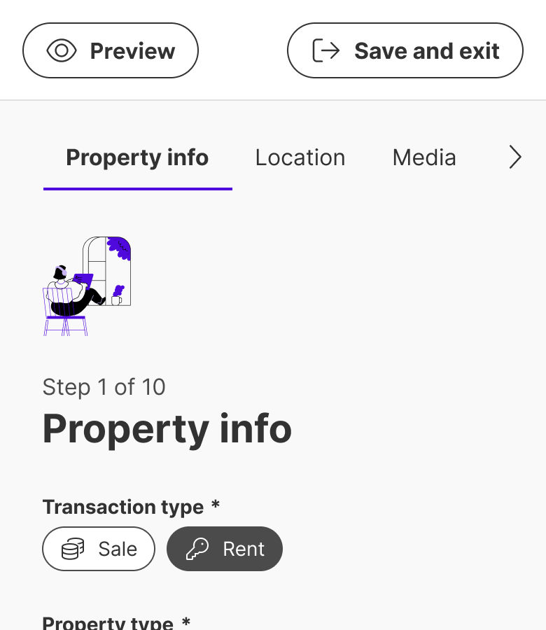<br>**DON'T:** Don’t use tabs for linear step-by-step processes. Use the wizard instead. |

### Related Components

| Component | Priority | Usage | Example Scenario |
| --- | --- | --- | --- |
| **Tabs** | — | Tabs organize related content into distinct views and allow users to switch between them without leaving the page. | — |
| **Navigation bar (app)** | Medium | Navigation bars allow users to navigate between different pages within an app. They persist throughout the app to help users move between high-level destinations. | — |
| [**Segmented control**](../segmented-control/segmented-control.md) | High | Segmented controls are used to select one option from a group of mutually exclusive choices. | Switching view modes within a single content area |
| [**Wizard**](../wizard/wizard.md) | High | Wizards guide users through step-by-step processes to achieve their goal. | Steps must be completed in sequence |
| [**Navigation bar**](../navigation-bar/navigation-bar.md) | High | Navigation bars provide quick access to key pages within the site, helping users to navigate efficiently. | Switching between top-level destinations |
| [**Accordion**](../accordion/accordion.md) | Medium | Accordions are container that allow users to expand and collapse sections of content, making it easier to manage large amounts of information in a… | Accordion redirects here when: Sections are mutually exclusive views |

---

## Variants & Modifiers

### Number of items

Tabs are available with 2 to 5 elements. We don't recommend using more than this to avoid overwhelming the user.

| &nbsp; | &nbsp; | &nbsp; | &nbsp; |
| --- | --- | --- | --- |
|  |  |  |  |

### Modifiers

#### Icons

Icons can be positioned on the left or on top of the tab.

| DO |
| --- |
| 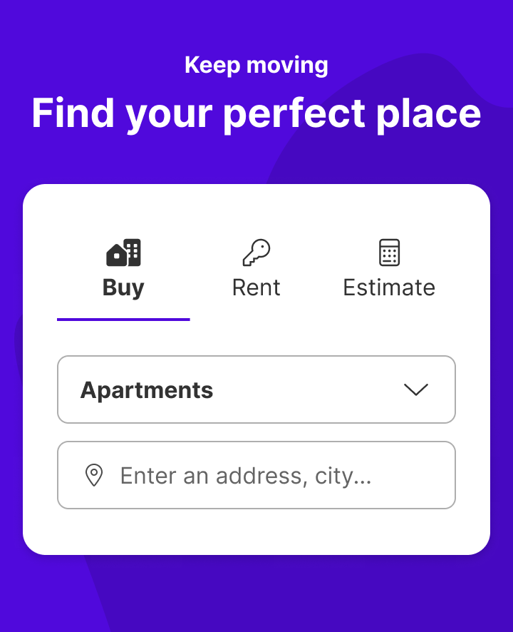 **DO:** On smaller screens with limited space, place the icons at the top to avoid scrolling. |
|  **DO:** On wider screens, position the icons on the left. |

| Without icons | With icons left | With icons on top |
| --- | --- | --- |
|  |  | 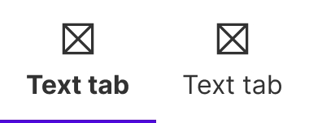 |

#### Badge

A badge can be placed next to the tab label.

| DO |
| --- |
| 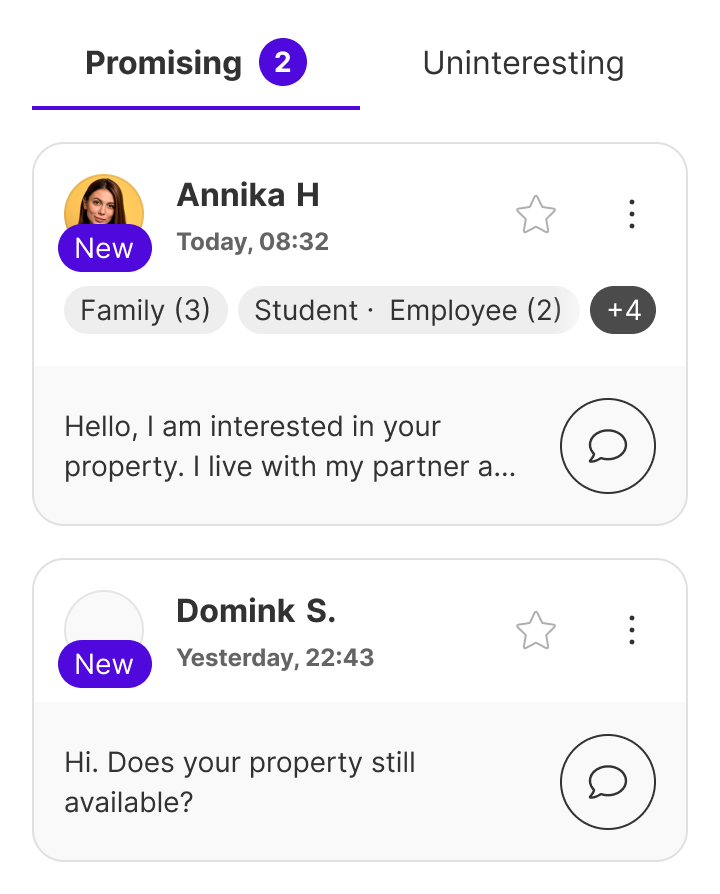 **DO:** Use badges to indicate notifications or updates. For example, for messages or alerts. |

---


## Behavior & Responsiveness

### Interactive States & Loading

* **States:** Each tab has the states default, hover, pressed and disabled.
* **Default selection:** By default, the tab component always has one tab preselected, typically the first tab. Only one tab can be active at a time. If the user selects a new element, the previous tab is automatically deactivated.
* **Interaction:** In order to change the active tab, the user must click on an inactive tab.

| Default | Hover | Presed | Disabled |
| --- | --- | --- | --- |
|  | 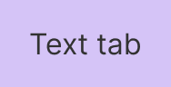 | 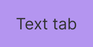 |  |

| Default active | Hover active | Pressed active |
| --- | --- | --- |
|  | 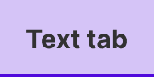 | 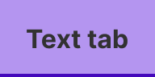 |

#### Scrolling and arrows

On android and iOS, when a row of tabs doesn't fit on the screen, the tabs become scrollable.

On the web, arrows need to be added to allow the user to navigate through them.

| Without arrows | With arrows left and right | With arrow left | With arrow right |
| --- | --- | --- | --- |
|  |  |  |  |

#### Compact Tabs

Alernatively for small spaces, consumers instead of implementing the Scrolling and arrows can implement the Compact Tab variant.

| Rest | Active |
| --- | --- |
|  | 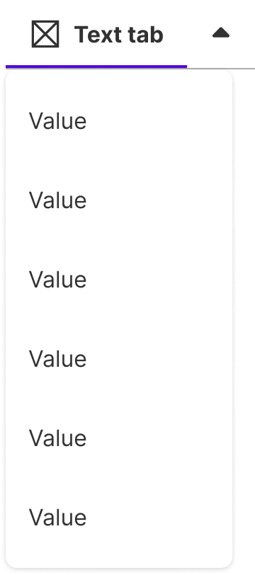 |

### Touch Target & Layout

* **Size:** Tabs can be configured to either adapt to the content length (Hug content), or be evenly distributed to fill the available container space (Fill container). Use the "Hug Content" option for varying tab lengths, preserving a more compact layout. Choose "Fill container" if you want the tabs to span the entire width.
* **Alignment:** Tabs can be aligned in different ways within their container. Use center alignment to position tabs evenly in the middle, creating a balanced look. Use left alignment to align tabs to the beginning of the container, which is useful for interfaces where a left-anchored layout is preferred.

| Hug content | Fill container |
| --- | --- |
|  | 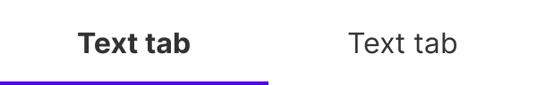 |

#### Alignment

| Center | Left |
| --- | --- |
|  |  |

### Breakpoints & Platform Adaptations

| Platform / Breakpoint | Layout & Width Behavior |
| --- | --- |
| **Android & iOS** | When a row of tabs doesn't fit on the screen, the tabs become scrollable. |
| **Web** | Arrows need to be added to allow the user to navigate through them. Alternatively, for small spaces, consumers can implement the Compact Tab variant instead of [Scrolling and arrows](https://zeroheight.com/626199550/p/45521d-tabs/t/page-45521d-84054612-14) — when there are too many tabs to fit horizontally across the viewport, the tabs component can be displayed as a Dropdown. The width of the Compact version is relative to the width of the active state. |

| DO |
| --- |
| 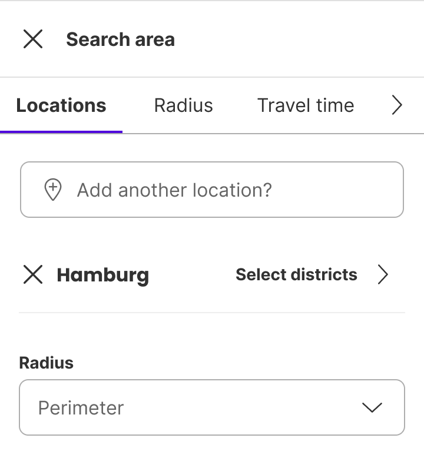 **DO:** Use the arrows on the mobile web to ensure accessibility. This is critical to ensure that users with motor impairments, or those who rely on assistive technology, can comfortably access content without having to scroll or directly interact with dynamic elements. |

---

## Content & UX Writing

* **Label length:** When labelling tabs, keep the text short and descriptive. Use 1-2 words that accurately convey what the user will find when they click on the tabs.

For more information on content guidelines, please refer to the [UX Writing principles](https://zeroheight.com/626199550/p/324518-intro).

---

## Accessibility (a11y)

Not documented
