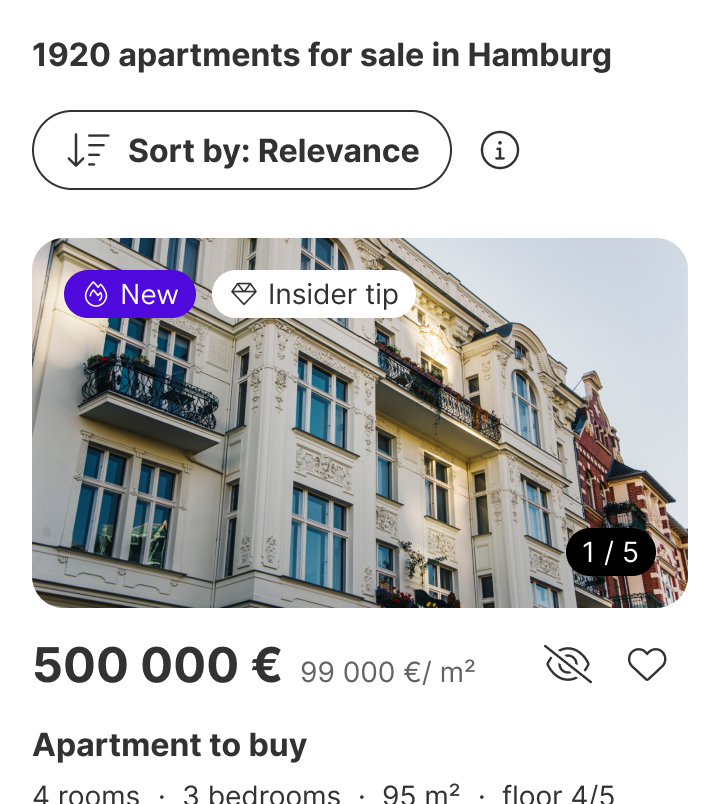

Tags are used to label, categorize and highlight items to help users quickly identify content.

  <!-- MISSING LOCAL IMAGE: 3a6c28b5-6a93-47bd-89be-6ca7ad848112.png -->

| Figma | Web | iOS | Android |
| --- | --- | --- | --- |
| Ready ✅ | Ready ✅ | Ready ✅ | Partially available |

* [Tags on Figma](https://www.figma.com/design/xxqSJcKOphrgimxRQbvtfe/2.-Gemini-Components-Library?node-id=3-7314)
* [Tags on Storybook](https://gemini-storybook.prompt-scorpion-preview.aws.aviv.eu/?path=/docs/ui-content-tag--docs)

---

## Usage

Tags are non-interactive labels used to display information or status that cannot be edited or changed by the user. They are typically used to provide context, categorize or highlight important attributes of an item.

### When to use

**Tag** — non-interactive status labels or categories, standing on their own in the layout — "New", "Sold", "Exclusive".

### When NOT to use

| Instead, when… | Use |
| --- | --- |
| Seller lead scoring | **Score tag** |
| The element is interactive — selectable, filterable, removable | **Chip** |
| Status needs supporting text | **Feedback message** |
| The marker sits **on** another component rather than beside it | **Badge** |

### Variant Selection Flow

```
Context and style — chosen by meaning and by the surface behind it
├─ Strongest emphasis → Dark
├─ Lowest emphasis → Subdued or Light
├─ Brand emphasis → Primary or Secondary
└─ Status → Error · Success · Information · Warning
   └─ Emphasis signals importance, never decoration

Icon — mandatory when the label is dropped; otherwise optional
└─ Add one only when it makes the tag's meaning clearer

Label
├─ Almost always → With label
└─ The icon is universally recognised → Without label, and the icon becomes mandatory
```

### Usage Guidance

| DO |
| --- |
|  **DO:** Use tags to display static, non-interactive labels to categorize and highlight items. |

| DON'T |
| --- |
|  **DON'T:** Don't use tags to filter content or make selections. Use chips instead. |
|  **DON'T:** Don't use tags for seller lead scoring. Use the specific score tags instead. |

### Related Components

| Component | Priority | Usage | Example Scenario |
| --- | --- | --- | --- |
| **Tag** | Low | Tags are non-interactive labels used to display information or status that cannot be edited or changed by the user. They are typically used to provide context, categorize or highlight important attributes of an item. | Highlight new listings, energy performance |
| [**Chip**](../chip/chip.md) | High | Chips are interactive elements used to select, filter or organize content. Unlike tags, chips allow users to take action, such as applying or removing a filter, or making a selection. | Filter search results by property features |
| **Score tag** | High | Score tags are specific tags used for seller lead scoring. They indicate the score or rating of a lead and are available in different variants to convey different score levels. | Display seller lead score |
| [**Feedback message**](../feedback-message/feedback-message.md) | High | Feedback messages are non-disruptive, inline notifications that provide users with important information or contextual messages. | Status needs supporting text |
| **Badge** | High | Attention marker attached to a host component. | The marker sits on another component rather than beside it |
| [**Chip group**](../chip-group/chip-group.md) | Medium | Chip groups are collections of chips that allow users to filter, select, or manage multiple related options simultaneously. | Chip group redirects here when: The element is non-interactive |

---

## Variants & Modifiers

### Context / Style

Tags are available in a variety of styles to suit different visual contexts and hierarchies. They are available in the following contexts: Dark, Subdued, Primary, Secondary, Light, Error, Success, Information, and Warning. The choices of style depends on the purpose and the importance of the tag.

| Dark | Subdued | Primary | Secondary | Light | Error | Success | Information | Warning |
| --- | --- | --- | --- | --- | --- | --- | --- | --- |
|  |  |  |  |  |  |  |  |  |

| DO |
| --- |
|  **DO:** Use tags with different emphasis to indicate the level of importance. |
|  **DO:** Use tags to communicate the status of items. |

### Modifiers

#### Icons

Icons are optional and can be included to provide additional context or visual cues that make the purpose of the tag more intuitive and easier to understand.

| With icon | Without icon |
| --- | --- |
|  |  |

#### Label

We recommend to use the tag with a label for most use cases. Only use it without a label when the icon is universally recognized.

| With label | Without label |
| --- | --- |
|  |  |

---

## Behavior & Responsiveness

### Interactive States & Loading

This component has no interactive states. It is a static, display-only element with no hover, focus, pressed, loading, or disabled behavior.

### Touch Target & Layout

Not applicable. This component does not respond to touch or pointer interaction and has no minimum touch target requirement.

| 12 | 14 |
| --- | --- |
|  |  |

#### Type

Tags are visually styled to reflect their purpose, either by indicating their level of emphasis (e.g. primary, secondary...) or by representing a specific status, such as information, success, warning or error. The primary tag and the status tags are available in strong and weak colors.

#### Emphasis

| Primary | Secondary | Light |
| --- | --- | --- |
|  |  |  |

| Subdued | Dark | Primary |
| --- | --- | --- |
|  |  |  |

#### Status

| Information | Success | Warning | Error |
| --- | --- | --- | --- |
|  |  |  |  |

| Information | Success | Warning | Error |
| --- | --- | --- | --- |
|  |  |  |  |

### Breakpoints & Platform Adaptations

Not applicable. This component does not adapt its layout or behavior across breakpoints or platforms.

---

## Content & UX Writing

* **Capitalization:** Sentence case, without punctuation.
* **Length Limits:** 2-3 words, about 20-30 characters in English.

Tag labels should be clear, concise, and specific to effectively convey their purpose. For more information on content guidelines, please refer to the [UX Writing principles](https://zeroheight.com/626199550/p/324518-intro).

---

## Accessibility (a11y)

Not documented
